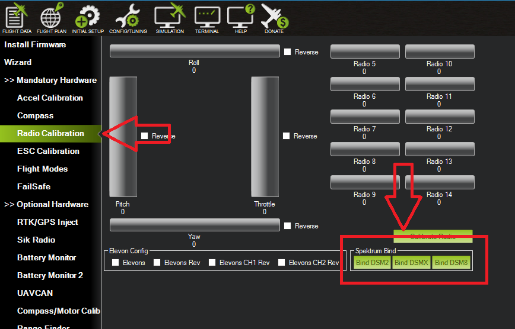
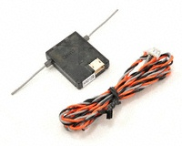
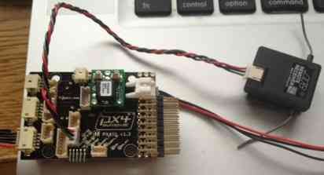

.. _common-spektrum-rc:

===================
Spektrum RC Systems
===================

Any DSM/DSM2 compatible receiver can be used with ArduPilot. Spektrum also makes receivers with SBus, PPM, and SXRL protocols which are also compatible.

For a **Spektrum DSM**, **DSM2**, or **DSM-X Satellite** receiver,
connect to the **SPKT/DSM** port (some boards, such as the CUBE mini carrier board, require you to modify solder bridges. See the autopilot board's documentation)

.. image:: ../../../images/pixhawk_spektrum_connection.jpg
    :target: ../_images/pixhawk_spektrum_connection.jpg
    
Spektrum Satellite Receivers 
============================

`Spektrum Satellite Receivers <http://www.spektrumrc.com/Products/Default.aspx?ProdID=SPM9645>`__
work as a DSM receiver with Pixhawk. Spektrum satellite receivers do not have buttons to bind, so
there are two ways to bind them to a transmitter. They are connected as if they were PPM-SUM or SBus output devices.
ArduPilot automatically discovers the serial protocol being used.

-  Pre-bind the Spektrum Satellite to your transmitter using a
   conventional Spektrum receiver with satellite attached, then
   disconnect the satellite from the conventional receiver, and
   connect it to the Spektrum port on autopilot
-  Bind the satellite receiver using Mission Planner to initiate
   the bind. This functionality is located in Radio Calibration 
   screen on Initial Setup.

-  Being a satellite, range may be limited and the
   preceding receivers and methods may provide greater range.

