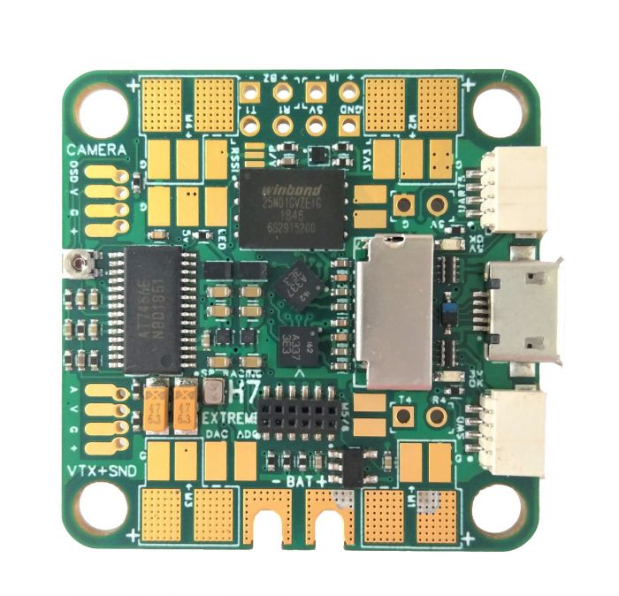
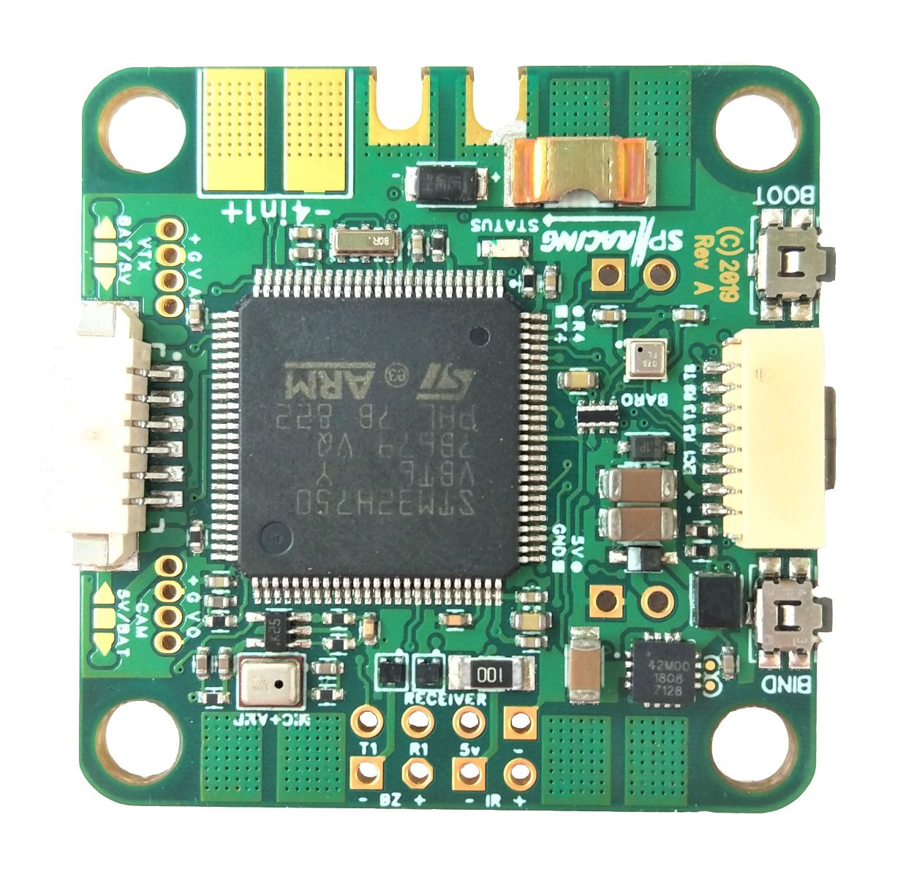
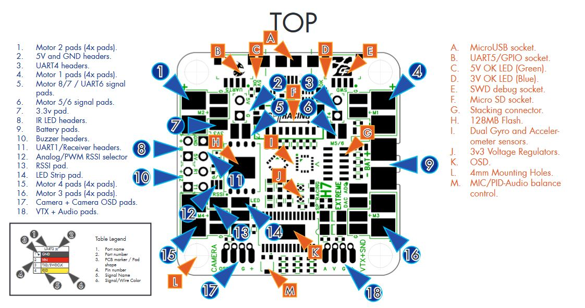
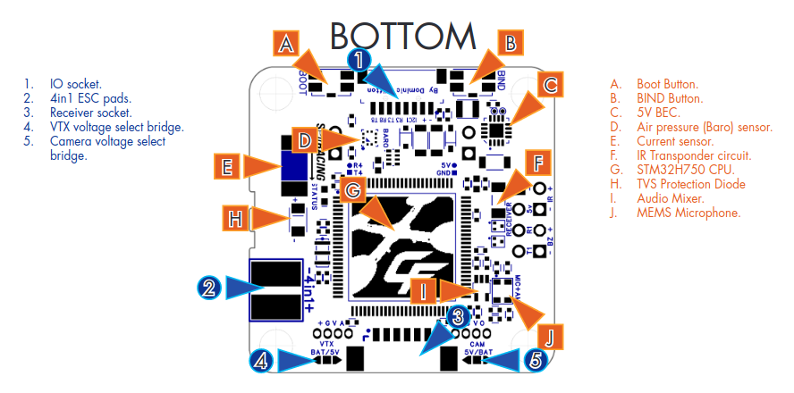

.. _common-spracingh7-extreme:

===================
SPRacing H7 Extreme
===================

The SPRacingH7 Extreme is an autopilot produced by `Seriously Pro Racing <http://www.seriouslypro.com/>`__ .

Specifications
==============

-  **Processor**

   -  STM32F750  ARM 32-bit processor running at 400 MHz
   -  OSD: AT7456E 
   -  128MB Serial NOR flash via QuadSPI for program storage

-  **Sensors**

   -  2x ICM20602
   -  BMP388 barometer
   -  Voltage sensor (2-6S)
   -  Current Sensor (110A Continuous/ 130A Maximum)

-  **Peripheral Connections**

   - 7 UARTs
   - Micro SD Card
   - Micro USB
   - I2C
   - Analog RSSI input
   - Camera and VTX
   - Active Buzzer

-  **Power**

   -  2-6S DC input power
   -  5V, 1A BEC for peripherals

Pinout
======

.. note:: be sure to configure the voltage selection pads for the camera, vtx

VTX Supply Switch
=================
Set the ``RELAYx_PIN`` to "81" for on/off of VTX power pad.

Then select an RC channel for control (Chx) and set its ``RCx_OPTION`` to the appropriate Relay (1-4) that you had set its pin parameter above.

For example, use Channel 10 to control the power using Relay 2:

- :ref:`RELAY2_PIN<RELAY2_PIN>` = "81" (Relay 2 is set by default, but can be changed)
- :ref:`RC10_OPTION<RC10_OPTION>` = "34" (Relay2 Control)

.. note:: setting the above Relay on/high will turn off that supply. If nothing is assigned, default is powered on.

Default UART order
==================

- SERIAL0 = console = USB
- SERIAL1 = Telemetry1 = USART1 (has DMA) normally RC input
- SERIAL2 = Telemetry2 = USART2 (has DMA) (only TX pin available)
- SERIAL3 = GPS1 = USART3 (has DMA)
- SERIAL4 = GPS2 = UART4 (has DMA)
- SERIAL5 = USER = UART5 (has DMA)
- SERIAL6 = USER = USART6 (available instead of PWM outputs 7(TX6) and 8(RX6) if :ref:`BRD_ALT_CONFIG<BRD_ALT_CONFIG>` = 1)
- SERIAL8 = USER = UART8 

Serial port protocols (Telem, GPS, etc.) can be adjusted to personal preferences.

RC Input
========
RC input is configured on the R1 (UART1_RX) pin. It supports all RC protocols except PPM. See :ref:`common-rc-systems` for details for a specific RC system. :ref:`SERIAL1_PROTOCOL<SERIAL1_PROTOCOL>` is set to "23", by default, to enable this.

- SBUS/DSM/SRXL connects to the R1 pin but SBUS requires that the :ref:`SERIAL1_OPTIONS<SERIAL1_OPTIONS>` be set to "3".

- FPort requires connection to T6 and :ref:`SERIAL1_OPTIONS<SERIAL1_OPTIONS>` be set to "7".

- CRSF also requires a T1 connection, in addition to R1, and automatically provides telemetry. Set :ref:`SERIAL1_OPTIONS<SERIAL1_OPTIONS>` to "0".

- SRXL2 requires a connection to T1 and automatically provides telemetry.  Set :ref:`SERIAL1_OPTIONS<SERIAL1_OPTIONS>` to "4".

Any UART can be used for RC system connections in ArduPilot also, and is compatible with all protocols except PPM. See :ref:`common-rc-systems` for details.

OSD Support
===========

The SPracing H7 Extreme onboard OSD is used by setting :ref:`OSD_TYPE<OSD_TYPE>` 1 (MAX7456 driver).

SmartPort Telemetry
===================

SmartPort (Sport) telemetry setup by default to be connected directly to UART2 TX pin with no external inverters required.
 
Dshot capability
================

All motor/servo outputs are DShot and PWM capable. Motor outputs 1-4 are bi-directional DShot capable. However, mixing DShot and normal PWM operation for outputs is restricted into groups, ie. enabling DShot for an output in a group requires that ALL outputs in that group be configured and used as DShot, rather than PWM outputs. The output groups that must be the same (PWM rate or DShot, when configured as a normal servo/motor output) are: 1-4, 5/6, 7/8, 9/10.

Battery Monitor Settings
========================

These should already be set by default. However, if lost or changed:

Enable Battery monitor with these parameter settings :

:ref:`BATT_MONITOR<BATT_MONITOR>` 4

Then reboot.

- :ref:`BATT_VOLT_PIN<BATT_VOLT_PIN>` 11
- :ref:`BATT_CURR_PIN<BATT_CURR_PIN>` 10
- :ref:`BATT_VOLT_MULT<BATT_VOLT_MULT>` 10.9
- :ref:`BATT_AMP_PERVLT<BATT_AMP_PERVLT>` 28.5

RSSI Input
==========

Analog or PWM RSSI Input can be attached to the RSSI pin. Set :ref:`RSSI_ANA_PIN<RSSI_ANA_PIN>` = 0. adjust other RSSI parameters as needed, see :ref:`common-rssi-received-signal-strength-indication`.

NeoPixel LED
============

The LED output is setup for use with NeoPixel LEDs by default.

Firmware
========

Firmware for these boards can be found `here <https://firmware.ardupilot.org>`_ in  sub-folders labeled "SPracingH7".

Loading Firmware
----------------

Since this board stores the flight control software on external flash the initial firmware load should be done using the `SPRacing SSBL <https://github.com/spracing/ssbl>`__ . Please follow the instructions for loading PX4 firmware to load ArduPilot.

A `convenient script <https://github.com/ArduPilot/ardupilot/blob/master/Tools/scripts/ssbl_uploader.sh>`__ is also available to perform the required steps.

It should also be possible to load the ArduPilot firmware and bootloader via DFU <common-loading-firmware-onto-chibios-only-boards>`__ , but doing so will invalidate your warranty.
[copywiki destination="plane,copter,rover,blimp"]
