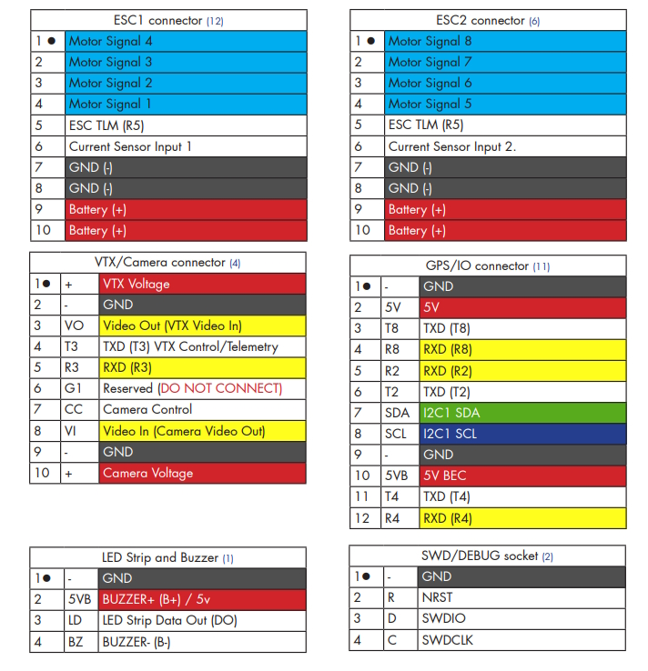

.. _common-spracingh7-rf:

==============
SPRacing H7 RF
==============

The SPRacingH7 RF is an autopilot produced by `Seriously Pro Racing <http://www.seriouslypro.com/>`__ .

.. image:: ../../../images/spracingh7rf.jpg
     :target: ../_images/spracingh7rf.jpg
     :width: 240px

.. warning:: this autopilot does not come preloaded wit ArduPilot and installing the ArduPilot bootloader requires soldering and is recommended only for advanced users,

Specifications
==============

-  **Processor**

 - MCU - STM32H730 32-bit processor running at 520 MHz
 - 2MByte Serial NOR flash via QuadSPI for firmware
 - Onboard Flash: 128Kbytes
 - OSD - Pixel, not supported currently by ArduPilot

-  **Sensors**

 - IMUs - ICM42688
 - Barometer - BMP388

-  **Peripheral Connections**

 - 6x UARTs (USB,2,3,4,5,8)
 - 9x PWM Outputs (8 Motor Output, 1 LED)
 - Micro SD Card
 - Micro USB
 - I2C
 - Active Buzzer

-  **Power**

   -  2-8S DC input power
   -  5V, 1A BEC for peripherals

Pinout
======

.. image:: ../../../images/spracingh7rf_bottom.jpg
     :target: ../_images/spracingh7rf_bottom.jpg

Default UART order
==================

The UARTs are marked Rn and Tn in the above pinouts. The Rn pin is the
receive pin for UARTn. The Tn pin is the transmit pin for UARTn.

 - SERIAL0 -> USB
 - SERIAL2 -> UART2 (RC input)
 - SERIAL3 -> UART3 (DJI)
 - SERIAL4 -> UART4 (GPS)
 - SERIAL5 -> UART5 (ESC Telemetry, RX only)
 - SERIAL8 -> UART8 (USER)

All UARTS are DMA capable

Serial port protocols (Telem, GPS, etc.) can be adjusted to personal preferences.

RC Input
========
Ardupilot does not currently support the integrated ELRS chip.

RC input is configured on the R2 pin. It supports all serial RC
protocols. PPM is not supoorted. For protocols requiring half-duplex serial to transmit
telemetry (such as FPort) you should setup SERIAL2 as an RC input serial port,
with half-duplex, pin-swap and inversion enabled. For duplex protocols, like CRSF/ELRS, T2 must also be connected to the receiver.

Any UART can be used for RC system connections in ArduPilot also, and is compatible with all protocols except PPM. See :ref:`common-rc-systems` for details.

OSD Support
===========

Ardupilot does not currently support the integrated OSD chip. UART3 is setup for use with DisplayPort goggles with OSD.

PWM Output
==========

The SPRacingH7 RF supports up to 9 PWM outputs. PWM 1-8 support DShot and Bi-Directional DShot. The pads for motor output
M1 to M4 on ESC connector 1, and M5 to M8 on ESC connector 2, plus
M9 for LED strip or another PWM output.

The PWM is in 5 groups:

 - PWM 1-4   in group1
 - PWM 5-8  in group2
 - PWM 9 (LED)  in group3

Channels within the same group need to use the same output rate. If
any channel in a group uses DShot then all channels in the group need
to use DShot.

Battery Monitor Settings
========================

The board has a built-in voltage sesnor and current sensor input from the ESC connectors. The voltage sensor can handle up to 8S LiPo batteries.

The correct battery setting parameters are (these aew already set by default):

 - BATT_MONITOR 4 (reboot after setting)
 - BATT_VOLT_PIN 13
 - BATT_CURR_PIN 11
 - BATT_VOLT_MULT 10.9
 - BATT_AMP_PERVLT 28.5 (will need adjustment for the current sensor range of the ESC)

VTX Supply Switch
=================
Set the ``RELAYx_PIN`` to "81" for on/off of VTX power pad.

Then select an RC channel for control (Chx) and set its ``RCx_OPTION`` to the appropriate Relay (1-4) that you had set its pin parameter above.

For example, use Channel 10 to control the power using Relay 2:

- :ref:`RELAY2_PIN<RELAY2_PIN>` = "81" (Relay 2 is set by default, but can be changed)
- :ref:`RC10_OPTION<RC10_OPTION>` = "34" (Relay2 Control)

.. note:: setting the above Relay low will turn off that supply. If nothing is assigned, default is powered on.

NeoPixel LED
============

The LED output is setup for use with NeoPixel LEDs by default.

User Manual
===========

http://seriouslypro.com/files/SPRacingH7RF-Manual-latest.pdf

Firmware
========

Firmware for these boards can be found `here <https://firmware.ardupilot.org>`_ in  sub-folders labeled "SPracingH7RF".

Loading Firmware
----------------

This board stores the flight control software on external flash and requires installing an ArduPilot bootloader while in DFU mode. It is recommended only for advance users. The steps are:

- boot the autopilot in DFU mode by connecting the boot0 test pad on the board to 3.3v test pad
- download the bootloader .bin file from ArduPilot's `bootloader section <https://github.com/ArduPilot/ardupilot/tree/master/Tools/bootloaders>`__
- flash the file using a tool like https://www.st.com/en/development-tools/stm32cubeprog.html

Now it should be possible to load the ArduPilot firmware via the normal :ref:`firmware update procedure <common-loading-firmware-onto-pixhawk>`
[copywiki destination="plane,copter,rover,blimp"]
