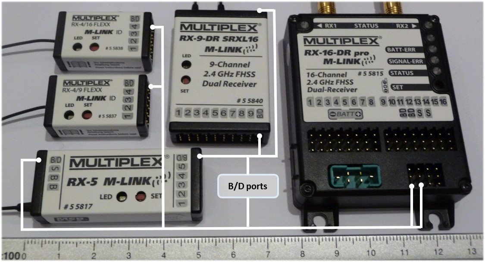
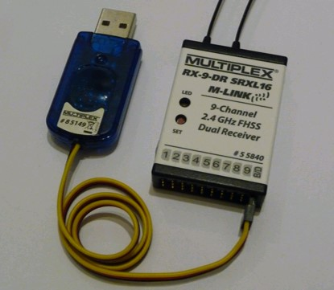
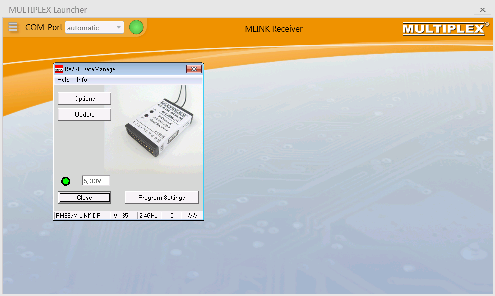
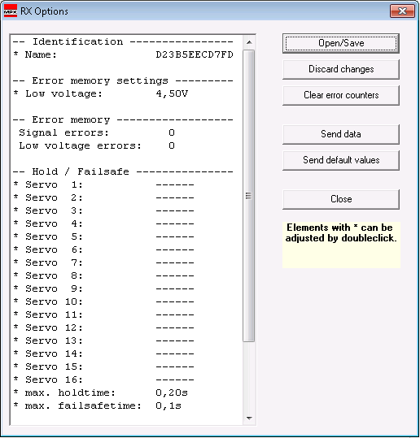
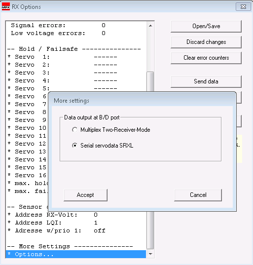

.. _common-srxl-receivers:

==================
SRXL R/C Receivers
==================

This article explains how to use SRXL receivers with ArduPilot.

Overview
========
SRXL is a serial protocol which transfers control data of a R/C receiver to a flight controler or other device. In case of ArduPilot, the R/C receiver transfers servo outputs as a sum signal. ArduPilot is decoding the SRXL datastream of the R/C receiver depending on the SRXL variant identified and extracts the servo output signals. This technique enables the user to connect a SRXL R/C receiver to the pixhawk using a single cable connection similar to a PPM sum signal.

.. note::

   The following SRXL variants are supported by ArduPilot
   
     #. `MULTIPLEX SRXL version 1 "12-channel" <http://www.multiplex-rc.de/Downloads/Multiplex/Schnittstellenbeschreibungen/srxl-multiplex-v2.pdf>`__
     #. `MULTIPLEX SRXL version 2 "16-channel" <http://www.multiplex-rc.de/Downloads/Multiplex/Schnittstellenbeschreibungen/srxl-multiplex-v2.pdf>`__
     #. JR propo X.BUS Mode B
     #. `SPEKTRUM SRXL <http://www.spektrumrc.com/ProdInfo/Files/SPM4649T_Bi-Directional_SRXL_specifications.pdf>`__

.. _common-srxl-receivers-how-to-use-multiplex-srxl-receivers:

How to use **MULTIPLEX** SRXL Receivers
=======================================

MULTIPLEX receivers supporting SRXL
-----------------------------------

All MULTIPLEX receivers which are telemetry capable can be configured to send out a SRXL signal. An exception are the MULTIPLEX FLEXX receivers, which are sending the SRXL signal by default without any receiver configuration required.

SRXL signal output at receivers B/D port
----------------------------------------
The SRXL signal is emitted by the **B/D port(s)** of the receiver.

The number of active channels on the SRXL signal are depending on the type of receiver:

   - `RX-4/9 FLEXX, # 55837 <http://www.multiplex-rc.de/Downloads/Multiplex/Bedienungsanleitungen/55837-bedienungsanleitung-empfaenger-rx-4-9-flexx--de-en-fr-it-es.pdf>`__ , 4 servo sockets, 9 channels active on SRXL signal
   - `RX-4/16 FLEXX, # 55838 <http://www.multiplex-rc.de/Downloads/Multiplex/Bedienungsanleitungen/55838-bedienungsanleitung-empfaenger-rx-4-16-flexx--de-en-fr-it-es.pdf>`__ , 4 servo sockets, 16 channels active on SRXL signal
   - `RX-5, # 55817 <http://www.multiplex-rc.de/Downloads/Multiplex/Bedienungsanleitungen/55817-bedienungsanleitung-empfaenger-rx-5--de-en-fr-it-es.pdf>`__ , 5 servo sockets, 5 channels active on SRXL signal
   - `RX-7, # 55818 <http://www.multiplex-rc.de/Downloads/Multiplex/Bedienungsanleitungen/55818-bedienungsanleitung-empfaenger-rx-7--de-en-fr-it-es.pdf>`__ , 7 servo sockets, 7 channels active on SRXL signal
   - `RX-7-DR, # 55811 <http://www.multiplex-rc.de/Downloads/Multiplex/Bedienungsanleitungen/55811-bedienungsanleitung-empfaenger-rx-7-dr--de-en-fr-it-es.pdf>`__ , 7 servo sockets, 7 channels active on SRXL signal
   - `RX-7-DR compact, # 55819 <http://www.multiplex-rc.de/Downloads/Multiplex/Bedienungsanleitungen/55819-bedienungsanleitung-empfaenger-rx-7-dr-compact--de-en-fr-it-es.pdf>`__ , 7 servo sockets, 7 channels active on SRXL signal
   - `RX-9-DR, # 55812 <http://www.multiplex-rc.de/Downloads/Multiplex/Bedienungsanleitungen/55812-bedienungsanleitung-empfaenger-rx-9-dr--de-en-fr-it-es.pdf>`__ , 9 servo sockets, 9 channels active on SRXL signal
   - `RX-9-DR compact, # 55820 <http://www.multiplex-rc.de/Downloads/Multiplex/Bedienungsanleitungen/55820-bedienungsanleitung-empfaenger-rx-7-dr-compact--de-en-fr-it-es.pdf>`__ , 9 servo sockets, 9 channels active on SRXL signal
   - `RX-9-DR SRXL16, # 55840 <http://www.multiplex-rc.de/Downloads/Multiplex/Bedienungsanleitungen/55840-bedienungsanleitung-rx-9-dr-srxl-16--de-en-fr.pdf>`__ , 9 servo sockets, 16 channels active on SRXL signal
   - `RX-9-DR pro, # 55813 <http://www.multiplex-rc.de/Downloads/Multiplex/Bedienungsanleitungen/55813-bedienungsanleitung-empfaenger-rx-9-dr-pro--de-en-fr-it-es.pdf>`__ , 9 servo sockets, 9 channels active on SRXL signal
   - `RX-12-DR pro, # 55814 <http://www.multiplex-rc.de/Downloads/Multiplex/Bedienungsanleitungen/55814-bedienungsanleitung-empfaenger-rx-12-dr-pro--de-en-fr-it-es.pdf>`__ , 12 servo sockets, 12 channels active on SRXL signal
   - `RX-12-DR compact, # 55821 <http://www.multiplex-rc.de/Downloads/Multiplex/Bedienungsanleitungen/55821-bedienungsanleitung-empfaenger-rx-7-dr-compact--de-en-fr-it-es.pdf>`__ , 12 servo sockets, 12 channels active on SRXL signal
   - `RX-16-DR pro, # 55815 <http://www.multiplex-rc.de/Downloads/Multiplex/Bedienungsanleitungen/55815-bedienungsanleitung-empfaenger-rx-16-dr-pro--de-en-fr-it-es.pdf>`__ , 16 servo sockets, 16 channels active on SRXL signal

How to configure a MULTIPLEX receiver for SRXL signal output
------------------------------------------------------------
To configure the receiver to send out SRXL signal you need a USB to UART Adapter. 

    
For this purpose MULTIPLEX offers the plug-and-play `PC-cable # 85149 <http://www.multiplex-rc.de/produkte/85149-usb-pc-kabel-rx-s-telemetrie-uni>`__ which contains a SILABS CP2102 Single-chip USB to UART Bridge.

To do the configuration follow the following steps:

- Download and install `MULTIPLEX Launcher <http://www.wingstabi.de/download/mpx_launcher.exe>`__ Software
- With Transmitter switched off, connect PC-cable # 85149 to a B/D port of the receiver and connect a sufficient power supply to any of the servo sockets.
- Start the MULTIPLEX Launcher Software and connect PC-cable # 85149 to the PC.
- MULTIPLEX Launcher will detect the connected device automatically and will open the “RX/RF DataManager”-Window.

- In the “RX/RF DataManager”-Window click “Options” and the “RX Options”-Window will be opened.

- In the “RX-Options” Window scroll down to “More Settings”. In the “More Settings” section double-click “* Options…” to open the “More setting”-Window and select “Serial servodata SRXL” as data output at B/D port. Close the “More setting”-Windows by clicking “Accept”.

- Upload data to the receiver by clicking “Send data” in the “RX Options”-Window.

.. note:: 
      There will be no active feedback of the receiver to show you that data are stored successfully. But no worries – they will be stored reliably.

- To complete the SRXL activation on B/D port click “Close” in the “RX Options”-Window and “Close” in the “RX/RF DataManager”-Window.
- To reboot the receiver, disconnect PC-cable and power supply from the receiver.
- Receiver is now configured for SRXL output.
- Connect receivers to the PIXHAWK as described :ref:`here <common-pixhawk-and-px4-compatible-rc-transmitter-and-receiver-systems-multiplex-srxl>`.
- Test and adjust servo channel assignments in Mission planner if required. MULTIPLEX radios without free servo assignment (e.g. Cockpit SX) have the following standard servo assignment:
   
.. image:: ../../../images/Multiplex_SRXL_Receivers_Standard_Servo_Assignment.jpg
    :target: ../_images/Multiplex_SRXL_Receivers_Standard_Servo_Assignment.jpg
