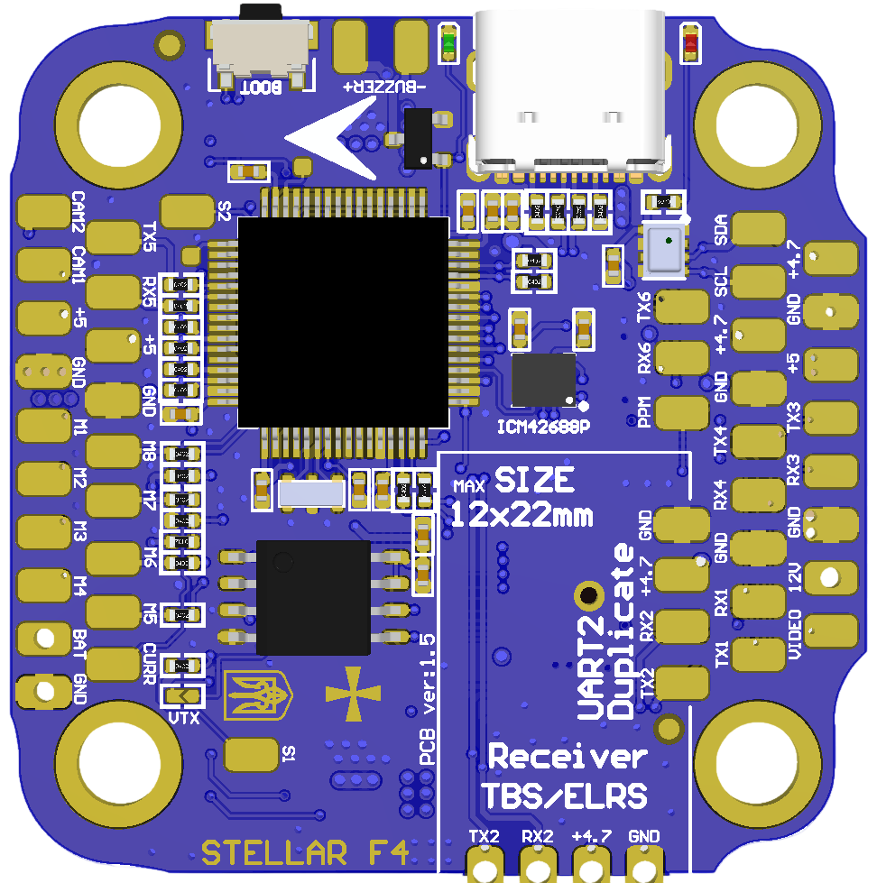

.. _common-stellarf4:
[copywiki destination="plane,copter,rover,blimp"]
===========================
StellarF4 Flight Controller
===========================
Stellar F4V2 is an autopilot by `Stingbee <https://stingbee.com.ua/flight_controllers/stellarf4>`__.

Features
========

* Processor
   *  STM32F405
* Sensors
   *  ICM-42688p/BMI270 Acc/Gyro
   *  DPS310/BMP280 barometer
   *  AT7456E OSD
   *  W25Q128 dataflash
* Power
   *  2S-6S Lipo input voltage with voltage monitoring
   *  12V, 3A BEC for powering Video Transmitter
   *  5V, 2A BEC for internal and peripherals
* Interfaces
   *  10x PWM outputs DShot capable, PWM1-4 DShot capable
   *  6x UARTs
   *  1x I2C
   *  2x ADC
   *  SPI flash for logging
   *  USB-C port
* LED
   *  Red, 3.3V power indicator
   *  Green, FC status
* Size
   *  41 x 41mm PCB with 30.5mm M3 mounting

Pinout
======

.. image:: ../../../images/StellarF4-bot.png
   :target: ../_images/StellarF4-bot.png

UART Mapping
============
The UARTs are marked RXn and TXn in the above pinouts. The RXn pin is the
receive pin for UARTn. The TXn pin is the transmit pin for UARTn.

- SERIAL0 -> USB
- SERIAL1 -> USART1 (DJI / VTX, DMA capable)
- SERIAL2 -> USART2 (Serial RC input, DMA capable)
- SERIAL3 -> USART3 (User) (NO DMA)
- SERIAL4 -> UART4 (User) (NO DMA)
- SERIAL5 -> UART5 (ESC Telemetry) (NO DMA)
- SERIAL6 -> USART6 (GPS) (NO DMA)

RC Input
========
The default RC input is configured on the UART2(SERIAL1) RX2 input and can be used for all ArduPilot supported unidirectional receiver protocols except PPM.

* SBUS/DSM/SRXL connects to the RX2 pin.
* CRSF also requires a TX2 connection, in addition to RX2, and automatically provides telemetry.
* FPort requires connection to TX2 and :ref:`SERIAL1_OPTIONS<SERIAL1_OPTIONS>` set to "7". See :ref:`common-FPort-receivers`.
* SRXL2 requires a connection to TX2 and automatically provides telemetry. Set :ref:`SERIAL1_OPTIONS<SERIAL1_OPTIONS>` to “4”.

OSD Support
===========
StellarF4V2 supports using its internal OSD using OSD_TYPE 1 (MAX7456 driver).
External OSD support such as DJI or DisplayPort can be used simultaneously and is preconfigured on SERIAL3 but can be supported on any spare UART. See :ref:`common-msp-osd-overview-4.2` for more info.

PWM Output
==========
StellarF4V2 supports up to 10 PWM/Dshot outputs. PWM1-4 outputs support Bi-Directional DShot.

Channels 1-4 support bi-directional DShot. Channels 1-8 marked as M1-M8 on the board. Channels 9-10 marked as S1-S2 on the board. PWM outputs are grouped and every group must use the same output protocol:

* 1, 2, 3, 4  are Group 1;
* 5, 6, 7, 8  are Group 2;
* 9           is Group 3;
* 10           is Group 4;

Battery Monitoring
==================
The board has 1 built-in voltage divider on an ADC input and 1x current ADC input and supports and external 3.3V based current sensor. The voltage input is compatible with 2~6S LiPo batteries.

The default battery parameters are:

* :ref:`BATT_MONITOR<BATT_MONITOR>` = 4
* :ref:`BATT_VOLT_PIN<BATT_VOLT_PIN__AP_BattMonitor_Analog>` = 10
* :ref:`BATT_CURR_PIN<BATT_CURR_PIN__AP_BattMonitor_Analog>` = 11 (CURR pin)
* :ref:`BATT_VOLT_MULT<BATT_VOLT_MULT__AP_BattMonitor_Analog>` = 11
* :ref:`BATT_AMP_PERVLT<BATT_AMP_PERVLT__AP_BattMonitor_Analog>` = 52.7

Compass
=======
StellarF4V2 does not have a built-in compass, but you can attach an external compass using I2C on the SDA and SCL pads.

Camera Switch
=============
GPIO 81 controls which camera input (CAM1 or CAM2) is applied to the internal OSD. A :ref:`RELAY <common-relay>` function can be enabled to control the switching.

Loading Firmware
================
Firmware for these boards can be found at https://firmware.ardupilot.org in sub-folders labeled StellarF4.

Initial firmware load can be done with DFU by plugging in USB with the
boot button pressed. Then you should load the "ardu*_with_bl.hex" firmware, using your favourite DFU loading tool. eg STM32CubeProgrammer

Subsequently, you can update firmware with Mission Planner.
