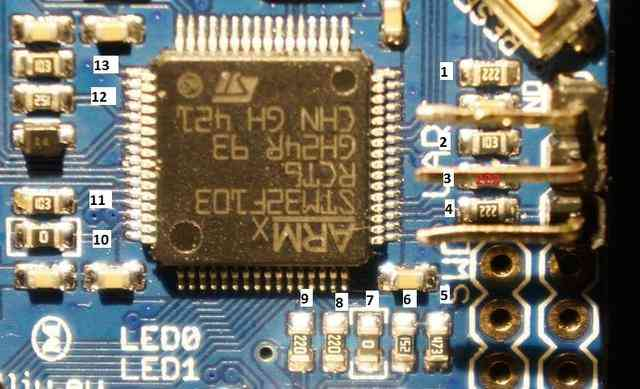

.. _common-storm32-gimbal:

=========================
STorM32 Gimbal Controller
=========================

The *STorM32-BGC* is a relatively low-cost 3-axis brushless gimbal
controller that can communicate with ArduPilot (Copter, Plane and Rover)
using MAVLink.

With 3-axis control and MAVLink interface, the STorM32 offers more
capabilities and than the Tarot Gimbal.  MAVLink is a richer
communications format that PWM and may be used in the future to provide
additional information to the gimbal including centrefugal force
corrections leading to better performance during aggressive maneuvers.

Please refer to the `STorM32-BGC wiki pages <http://www.olliw.eu/storm32bgc-wiki/Main_Page>`__ for more
detailed information including where the gimbals can be purchased.  This
gimbal has been tested with a `DYS 3-axis brushless gimbal <https://hobbyking.com/en_us/dys-smart3-3-axis-gopro-gimbal-with-alexmos-control-board-basecam.html?___store=en_us>`__.

.. note::

   Support for this gimbal is included for
   gimbals running
   `v067e <http://www.olliw.eu/storm32bgc-wiki/Downloads>`__ (or higher). 

Be aware that some v1.3x boards has been found to cause significant RF interference on the 433mhz and 915mhz band.
Use with caution, if you are using either 433/915mhz control or telemetry.

Connecting the gimbal to the Pixhawk
====================================

You will need to solder 3-pins of a `DF13 6-pin cable <http://store.jdrones.com/cable_df13_6pin_25cm_p/cbldf13p6c25.htm>`__
to the gimbal controller board as shown above and then plug the other
end into one of the Pixhawk's Telemetry ports (Telem1, Telem2, Serial4).

.. note::

   The remaining 3 pins (VCC, RTS, CTS) of the cable should not be
   connected.

.. _common-storm32-gimbal_configuring_the_gimbal:

Configuring the gimbal
======================

In addition to the regular gimbal configuration described on the
`STorM32-BGC wiki <http://www.olliw.eu/storm32bgc-wiki/Getting_Started>`__, the
MAVlink heartbeats should be enabled through OlliW's o323BGCTool's
**Tools \| Expert Tool** screen as shown below.

.. image:: ../../../images/SToRM32_enableMavlink.png
    :target: ../_images/SToRM32_enableMavlink.png

Set-up through the Mission Planner (MAVLink protocol)
=====================================================

Through your GCS (i.e. MP's Full Param List or Tree) set the following
parameters

If using Telem1:

-  ``SERIAL1_BAUD = "115"``\ 
-  ``SERIAL1_PROTOCOL = "1"``\ 
-  ``BRD_SER1_RTSCTS = "0"``\ 

If using Telem2:

-  ``SERIAL2_BAUD = "115"``\ 
-  ``SERIAL2_PROTOCOL = "1"``\ 
-  ``BRD_SER2_RTSCTS = "0"``\ 

If using Serial4:

-  ``SERIAL4_BAUD = "115"``\ 
-  ``SERIAL4_PROTOCOL = "1"``\ 

Set ``MNT_TYPE`` to "4" to enable the STorM32 gimbal driver (the Pixhawk
must be rebooted for this change to take effect).

Set ``MNT_RC_IN_TILT`` to "6" if you wish to control the gimbal's tilt
(aka pitch angle) with your transmitters ch6 tuning knob.

Set the ``MNT_ANGMAX_PAN``, ``MNT_ANGMIN_TIL``, ``MNT_ANGMIN_ROL`` and
``MNT_ANGMIN_PAN``, ``MNT_ANGMIN_TIL``, ``MNT_ANGMIN_ROL`` to match the
range of your gimbal. For example, the screenshot below shows a setup in
which the gimbal has:

-  360 of yaw rotation (``MNT_ANGMIN_PAN`` = -18000, ``MNT_ANGMAX_PAN``
   = 17999)
-  60 degrees of roll (``MNT_ANGMIN_ROL`` = -6000, ``MNT_ANGMAX_ROL`` =
   +6000)
-  Can point straight down (``MNT_ANG_MIN_TIL`` = -9000)
-  Can point straight up (``MNT_ANG_MAX_TIL`` = +9000)

.. image:: ../../../images/SToRM32_MP_MountParams.png
    :target: ../_images/SToRM32_MP_MountParams.png

Set-up through the Mission Planner (STorM32 serial protocol)
============================================================

The custom STorM32 protocol was added as an alternative to the MAVLink
protocol and has the same features. To use the serial protocol use all
the same settings as above except:

-  Set ``SERIALX_PROTOCOL`` to "8" (where "X" is "1", "2" or "4" depending upon which Pixhawk serial port the gimbal is connected to)
-  Set ``MNT_TYPE`` to "5"
-  When :ref:`Configuring the Gimbal <common-storm32-gimbal_configuring_the_gimbal>` controller set the "MAVLink configuration" parameter to "no heartbeat"

Testing the gimbal
==================

For instructions for testing the gimbal moves correctly please check the
:ref:`similar section for the SimpleBGC gimbal <common-simplebgc-gimbal_testing_the_gimbal_moves_correctly>`.

The video below shows the STorM32 being tested on Copter3.3. 
It demonstrates a few features that would not be possible on a 2-axis gimbal like the :ref:`Tarot Gimbal <common-tarot-gimbal>`.

..  youtube:: LAKrGXSFWpM
    :width: 100%

Resistor issue on some boards
=============================

Some in-depth analysis `here on rcgroups <https://www.rcgroups.com/forums/showthread.php?2494532-Storm32-with-Pixhawk-over-serial-connection/page5>`__
turned up that some STorM32 boards need resistor #4 (shown in pic below)
shorted (i.e. a wire soldered over the top of the resistor to turn it
into a regular wire) in order for the gimbal controllers messages to get
through to the Pixhawk.

