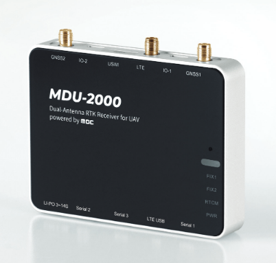

.. _common-synerex-mdu-2000:

================
Synerex MDU-2000
================

MDU-2000 UAV Kit is a GNSS RTK receiver for UAV with dual antenna support that provides centimeter-level position and heading in real time. MBC RTK service guarantees less than 3cm latitude/longitude error and 10cm altitude error. It supports azimuth using dual antenna RTK technology instead of conventional external COMPASS, which is greatly affected by metals or electromagnetic fields, enabling more stable flight near high-voltage power lines and large structures.

Features
========

- Provides heading in presence of magnetic field interference.
- Dual Band
- Built-in LTE cellular interface to obtain NTRIP RTK informance without additional equipment
- 30ns accurate PPS output for time references to external equipment requiring time synchronization
- 3 to 14 cell LiPo power input
- Size: 95mm x 75mm x 15mm
- 127g

ArduPilot Setup for Moving Baseline Yaw
=======================================

The unit is connected to two autopilot UARTs. In this example SERIAL3 and SERIAL4.

- :ref:`SERIAL3_BAUD <SERIAL3_BAUD>` = 38
- :ref:`SERIAL3_PROTOCOL <SERIAL3_PROTOCOL>` = 5
- :ref:`SERIAL4_BAUD <SERIAL4_BAUD>` = 38
- :ref:`SERIAL4_PROTOCOL <SERIAL4_PROTOCOL>` = 5
- :ref:`GPS1_TYPE <GPS1_TYPE>` = 17 ("UBlox moving baseline base")
- :ref:`GPS2_TYPE <GPS2_TYPE>` = 18 ("UBlox moving baseline rover")
- Set the :ref:`GPS1_POS_X <GPS1_POS_X>`/Y/Z and :ref:`GPS2_POS_X <GPS2_POS_X>`/Y/Z parameters for the GPSs (see :ref:`Sensor Position Offset are here <common-sensor-offset-compensation>`)
- :ref:`GPS_AUTO_SWITCH <GPS_AUTO_SWITCH>` = 1
- :ref:`EK2_ENABLE<EK2_ENABLE>` = 0 (to disable EKF2)
- :ref:`EK3_ENABLE<EK3_ENABLE>` = 1 (to enable EKF3)
- :ref:`AHRS_EKF_TYPE <AHRS_EKF_TYPE>` = 3 (to use EKF3)

If using 4.0 firmware in autopilot:

- :ref:`EK3_MAG_CAL <EK3_MAG_CAL>` = 5 ("Use external yaw sensor")

If using 4.1 (or higher):

- :ref:`EK3_MAG_CAL <EK3_MAG_CAL>` is not used for this feature so it can be left at its default value ("0" for Plane, "3" for Copter, "2" for Rover)
- :ref:`EK3_SRC1_YAW <EK3_SRC1_YAW>` = 2 ("GPS") or 3 ("GPS with Compass Fallback")

See :ref:`common-gps-for-yaw` for more information and options.

`USER MANUAL <https://7245aca7-d092-4daf-b57d-4a2bfea81afd.filesusr.com/ugd/582ab3_c286f0f31f264847acc90817b65ebdb5.pdf>`__
===========================================================================================================================

Where to Buy
============

`Synerex <https://smartstore.naver.com/synerex/products/6055792991>`__
