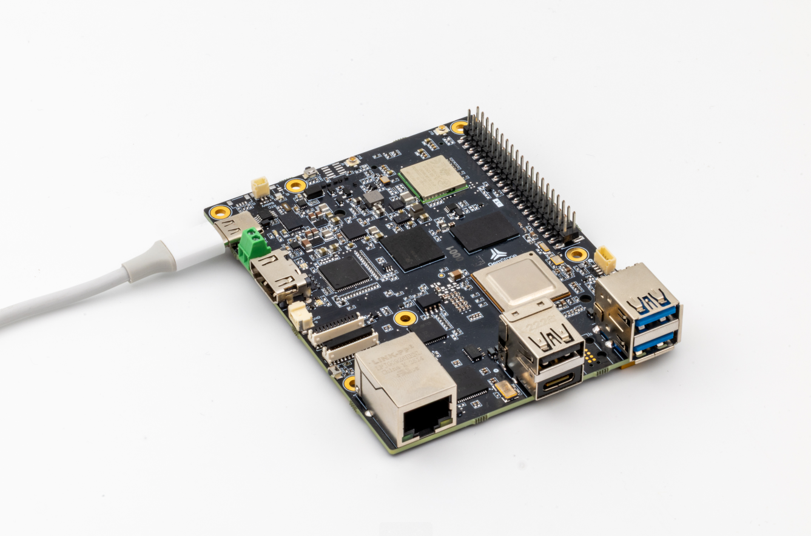

.. _common-t3-gem-o1-overview:

=======================
T3 Gemstone O1 Overview
=======================

This page presents `T3 Gemstone O1 <https://t3gemstone.org/en/>`__ - High-performance development board based
on Texas Instruments AM67A processor, which runs well proven ArduPilot flight stack on Linux.

Specifications
==============

-  **Processor** (`TI AM67A <https://www.ti.com/product/AM67A/>`__)

   -  Quad-core 64-bit ARM Cortex-A53 @1.4 GHz for running high-level operating systems such as Linux
   -  Dual single-core ARM Cortex-R5F @800 MHz for running real-time MCU applications
   -  Dual 2 TOPS (4 TOPS total) deep learning accelerators for running vision applications
   -  Advanced 50 GFLOPS GPU for high-performance graphics processing
   -  4GB LPDDR4 RAM

-  **Sensors**

   -  InvenSense ICM-20948 IMU (accel, gyro, compass)
   -  Bosch BMP390 barometer
   -  TI HDC2010 humidity and temperature

-  **Storage**

   -  **On-board**

      -  32GB eMMC flash
      -  512Kbit EEPROM

   -  **Expandable**

      -  microSD card slot
      -  M.2 2280 SSD port

-  **Network Connections**

   -  1x Gigabit ethernet
   -  1x CAN bus
   -  Wi-Fi 4 (802.11n)
   -  Bluetooth 5.1, Bluetooth Low Energy (BLE)

-  **Power**

   -  USB Type-C power (5-9V / 3A)
   -  DC power connector (5-12V / 3A)

-  **Interfaces**

   -  UART, I2C and SPI for extensions
   -  S.Bus input
   -  7x PWM servo outputs
   -  Green-red status leds
   -  Real-time clock
   -  Fan with PWM speed control
   -  4x USB ports
   -  2x 4-lane MIPI CSI/DSI
   -  1x HDMI

For more details and purchase
=============================

- `Website <https://t3gemstone.org/en/>`__
- `Board Specs <https://docs.t3gemstone.org/en/boards/o1/introduction/>`__
- `Documentation <https://docs.t3gemstone.org/en/projects/ardupilot/>`__

[copywiki destination="plane,copter,rover,blimp,sub"]
