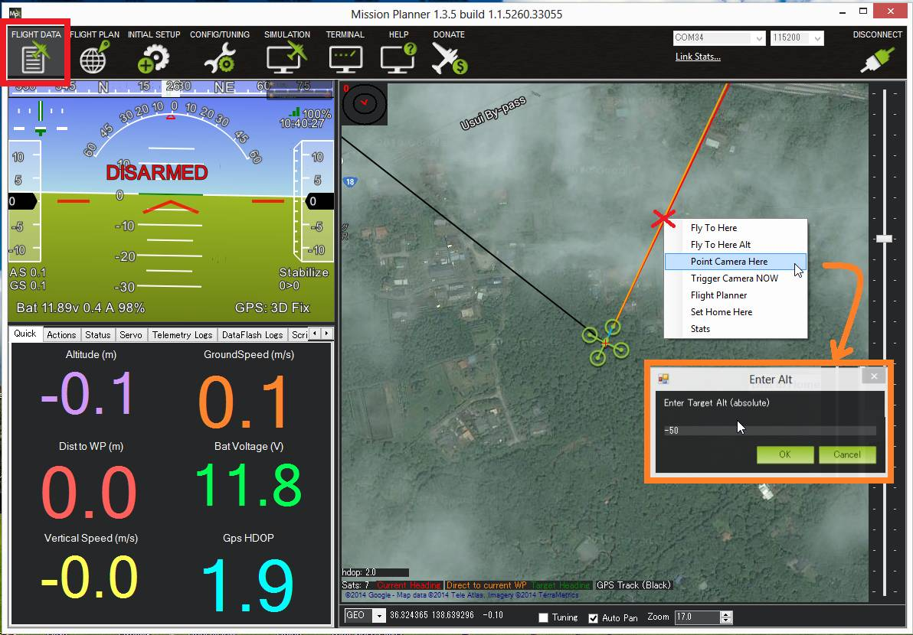

.. _common-tarot-gimbal:

============
Tarot Gimbal
============

The `Tarot 2-Axis Gimbal <https://store.3dr.com/products/tarot-t-2d-brushless-gimbal-kit>`__
is the recommended gimbal for the :ref:`Pixhawk <common-pixhawk-overview>`
and :ref:`APM2 <common-apm25-and-26-overview>` due to its low cost and good
performance.

Copter, Plane, Rover support passing through a pilot desired roll or
pitch angle and also more advanced automated aiming of the camera (i.e.
ROI - region-of-interest).

.. image:: ../../../images/Tarot_OnX8.jpg
    :target: ../_images/Tarot_OnX8.jpg

Gimbal Assembly instructions
============================

Paper instructions are normally provided with the gimbal and a short
user manual can also be found in the "User Manual" directory of the
`Tarot Gimbal Firmware v1.5 zip <http://download.ardupilot.org/downloads/wiki/advanced_user_tools/ZYX-BMGC-EN_V1.5.zip>`__
file.

Connecting the gimbal to the Pixhawk
====================================

.. image:: ../../../images/Gimbal_Pixhawk_Tarot.jpg
    :target: ../_images/Gimbal_Pixhawk_Tarot.jpg

The Tarot gimbal's red and black power wires should be connected
directly to a 2S or 3S battery. If you plan to use 4S, please use a
voltage regulator to ensure the voltage stays within safe operating
limits: DC 7.4 V - 14.8 V (recommended 12 V). 3DR RTF Quad, Y6, and X8
include a voltage regular to allow use of 4S batteries with the Tarot
gimbal.

The "T" pin should be connected to the Pixhawk's AUX1 signal pin.

One of the two "-" pins should be connected to the Pixhawk's AUX1 ground
pin.

Operation
=========

Upon powering your vehicle, the gimbal will display a solid yellow light
while it is starting and calibrating. Do not touch the gimbal while it
is starting up. When the gimbal displays a blinking blue light, it is
ready for flight. If the gimbal is not connected to the autopilot, it
will perform basic stabilization without autopilot control, indicated by
a solid blue light.

**LED meanings**

Solid yellow      = calibrating

Blinking blue      = ready, connected to autopilot

Solid blue     = ready, not connected to autopilot

Configuring the gimbal
======================

Tarot gimbals purchased from 3DR should come pre-configured to work with
Copter but if you have purchased from another source or just wish to
change the configuration you should:

#. Use the provided USB dongle to connect the Gimbal board to your
   computer (Windows only).  If this is the first time you have plugged
   in the dongle you will likely see a USB device installation window. 
   After successful installation of the driver a new COM port named
   "Prolific USB-to-Serial Comm Port" should appear in the Device
   Manager as shown below.  If drivers cannot be found you may be able
   to install Windows 7 or Windows XP drivers using one of the .exe
   files found in the "driver" directory of the `Tarot Gimbal Firmware v1.5 zip <http://download.ardupilot.org/downloads/wiki/advanced_user_tools/ZYX-BMGC-EN_V1.5.zip>`__
   file. 

   .. image:: ../../../images/Gimbal_Tarot_DeviceManager2.png
       :target: ../_images/Gimbal_Tarot_DeviceManager2.png
   
   .. note::
   
       Windows 8 and 10 users may find issues with the Prolific USB-to-Serial driver not starting.  This issue can apparently be resolved according by `following instructions on this web page: <http://leftbraintinkering.blogspot.jp/2013/05/usb-to-serial-prolific-2303-device.html>`__
   
#. Download and unzip the `Tarot Gimbal Firmware v1.5 zip <http://download.ardupilot.org/downloads/wiki/advanced_user_tools/ZYX-BMGC-EN_V1.5.zip>`__
   file to a convenient place on your computer.
#. Double click on the **ZYX-BMGC-EN_V1.5.exe** file (found in the
   above zip) and the configuration UI shown below should appear

   .. image:: ../../../images/Tarot_Gimbal_Config.png
       :target: ../_images/Tarot_Gimbal_Config.png
    
#. Power the Gimbal by plugging in the battery.
#. In the configuration UI, select the COM port and press the **Open COM Port** button.  After a few seconds the image of the camera should begin moving as the gimbal is moved.
#. The most important setting is to set the **Default Mode** (just above COM port drop-down) to **Default Mode: stick position mode**.  Select this and press **Write Settings To Flash**.  Alternatively to load all the 3DR recommended configuration:

   #. First right-click on `this link to the 3DR_Tarot.bgsc file <https://raw.githubusercontent.com/diydrones/ardupilot/master/Tools/Frame_params/3DR_Tarot.bgsc>`__
      and save to somewhere on your computer.
   #. Press the **Load Config** button on the configuration UI and
      select the *3DR_Tarot.bgsc file* downloaded above.
   #. Press Write **Settings To Flash** button

Set-up through the mission planner
==================================

The channel 6 tuning knob's output can be used to control the pitch
angle of the gimbal by:

-  Connect the Pixhawk to the mission planner
-  Open the **Initial Setup \| Optional Hardware \| Camera Gimbal**
   screen set:

   -  Tilt drop-down to RC9 (equivalent to the Pixhawk's AUX OUT1)
   -  Input Ch drop-down to RC6
   -  The "Stabilize Tilt" checkbox should not be checked

:ref:`Do-Set-ROI <copter:mission-command-list_do-set-roi>`
mission commands and the MP's "Point Camera Here" feature should work if
the Tilt Servo Limits and Angle Limits Min and Max values as set as
shown above.

The "Servo Limits" holds the minimum and maximum PWM values that will be
sent from the APM/Pixhawk to the gimbal (i.e. on RC9 if set-up like
above).

The "Angle Limits" are the earth-frame angles (in degrees) that the
gimbal can achieve. "0" degrees is straight ahead, "90" degrees is
straight up, "-90" degrees is straight down. The Tarot gimbal is capable
of pointing straight down (i.e. "-90") to straight ahead (i.e. "0").

.. _common-tarot-gimbal_testing_the_gimbal_moves_correctly:

Testing the gimbal moves correctly
==================================

**Testing the pilot's control of pitch**

Once powered the gimbal should point to it's Tilt Angle Min (i.e.
straight down) when your transmitter's channel 6 tuning knob is at it's
minimum pwm value (perhaps around 1000) and the camera should point to
it's maximum tilt angle (i.e. straight forward) when the tuning knob is
at it's maximum (perhaps around 2000). The mission planner's Radio
calibration page can be used to check the Ch6's current input pwm value.

**Testing ROI**

**You must have GPS lock to test ROI.** The ROI feature points the vehicle and/or camera to point at a target. The instructions above describe setting up the APM/Pixhawk so that it only controls the Tilt (i.e. pitch) of the Tarot gimbal so when a :ref:`Do-Set-ROI <copter:mission-command-list_do-set-roi>` command is received Copter will attempt to turn the vehicle's nose to point in the direction of the target and tilt camera depending upon the vehicle's distance and altitude. You can test the gimbal tilt moves correctly by connecting with the mission planner, then on the Flight Data screen's map, right-mouse-button-click on a point about 50m ahead of the vehicle (the orange and red lines show the vehicle's current heading), select "Point Camera Here" and input an altitude of -50 (meters). This should cause the gimbal to point down at about 45 degrees.

Updating the gimbal software
============================

The gimbal must be running firmware version 1.4 or higher. Follow the instructions below to update both the controller and motor firmwares.

#. Connect the gimbal to your computer using the USB dongle. Ensure that the gimbal end is plugged into the "Gimbal Controller Connector" (see diagram in the Connecting the Gimbal to the Pixhawk section above). Leave the gimbal unpowered for now.
#. Start the "ZYX-BMGC-EN_V1.5" configuration application
#. Select **Open Firmware** and select the **../Firmware_V1.5/Gimbal Controller Firmware V1.5.bgsf** file from the `Tarot Gimbal Firmware v1.5 zip. <http://download.ardupilot.org/downloads/wiki/advanced_user_tools/ZYX-BMGC-EN_V1.5.zip>`__
#. Select the COM Port that has been assigned to the gimbal, then select "Open COM Port."
#. Select **Start Upgrade**.
#. Connect the battery to power the gimbal. You will see a green progress bar on the screen indicating the status of the update.
#. To verify that the firmware has updated successfully, disconnect and reconnect the battery. Select **Open COM Port**, and check that the version firmware number now displays the updated version.
#. Now you'll need to update the motor firmware. Disconnect the battery from the gimbal so that it is not powered. Disconnect the USB dongle from the "Gimbal Controller Connector" and reconnect to the "Motor Driver Connector" on the other side of the board.
#. Select **Motor Configuration**.
#. Select **Open COM Port**. Ensure that the same COM port as before is selected (the gimbal controller and motor controller use the same COM port)
#. Now select **Open Firmware**, but this time select the **../Firmware_V1.5/Motor Driver Firmware V1.5.bmcf** file.
#. Select **Start Upgrade**.
#. Connect the battery to power the gimbal. There will be another progress bar indicating the status of the upgrade.
#. Disconnect and reconnect the battery from the gimbal to complete the upgrade process.
#. You may need to check/set the configuration settings again, as above. In particular, check that the manual control mode is "Stick Position Mode" and remember to write your settings when you're done!

..  youtube:: A2WXguD2Ghs
    :width: 100%

