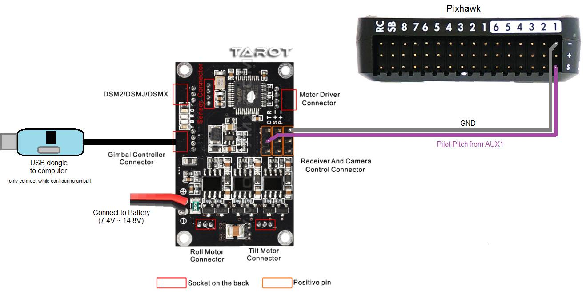

.. _common-tarot-gimbal:

============
Tarot Gimbal
============

.. note::

   The Tarot T-2D has been a popular low cost 2-axis brushless gimbal. While this actual hardware has been retired and manufacturer support discontinued, this page is intended to keep up basic support for this item, as well as to serve as an illustrative example of how to configure ardupilot gimbal control options.

.. image:: ../../../images/Tarot_OnX8.jpg
    :target: ../_images/Tarot_OnX8.jpg
    :width: 450px

.. note::

    The instructions below recommend using `Tarot Gimbal Firmware v1.5 <https://download.ardupilot.org/downloads/wiki/advanced_user_tools/ZYX-BMGC-EN_V1.5.zip>`__

Connecting to the Autopilot
---------------------------

- The Tarot gimbal's red and black power wires should be connected directly to a 2S or 3S battery. If you plan to use 4S (or higher), please use a voltage regulator to ensure the voltage stays within safe operating limits: DC 7.4 V - 14.8 V (recommended 12 V). 3DR RTF Quad, Y6, and X8 include a voltage regular to allow use of 4S batteries with the Tarot gimbal
- The "T" pin should be connected to the Pixhawk's AUX1 signal pin
- One of the two "-" pins should be connected to the Pixhawk's AUX1 ground pin

Operation
---------

Paper instructions are normally provided with the gimbal but a slightly out of date user manual can be found in the "User Manual" directory of the
`Tarot Gimbal Firmware v1.5 zip <https://download.ardupilot.org/downloads/wiki/advanced_user_tools/ZYX-BMGC-EN_V1.5.zip>`__ file.

Upon powering your vehicle, the gimbal will display a solid yellow light
while it is starting and calibrating. Do not touch the gimbal while it
is starting up. When the gimbal displays a blinking blue light, it is
ready for flight. If the gimbal is not connected to the autopilot, it
will perform basic stabilization without autopilot control, indicated by
a solid blue light.

**LED meanings**

- Solid yellow      = calibrating
- Blinking blue      = ready, connected to autopilot
- Solid blue     = ready, not connected to autopilot

Configuring the Gimbal
----------------------

Tarot gimbals normally work out of the box but if you wish to
change the gimbal's internal configuration:

#. Use the provided USB dongle to connect the Gimbal board to your
   computer (Windows only).  If this is the first time you have plugged
   in the dongle you will likely see a USB device installation window. 
   After successful installation of the driver a new COM port named
   "Prolific USB-to-Serial Comm Port" should appear in the Device
   Manager as shown below.  If drivers cannot be found you may be able
   to install Windows 7 or Windows XP drivers using one of the .exe
   files found in the "driver" directory of the `Tarot Gimbal Firmware v1.5 zip <https://download.ardupilot.org/downloads/wiki/advanced_user_tools/ZYX-BMGC-EN_V1.5.zip>`__
   file

   .. image:: ../../../images/Gimbal_Tarot_DeviceManager2.png
       :target: ../_images/Gimbal_Tarot_DeviceManager2.png
       :width: 300px

   .. note::

       Windows 8 and 10 users may find issues with the Prolific USB-to-Serial driver not starting.  This issue can apparently be resolved according by `following instructions on this web page: <http://leftbraintinkering.blogspot.com/2013/05/usb-to-serial-prolific-2303-device.html>`__

#. Download and unzip the `Tarot Gimbal Firmware v1.5 zip <https://download.ardupilot.org/downloads/wiki/advanced_user_tools/ZYX-BMGC-EN_V1.5.zip>`__ file to a convenient place on your computer
#. Double click on the **ZYX-BMGC-EN_V1.5.exe** file (found in the above zip) and the configuration UI shown below should appear

   .. image:: ../../../images/Tarot_Gimbal_Config.png
       :target: ../_images/Tarot_Gimbal_Config.png

#. Power the Gimbal by plugging in the battery
#. In the configuration UI, select the COM port and press the **Open COM Port** button.  After a few seconds the image of the camera should begin moving as the gimbal is moved
#. The most important setting is to set the **Default Mode** (just above COM port drop-down) to **Default Mode: stick position mode**.  Select this and press **Write Settings To Flash**

Set-up through the Ground Station
---------------------------------

.. image:: ../../../images/Tarot_MP_CameraGimbal_setup.png
    :target: ../_images/Tarot_MP_CameraGimbal_setup.png

If using the Mission Planner a Camera Gimbal setup screen is available as shown above:

- "Type" should be set to "Servo"
- "Tilt" should be set to "SERVO9" to specify AUX OUT 1 is connected to the gimbal's tilt input
- "Stabilize Tilt" should be unchecked
- "Servo Limits" holds the minimum and maximum PWM values that will be sent to the gimbal
- "Angle Limits" are the earth-frame angles (in degrees) that the gimbal can achieve. "0" degrees is straight ahead, "-90" is straight down

If manually setting parameters:

- :ref:`MNT_TYPE <MNT_TYPE>` = 1 (for "Servo" gimbal)
- :ref:`MNT_RC_IN_TILT <MNT_RC_IN_TILT>` = 6 to specify that RC input channel 6 (normally the tuning knob) will be used to control the pitch/tilt of the gimbal
- :ref:`MNT_ANGMAX_TIL <MNT_ANGMAX_TIL>` = 0 to specify the gimbal's highest angle is zero degrees (i.e. forward)
- :ref:`MNT_ANGMIN_TIL <MNT_ANGMIN_TIL>` = -9000 to specify the gimbal's lowest angle is 90 degrees (i.e. down)
- :ref:`MNT_STAB_TILT <MNT_STAB_TILT>` = 0 to specify ArduPilot should not send tilt compensation to the gimbal (the gimbal does this by itself)
- :ref:`SERVO9_MIN <SERVO9_MIN>` = 1000 to specify the minimum PWM value to send to the gimbal
- :ref:`SERVO9_MAX <SERVO9_MAX>` = 1520 to specify the maximum PWM value to send to the gimbal

.. _common-tarot-gimbal_testing_the_gimbal_moves_correctly:

Testing the gimbal moves correctly
==================================

**Testing the pilot's control of pitch**

Once powered the gimbal should point to its Tilt Angle Min (i.e.
straight down) when your transmitter's channel 6 tuning knob is at its
minimum pwm value (perhaps around 1000) and the camera should point to
its maximum tilt angle (i.e. straight forward) when the tuning knob is
at its maximum (perhaps around 2000). The mission planner's Radio
calibration page can be used to check the Ch6's current input pwm value.

**Testing ROI**

**You must have GPS lock to test ROI.** The ROI feature points the vehicle and/or camera to point at a target. The instructions above describe a setup so that only controls the Tilt (i.e. pitch) of the Tarot gimbal so when a :ref:`Do-Set-ROI <copter:mission-command-list_do-set-roi>` command is received Copter will attempt to turn the vehicle's nose to point in the direction of the target and tilt camera depending upon the vehicle's distance and altitude. You can test the gimbal tilt moves correctly by connecting with the mission planner, then on the Flight Data screen's map, right-mouse-button-click on a point about 50m ahead of the vehicle (the orange and red lines show the vehicle's current heading), select "Point Camera Here" and input an altitude of -50 (meters). This should cause the gimbal to point down at about 45 degrees.

.. image:: ../../../images/Tarot_BenchTestROI.jpg
    :target: ../_images/Tarot_BenchTestROI.jpg

Pilot control of the gimbal can be restored by setting up an :ref:`auxiliary function switch <common-auxiliary-functions>` to "Retract Mount" (i.e. RCx_OPTION = 27) and then move the switch to the lower position.

Updating the gimbal software
============================

The gimbal must be running firmware version 1.4 or higher. Follow the instructions below to update both the controller and motor firmwares.

#. Connect the gimbal to your computer using the USB dongle. Ensure that the gimbal end is plugged into the "Gimbal Controller Connector" (see diagram in the Connecting the Gimbal to the Pixhawk section above). Leave the gimbal unpowered for now.
#. Start the "ZYX-BMGC-EN_V1.5" configuration application
#. Select **Open Firmware** and select the **../Firmware_V1.5/Gimbal Controller Firmware V1.5.bgsf** file from the `Tarot Gimbal Firmware v1.5 zip. <https://download.ardupilot.org/downloads/wiki/advanced_user_tools/ZYX-BMGC-EN_V1.5.zip>`__
#. Select the COM Port that has been assigned to the gimbal, then select "Open COM Port."
#. Select **Start Upgrade**.
#. Connect the battery to power the gimbal. You will see a green progress bar on the screen indicating the status of the update.
#. To verify that the firmware has updated successfully, disconnect and reconnect the battery. Select **Open COM Port**, and check that the version firmware number now displays the updated version.
#. Now you'll need to update the motor firmware. Disconnect the battery from the gimbal so that it is not powered. Disconnect the USB dongle from the "Gimbal Controller Connector" and reconnect to the "Motor Driver Connector" on the other side of the board.
#. Select **Motor Configuration**.
#. Select **Open COM Port**. Ensure that the same COM port as before is selected (the gimbal controller and motor controller use the same COM port)
#. Now select **Open Firmware**, but this time select the **../Firmware_V1.5/Motor Driver Firmware V1.5.bmcf** file.
#. Select **Start Upgrade**.
#. Connect the battery to power the gimbal. There will be another progress bar indicating the status of the upgrade.
#. Disconnect and reconnect the battery from the gimbal to complete the upgrade process.
#. You may need to check/set the configuration settings again, as above. In particular, check that the manual control mode is "Stick Position Mode" and remember to write your settings when you're done!

..  youtube:: A2WXguD2Ghs
    :width: 100%
