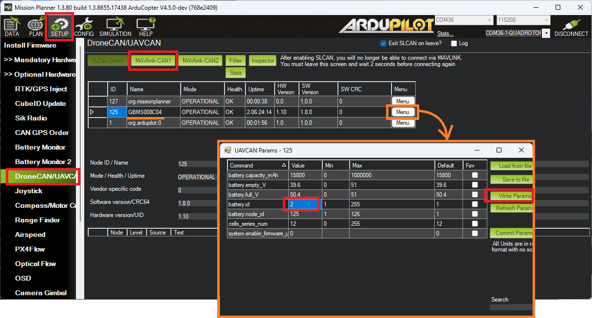

.. _common-tattu-dronecan-battery:

===========================
Tattu Plus DroneCAN Battery
===========================

Tattu Plus batteries with AS150U connectors support DroneCAN which allows the autopilot to retrieve the battery's total voltage, individual cell voltages, current, temperature and percentage of remaining capacity.

The contents of this page were verified using a Tattu Plus 1.0 battery with SKU:TAA16KP12S15C.

Some images courtesy of genstattu.com and 3dxr.co.uk

Connection and Configuration
============================

A female AS150U connector with leads should be used to connect the battery's signal wires to the autopilot's CAN port as shown below.

Connect to the autopilot with a ground station and set the following parameters and then reboot the autopilot

- Set :ref:`CAN_P1_DRIVER<CAN_P1_DRIVER>` to 1 (First Driver)
- Set :ref:`CAN_D1_PROTOCOL<CAN_D1_PROTOCOL>` to 1 (DroneCAN)
- Set :ref:`BATT_MONITOR<BATT_MONITOR>` to 8 (DroneCAN)

Connecting Multiple Batteries
=============================

If more than one Tattu battery is connected, use MP's DroneCAN, MAVLink-CAN1 feature or the :ref:`DroneCAN GUI<common-uavcan-gui>` to set each battery's "battery.id" field to a unique number (e.g. 1 for the 1st battery, 2 for the 2nd battery).

On the autopilot, set the appropriate battery serial number parameter to match the above battery.id values

- Set :ref:`BATT_SERIAL_NUM<BATT_SERIAL_NUM>` to 1
- Set :ref:`BATT2_SERIAL_NUM<BATT2_SERIAL_NUM>` to 2

To more easily see the average voltage and total current of multiple batteries a :ref:`"Sum of Selected Monitors" battery monitor <common-power-module-configuration-in-mission-planner>` can be configured.

Testing
=======

Once connected the battery voltage, current, percent remaining, etc will be visible in the ground station and recorded in the onboard logs.  The image below shows where the data appears on Mission Planner's status screen.

