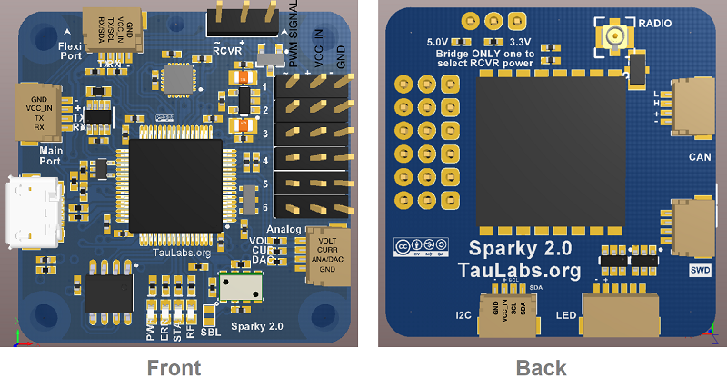

.. _common-taulabs-sparky2:

===============
TauLabs Sparky2
===============

*above image and some content courtesy of the* `TauLabs wiki <https://github.com/TauLabs/TauLabs/wiki/Sparky2>`__

.. note::

   Support for the TauLabs Sparky2 will be released with Copter-3.6.

Specifications
==============

-  **Processor**

   -  STM32F405 ARM Cortex-M4 microcontroller
   -  168 Mhz/1 MB Flash
   -  32-bit failsafe co-processor

-  **Sensors**

   -  InvenSense MPU9250 IMU (accel, gyro, compass)
   -  MS5611 barometers
   -  Dataflash for logging

-  **Power**

   -  4.8V ~ 10V input power provided through ESC connection

-  **Interfaces**

   -  6x PWM outputs (+4 more on LED port)
   -  1x RC input PWM/PPM
   -  2x analog to digital inputs for battery voltage and current monitoring
   -  1x serial input for GPS
   -  1x I2C port for external compass
   -  1x CAN bus
   -  MMCX antenna connector for integrated radio
   -  USB port
   -  SWD Port for flashing and debugging

Where to Buy
============

- Available from many retailers including `HobbyKing <https://hobbyking.com/en_us/taulabs-sparky-2-0-32bit-flight-controller.html>`__

Videos
======

..  youtube:: 3esk1lnw3SI
    :width: 100%

* first flight of ArduPilot on Sparky2*

..  youtube:: WGLc7jNqAyE
    :width: 100%

* 2nd flight using PosHold, RTL*
