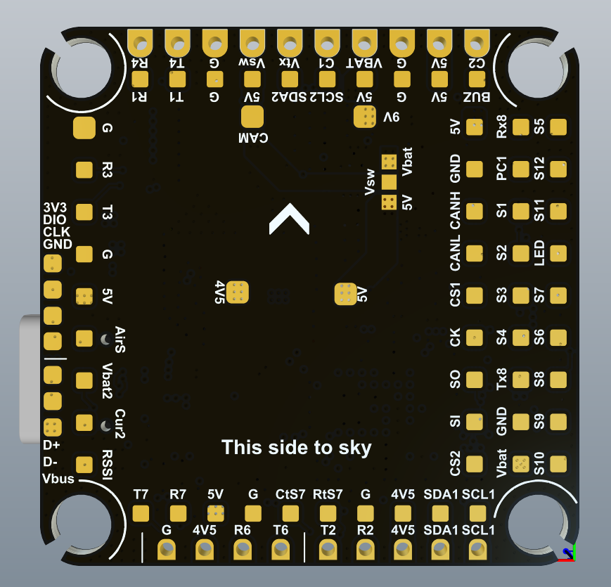
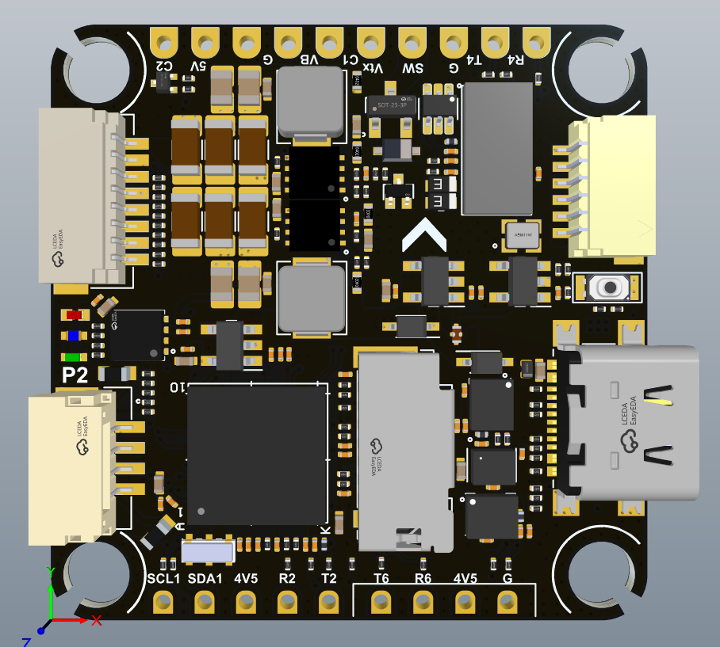

.. _common-tbs-lucidh7:

[copywiki destination="plane,copter,rover,blimp"]
==============================
TBS LUCID H7 Flight Controller
==============================

The TBS LUCID H7 is a flight controller produced by `TBS <https://www.team-blacksheep.com/>`_.

Features
========

* MCU - STM32H743 32-bit processor running at 480 MHz
* IMU - Dual ICM42688
* Barometer - DPS310
* OSD - AT7456E
* microSD card slot
* 7x UARTs
* CAN support
* 13x PWM Outputs (12 Motor Output, 1 LED)
* Battery input voltage: 2S-6S
* BEC 3.3V 0.5A
* BEC 5V 3A
* BEC 9V 3A for video, gpio controlled, pinned out on HD VTX connector
* Selectable 5V or VBAT pad, for analog VTX, gpio controlled on/off
* Dual switchable camera inputs

Pinout
======

UART Mapping
============

The UARTs are marked Rn and Tn in the above pinouts. The Rn pin is the
receive pin for UARTn. The Tn pin is the transmit pin for UARTn.

* SERIAL0 -> USB   (MAVLink2)
* SERIAL1 -> UART1 (USER, R1 is SBUS in HD VTX connector)
* SERIAL2 -> UART2 (GPS, DMA-enabled)
* SERIAL3 -> UART3 (DisplayPort, DMA-enabled)
* SERIAL4 -> UART4 (MAVLink2, Telem1)
* SERIAL6 -> UART6 (RC Input, DMA-enabled)
* SERIAL7 -> UART7 (MAVLink2, Telem2, DMA and flow-control enabled)
* SERIAL8 -> UART8 (ESC Telemetry, R8 on ESC connector for telem)

RC Input
========
RC input is configured by default via the USART6 RX input. It supports all serial RC protocols except PPM.

Note: If the receiver is FPort the receiver must be tied to the USART6 TX pin , RSSI_TYPE set to 3, and :ref:`SERIAL6_OPTIONS<SERIAL6_OPTIONS>` must be set to 7 (invert TX/RX, half duplex). For full duplex like CRSF/ELRS use both
RX6 and TX6 and set :ref:`RSSI_TYPE<RSSI_TYPE>` also to 3.

If SBUS is used on HD VTX connector (DJI TX), then :ref:`SERIAL1_PROTOCOl<SERIAL1_PROTOCOl>` should be set to "23" and :ref:`SERIAL6_PROTOCOL<SERIAL6_PROTOCOL>` changed to something else.

FrSky Telemetry
===============
FrSky Telemetry is supported using an unused UART, such as the T1 pin (UART1 transmit).
You need to set the following parameters to enable support for FrSky S.PORT:

* :ref:`SERIAL1_PROTOCOL<SERIAL1_PROTOCOL>` = 10
* :ref:`SERIAL1_OPTIONS<SERIAL1_OPTIONS>` = 7

OSD Support
===========
The TBS LUCID H7 supports OSD using OSD_TYPE 1 (MAX7456 driver) and simultaneously DisplayPort using TX3/RX3 on the HD VTX connector.

PWM Output
==========
The TBS LUCID H7 supports up to 13 PWM or DShot outputs. The pads for motor output
M1 to M4 are provided on both the motor connectors and on separate pads, plus
M9-13 on a separate pads for LED strip and other PWM outputs.

The PWM is in 4 groups:

* PWM 1-2   in group1
* PWM 3-4   in group2
* PWM 5-6   in group3
* PWM 7-10  in group4
* PWM 11-12 in group5
* PWM 13    in group6

Channels within the same group need to use the same output rate. If
any channel in a group uses DShot then all channels in the group need
to use DShot. Channels 1-10 support bi-directional dshot.

Battery Monitoring
==================
The board has a built-in voltage sensor and external current sensor input. The current
sensor can read up to 130 Amps. The voltage sensor can handle up to 6S
LiPo batteries.

The correct battery setting parameters are:

* :ref:`BATT_MONITOR<BATT_MONITOR>` = 4
* :ref:`BATT_VOLT_PIN<BATT_VOLT_PIN__AP_BattMonitor_Analog>` = 10
* :ref:`BATT_CURR_PIN<BATT_CURR_PIN__AP_BattMonitor_Analog>` = 11
* :ref:`BATT_VOLT_MULT<BATT_VOLT_MULT__AP_BattMonitor_Analog>` = 11.0
* :ref:`BATT_AMP_PERVLT<BATT_AMP_PERVLT__AP_BattMonitor_Analog>` = 40

Pads for a second analog battery monitor are provided. To use:

* Set :ref:`BATT2_MONIOTOR<BATT2_MONITOR>` = 4
* :ref:`BATT2_VOLT_PIN<BATT2_VOLT_PIN__AP_BattMonitor_Analog>` = 18
* :ref:`BATT2_CURR_PIN<BATT2_CURR_PIN__AP_BattMonitor_Analog>` = 7
* :ref:`BATT2_VOLT_MULT<BATT2_VOLT_MULT__AP_BattMonitor_Analog>` = 11.0
* :ref:`BATT2_AMP_PERVLT<BATT2_AMP_PERVLT__AP_BattMonitor_Analog>` as required

Analog RSSI and AIRSPEED inputs
===============================

* Analog RSSI uses :ref:`RSSI_ANA_PIN<RSSI_ANA_PIN>` = 8
* Analog Airspeed sensor would use :ref:`ARSPD_PIN<ARSPD_PIN>` = 4

Compass
=======

The TBS LUCID H7 does not have a builtin compass, but you can attach an external compass using I2C on the SDA and SCL pads.

VTX power control
=================

GPIO 81 controls the VSW pins which can be set to output either VBAT or 5V via a board jumper. Setting this GPIO high removes voltage supply to pins. RELAY2 is configured by default to control this GPIO and is low by default.

GPIO 83 controls the VTX BEC output to pins marked "9V" and is included on the HD VTX connector. Setting this GPIO low removes voltage supply to this pin/pad.

By default RELAY4 is configured to control this pin and sets the GPIO high.

Camera control
==============
GPIO 82 controls the camera output to the connectors marked "CAM1" and "CAM2". Setting this GPIO low switches the video output from CAM1 to CAM2. By default RELAY3 is configured to control this pin and sets the GPIO high.

Firmware
========
Firmware for this board can be found `here <https://firmware.ardupilot.org>`__ in sub-folders labeled “TBS_LUCID_H7”

Loading Firmware
================
Initial firmware load can be done with DFU by plugging in USB with the
bootloader button pressed. Then you should load the "with_bl.hex"
firmware, using your favourite DFU loading tool.

Once the initial firmware is loaded you can update the firmware using
any ArduPilot ground station software. Updates should be done with the
\*.apj firmware files.
