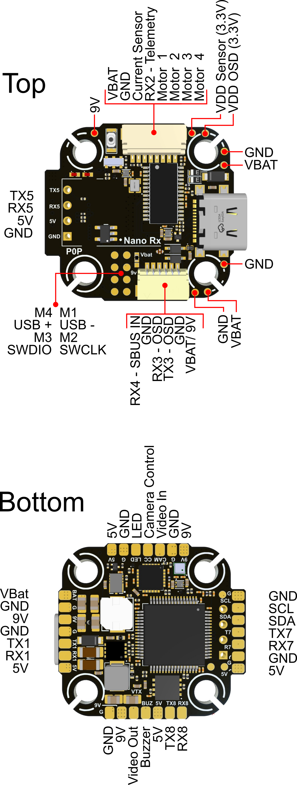

.. _common-tbs-lucidpro:
[copywiki destination="plane,copter,rover,blimp"]
===============================
TBS LUCID PRO Flight Controller
===============================

The TBS LUCID PRO/Freestyle is a flight controller produced by `Team Black Sheep <https://www.team-blacksheep.com/>`_.

Features
========

* MCU - STM32F405 32-bit processor running at 168 MHz
* IMU - ICM42688 (Freestyle) or MPU6000 (Pro)
* Barometer - SPL06
* OSD - AT7456E
* Onboard Flash: 4MByte
* 6x UARTs
* 6x PWM Outputs (4 Motor Output, 1 Camera PWM and 1 LED)
* Battery input voltage: 2S-6S
* BEC 3.3V 0.5A
* BEC 5V 3A
* BEC 9V 3A for video

Pinout
======

.. note:: pins PC2 and PC3 are undefined

UART Mapping
============
The UARTs are marked RXn and TXn in the above pinouts. The RXn pin is the
receive pin for UARTn. The TXn pin is the transmit pin for UARTn.

* SERIAL0 -> USB
* SERIAL1 -> UART1 (RCin, DMA-enabled)
* SERIAL2 -> UART2 (User, RX2 is SBUS input and is inverted from pin)
* SERIAL3 -> UART3 (DisplayPort, DMA-Enabled)
* SERIAL4 -> UART4 (SmartAudio)
* SERIAL5 -> UART5 (ESC Telem)
* SERIAL6 -> UART6 (GPS, DMA-Enabled)

RC Input
========
RC input is configured by default on  SERIAL1. It supports all serial RC protocols except PPM and SBUS. For SBUS use SERIAL2, set its protocol to RCIN ("23") and change :ref:`SERIAL1_PROTOCOL<SERIAL1_PROTOCOL>` to something other than RCIN ("23").

* If the receiver is FPort the receiver must be tied to the SERIAL1 TX pin, :ref:`RSSI_TYPE<RSSI_TYPE>` set to 3, and :ref:`SERIAL1_OPTIONS<SERIAL1_OPTIONS>` must be set to 7 (invert TX/RX, half duplex).
* For full duplex like CRSF/ELRS use both RX1 and TX1 and set :ref:`RSSI_TYPE<RSSI_TYPE>` also to 3.

FrSky Telemetry
===============
FrSky Telemetry is supported using an unused UART, such as the TX4 pin (UART4 transmit).
You need to set the following parameters to enable support for FrSky S.PORT:

* :ref:`SERIAL4_PROTOCOL<SERIAL4_PROTOCOL>` = 10
* :ref:`SERIAL4_OPTIONS<SERIAL4_OPTIONS>` = 7

OSD Support
===========
The TBS LUCID PRO supports OSD using the integrated OSD chip (MAX7456 driver) and simultaneously DisplayPort using TX3/RX3 on the HD VTX connector.

PWM Output
==========
The TBS LUCID PRO supports up to 6 PWM or DShot outputs. The pads for motor output
M1 to M4 are provided on both the motor connector and on separate pads, plus
M5-6 on a separate pads for LED strip and camera control.

The PWM is in 3 groups:

* PWM 1-2   in group1
* PWM 3-4   in group2
* PWM 5-6   in group3 (No DShot). PWM5 marked as "CAMC", PWM6 as "LED"

Channels within the same group need to use the same output rate. If
any channel in a group uses DShot then all channels in the group need
to use DShot. Channels 1-4 support bi-directional dshot.

Battery Monitoring
==================
The board has a built-in voltage sensor and external current sensor input. The current
sensor can read up to 130 Amps. The voltage sensor can handle up to 6S
LiPo batteries.

The correct battery setting parameters are:

* :ref:`BATT_MONITOR<BATT_MONITOR>` = 4
* :ref:`BATT_VOLT_PIN<BATT_VOLT_PIN__AP_BattMonitor_Analog>` = 10
* :ref:`BATT_CURR_PIN<BATT_CURR_PIN__AP_BattMonitor_Analog>` = 11
* :ref:`BATT_VOLT_MULT<BATT_VOLT_MULT__AP_BattMonitor_Analog>` = 20
* :ref:`BATT_AMP_PERVLT<BATT_AMP_PERVLT__AP_BattMonitor_Analog>` = 40

Compass
=======
The TBS LUCID PRO does not have a builtin compass, but you can attach an external compass using I2C on the SDA and SCL pads.

Firmware
========
Firmware for this board can be found `here <https://firmware.ardupilot.org>`__ in sub-folders labeled “TBS_LUCID_PRO”

Loading Firmware
================
Initial firmware load can be done with DFU by plugging in USB with the
bootloader button pressed. Then you should load the "with_bl.hex"
firmware, using your favourite DFU loading tool.

Once the initial firmware is loaded you can update the firmware using
any ArduPilot ground station software. Updates should be done with the
\*.apj firmware files.
