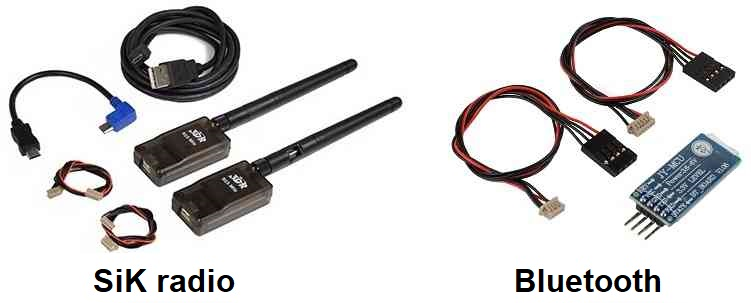

.. _common-telemetry-landingpage:
[copywiki destination="plane,copter,rover,blimp"]
========================
Telemetry (landing page)
========================

Copter/Plane/Rover/Blimp support sharing information with a ground station (or
transmitter) using telemetry. Follow the links below for configuration
information based upon your set-up.

.. note:: Some RC systems incorporate telemetry in addition to RC control
.. note:: ArduPilot will automatically fall back to back to MAVLink1 if MAVLink 2 serial port protocol is selected and no MAVLink 2 data is received from the groundstation in response in fimware versions before 4.2, but not after

.. note:: High value systems using RC control over a telemetry link should consider :ref:`common-redundant-telemetry`

Short Range (<10KM)
===================

.. toctree::
    :maxdepth: 1

    Bluetooth <common-mission-planner-bluetooth-connectivity>
    CUAV PW-Link <common-cuav-pwlink>
    ESP8266 wifi telemetry <common-esp8266-telemetry>
    ESP32 wifi telemetry <common-esp32-telemetry>
    FrSky telemetry <common-frsky-telemetry>
    Yaapu Bi-Directional Telemetry GCS <common-yaapu-gcs>
    HOTT telemetry <common-hott-telemetry>
    MSP (MultiWii Serial Protocol)(version 4.1) <common-msp-overview>
    MSP (version 4.2) <common-msp-overview-4.2>
    SiK Radio v1 <common-3dr-radio-v1>
    SiK Radio v2 <common-sik-telemetry-radio>
    SiK Radio configuration <common-configuring-a-telemetry-radio-using-mission-planner>
    SiK Radio advanced configuration <common-3dr-radio-advanced-configuration-and-technical-information>
    XBee <common-telemetry-xbee>

Long Range
==========

.. toctree::
    :maxdepth: 1

    Blicube RLINK P900 <common-blicube-rlink>
    ClearSky Airlink 4G LTE Telemetry <common-airlink-telemetry>
    CRSF Telemetry <common-crsf-telemetry>
    CUAV P8 Radio <common-cuav-p8>
    CUAV P9 Radio <common-cuav-p9>
    DragonLink <common-dragonlink-rc>
    Holybro 900Mhz XBP9X Telemetry Radio <https://shop.holybro.com/xbp9x-radio_p1268.html>
    Holybro Microhard P900 Radio Telemetry Radio <http://www.holybro.com/product/microhard-p900-radio/>
    LTM telemetry <common-ltm-telemetry>
    RFD900 <common-rfd900>
    Robsense SwarmLink <common-telemetry-robsense-swarmlink>
    SPL Satellite Telemetry <https://discuss.ardupilot.org/t/stretching-comm-links-from-indoors-to-the-globe/45896>
    UAVCast 3G/4G Cellular <common-uavcast-telemetry>
    XBStation 4G LTE Link <common-xbstation-telemetry>

Applications and Info
=====================

.. toctree::
    :maxdepth: 1

    FlightDeck FrSky Transmitter App <common-frsky-flightdeck>
    MAVLink2 Packet Signing (Security) <common-MAVLink2-signing>
    Repeater for Wireless Ground Station Connections <common-wireless-gcs-repeater>
    Telemetry Radio Regional Regulations <common-telemetry-radio-regional-regulations>

