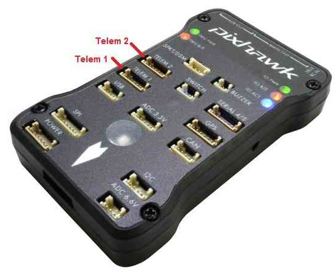
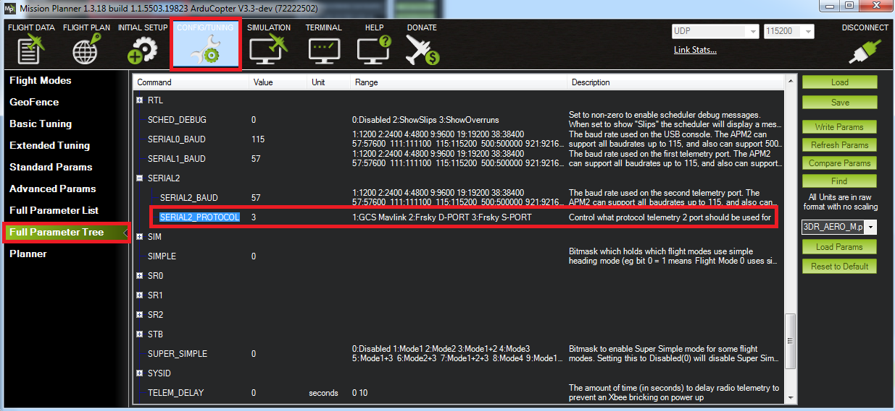

.. _common-telemetry-port-setup:

=============================
Telemetry / Serial Port Setup
=============================

This article shows how to configure the telemetry ports (aka serial ports) on the autopilot.
The instructions use the Pixhawk but they apply for most autopilots.

Overview
========

On a Pixhawk there are a total of 5 serial ports.  The default use of each port is:

- The micro USB port (aka Serial0) is used to connect to the ground station using a USB cable.  This should not be connected in flight because the flight code assumes that if it is receiving power through this port that it is on the bench and some :ref:`failsafes <copter:failsafe-landing-page>` (i.e. battery failsafe) are disabled.
- Telem1 (aka Serial1) is for MAVLink communication and supports flow control.  This should be used especially for high power devices (up to 1 amp) But NOT the :ref:`RFD900 telemetry radio <common-rfd900>`

.. note:: Many non-Pixhawk style autopilots CANNOT supply even 1 amp on their port supply lines. Be sure to verify with autopilots specifications. If not specified, limit current to < 200 ma.

- Telem2 (aka Serial2) is for MAVLink communication and supports flow control.
- GPS (aka Serial3) is for connecting a GPS
- Serial 4/5 contains two serial connections on a single port.  Serial4 is normally used for a :ref:`second GPS <common-gps-blending>`.  Serial5 is a :ref:`debug connection <dev:interfacing-with-pixhawk-using-the-nsh>`.

More details of the exact pins on each port can be found :ref:`here <common-pixhawk-overview>`.

Set-up through the Ground Station
=================================

The telemetry ports can be configured through the ground station by setting the parameters listed below.  If you are using the *Mission Planner* open the **Config/Tuning \| Full Parameter List** page.

- ``SERIALx_PROTOCOL`` parameters (where "x" is a number from 0 to 4, i.e. :ref:`SERIAL1_PROTOCOL <SERIAL1_PROTOCOL>`) control the protocol or purpose of the serial port.  You will see on wiki pages including the :ref:`Lightware Lidar page <common-lightware-sf10-lidar>` instructions for choosing the appropriate protocol.
- ``SERIALx_BAUD`` (i.e. :ref:`SERIAL1_BAUD <SERIAL1_BAUD>`) sets the baud rate or speed of the serial port.
- :ref:`BRD_SER1_RTSCTS <BRD_SER1_RTSCTS>` and :ref:`BRD_SER2_RTSCTS <BRD_SER2_RTSCTS>` parameters allow enabling or disabling flow control on Telem1 and Telem2.

MAVLink1, MAVLink2 and Stream Rates
===================================

For telemetry ports used for MAVLink communication you may select to use MAVLink1 by setting the ``SERIALx_PROTOCOL`` to "1" or MAVLink2 by setting ``SERIALx_PROTOCOL`` to "2".

MAVLink2 supports "signing" of packets which improves security and flexible length messages so it should be used when possible but some older telemetry radios do not understand MAVLink2 so the default is MAVLink1.

.. note:: MAVLink2 is required to upload and download complex fences in Copter and Rover from the Ground Control Station.

As mentioned on the :ref:`Telemetry Logs page <common-mission-planner-telemetry-logs>` the rate messages are sent from the vehicle can be controlled using the ``SRx_*`` parameters (i.e. :ref:`SR1_POSITION <SR1_POSITION>`).

SRx parameters do not directly correlate to the SERIALx port, but rather to the order of the ports which have MAVLink protocol active.

The Mission Planner's **Config/Tuning |Planner** screen's **Telemetry Rates** drop-downs allow a convenient way to set these parameters.

.. image:: ../../../images/mp_telemetry_rate.png
    :target: ../_images/mp_telemetry_rate.png

Due to CPU or bandwidth limitations, the actual rate of the data sent may be lower than the rate requested.

.. note::

   Most ground stations set the desired stream rate by sending the `REQUEST_DATA_STREAM <https://mavlink.io/en/messages/common.html#REQUEST_DATA_STREAM>`__ MAVLink message to the vehicle instead of directly settting the parameters mentioned above.  If done this way, Copter **DOES NOT** save the rate changes to eeprom meaning they will not persist over a reboot.

   In practice users may notice that if the vehicle is rebooted but the telemetry connection is not disconnected and reconnected that the data from the vehicle may be much slower or missing.  I.e. the vehicle's position on the map may not update.  Normally disconnecting/reconnecting with the ground station will resolve this.
