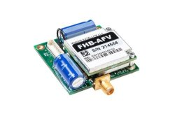

.. _common-telemetry-rockblock:
[copywiki destination="plane,copter,rover,blimp,sub"]
=========================
RockBLOCK Satellite Modem
=========================

.. note:: This feature is only available on ArduPilot 4.4 or later and requires a flight controller that supports :ref:`LUA Scripts<common-lua-scripts>`

The `RockBLOCK <https://www.groundcontrol.com/en/product/rockblock-9603-compact-plug-and-play-satellite-transmitter/>`__ satellite
modem allows for a global (including polar regions) MAVLink connection to an ArduPilot vehicle. This uses the
`Iridium SBD data service <https://www.iridium.com/services/iridium-sbd/>`__.

Due to the very low datarate of the RockBLOCK, there are a few key limitations:

- A single `HIGH_LATENCY2 <https://mavlink.io/en/messages/common.html#HIGH_LATENCY2>`__ packet will be sent every ``RCK_PERIOD`` sec. This will give basic position and status information.
- No heartbeats, statustexts, parameters and waypoints will be sent from the vehicle to the GCS.
- The RockBLOCK only sends a subset of MAVlink messages (see below list) from the GCS to Vehicle. Parameters and waypoints will not be sent.
- Only 1 command message can be sent per ``RCK_PERIOD`` from the GCS to vehicle. Any additional commands will overwrite the previous command

In practice, this means the RockBLOCK can only be used whilst monitoring a vehicle during automated flight modes. Any sort 
of manual control (outside of low-rate GUIDED mode "fly to" locations) is not possible.

The RockBLOCK has a latency of 20-60 seconds and is only able to send 1 message per 30 second period (or greater). This period is
configurable via the ``RCK_PERIOD`` parameter.

If desired, the RockBlock can automatically activate on loss-of-GCS-telemetry. This is done by setting the ``RCK_FORCEHL`` parameter to 2.
The RockBLOCK will then automatically activate when telemetry is lost for ``RCK_TIMEOUT`` seconds. When telemetry is restored,
the RockBLOCK will deactivate.

.. note:: Any modem using the Iridium 9602 or 9603 chipset *should* work, though only the RockBLOCK 9603N modem has been tested.

Supported MAVLink messages
==========================

The following MAVLink messages are supported from the GCS to the vehicle:

- COMMAND_LONG
- COMMAND_INT
- MISSION_ITEM_INT
- MISSION_SET_CURRENT

Within the COMMAND_LONG and COMMAND_INT messages, the following commands are supported:

- MAV_CMD_NAV_RETURN_TO_LAUNCH
- MAV_CMD_NAV_LAND
- MAV_CMD_NAV_TAKEOFF
- MAV_CMD_NAV_VTOL_TAKEOFF
- MAV_CMD_NAV_VTOL_LAND
- MAV_CMD_DO_SET_MODE
- MAV_CMD_DO_CHANGE_SPEED
- MAV_CMD_DO_SET_SERVO
- MAV_CMD_DO_PARACHUTE
- MAV_CMD_MISSION_START
- MAV_CMD_COMPONENT_ARM_DISARM
- MAV_CMD_DO_REPOSITION
- MAV_CMD_CONTROL_HIGH_LATENCY

Vehicle Setup
=============

#.  Connect the RockBLOCK modem to a spare UART on the flight controller. Only the +5V, RX, TX and GND lines need to be connected
#.  Ensure the modem is activated in your RockBLOCK account
#.  Copy the `Ardupilot RockBLOCK Lua script <https://github.com/ArduPilot/ardupilot/blob/master/libraries/AP_Scripting/applets/RockBlock.lua>`__ to the flight controller's SD card.
#.  Ensure :ref:`LUA Scripts<common-lua-scripts>` are enabled and the RockBLOCK UART is set as a scripting UART.

Ground Setup
============

The RockBLOCK messages are sent and received via the Rock7 gateway. It has an API that allows for
sending and receiving messages via a web service.

The `Rockblock2MAV <https://github.com/stephendade/rockblock2mav>`__ software is a companion to the RockBlock Lua
script. Use this software on the GCS to send and receive MAVLink messages from the RockBLOCK modem via the Rock7 gateway.

See the `Rockblock2MAV documentation <https://github.com/stephendade/rockblock2mav>`__ for installation and usage instructions.

.. note:: QGroundControl and Mission Planner have limited support for RockBLOCK MAVLink telemetry. It is recommended to use MAVProxy, which fully supports this telemetry.

Usage
=====

#.  Enable :ref:`High Latency<common-MAVLink-high-latency>` mode on the flight controller to start RockBLOCK mailbox checks.
#.  The RockBLOCK will do a mailbox check every ``RCK_PERIOD`` seconds. It will send one `HIGH_LATENCY2 <https://mavlink.io/en/messages/common.html#HIGH_LATENCY2>`__ message and recieve one message from the GCS at this time.
#.  Disable :ref:`High Latency<common-MAVLink-high-latency>` mode on the flight controller to stop RockBLOCK mailbox checks.

Data Costs
==========

Compared to terrestrial services (such as 4G Celluar), the RockBLOCK data costs are expensive.

Current data costs are available from the `RockBlock website <https://docs.rockblock.rock7.com/docs/iridium-contract-costs>`__.

1 RockBLOCK credit is used per MAVLink message. So, for example, if the RockBLOCK
was configured to send 1 ``HIGH_LATENCY2`` message every 30 seconds that would give a data usage of
120 credits per hour. If any commands are sent from the GCS to the vehicle via the RockBLOCK, they should be added too.
For example, if 5 commands are sent in the same hour, 5 credits are used. Combining both sent and recieved messages,
a total of 125 credits per hours are used.

Parameters
==========

The following parameters are available to control the script:

========================  ============================================================================================
Name                      Description
========================  ============================================================================================
 RCK_FORCEHL              Mode of operation. 0 = start disabled, 1 = start enabled, 2 = enabled on loss of telemetry
 RCK_PERIOD               When in High Latency mode, send RockBLOCK updates every RCK_PERIOD seconds
 RCK_DEBUG                Sends RockBLOCK debug text to GCS via statustexts
 RCK_ENABLE               Enables the modem transmission
 RCK_TIMEOUT              When RCK_FORCEHL=2, the number of seconds of no telemetry until High Latency mode is enabled
========================  ============================================================================================

