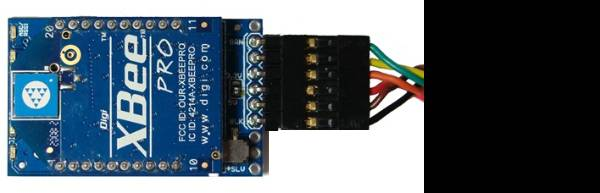

.. _common-telemetry-xbee:

==============
Telemetry-XBee
==============

XBee radios (also known as ZigBee radios) are generally not recommended
over the :ref:`SiK Radio <common-sik-telemetry-radio>`
and :ref:`RFD900 Radio <common-rfd900>`.  Still there may be some
situations where only an XBee can be used so these high-level
instructions could be helpful.

.. image:: ../../../images/Telemetry_XBee_Pixhawk.jpg
    :target: ../_images/Telemetry_XBee_Pixhawk.jpg

Where to Buy
============

XBee radios are available from
`Sparkfun <https://www.sparkfun.com/categories/111>`__ and many other
robotics stores globally.  Generally you will need two XBee radiios (one
for the ground station and one for the vehicle) along with two different
adapter boards.  `One with a USB connection <https://www.sparkfun.com/products/11812>`__ for the ground
station computer and `another with a serial connection <https://www.sparkfun.com/products/11373>`__ which can be
connected to the autopilot as shown above.

Configuration
=============

Click on the diagram at the top of this page to see the individual wire
connections that must be made between the autopilot and Xbee
module.  Note that in the diagram above only 4 wires are connected (GND,
5V, Transmit, Receiver).  The CTS and RTS (Ready-to-send) pins are left
unconnected because although connecting them should improve the data
rate during the creation of this wiki page we were unable to
successfully connect.

With the CTS and RTS pins disconnected the BRD_SER1_RTSCTS (if using
Telem1) or BRD_SER2_RTSCTS (if using Telem2) should be set to zero
(after making the change the autopilot will need to be
restarted).

.. image:: ../../../images/Telemetry_XBee_MPSetup.jpg
    :target: ../_images/Telemetry_XBee_MPSetup.jpg

The
`X-CTU <https://www.digi.com/products/xbee-rf-solutions/xctu-software/xctu>`__
application can be used to configure the XBee modules.  In particular
they should be set to transmit at 57600 baud.

Connecting to the Ground Station
================================

If you're using a USB adapter, simply connect it via a USB cable as
shown:

.. image:: ../../../images/xbee_usb_connection.jpg
    :target: ../_images/xbee_usb_connection.jpg

If you're using an XtreamBee adapter on the ground side, connect it to a
FTDI cable as shown below and plug that into your USB port. The adapter
should also be in Master mode.

   XBee with XtreemBee Adapter

Once properly configured you should be able to connect to the vehicle
from the ground station (i.e. Mission Planner) by selecting the
appropriate COM port for the XBee and selecting the baud rate of 57600.
If the connection is successful but the download of parameter stalls
please see the notes above re CTS and RTS.

.. image:: ../../../images/Telemetry_XBee_MPConnect.jpg
    :target: ../_images/Telemetry_XBee_MPConnect.jpg
