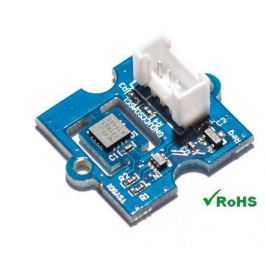

.. _common_temperature_sensors:
[copywiki destination="plane,copter,rover"]

===================
Temperature Sensors
===================

ArduPilot supports up to nine individual temperature sensors with I2C interfaces:

- `MAX31865 <https://www.analog.com/media/en/technical-documentation/data-sheets/MAX31865.pdf>`__
- `MCP9600 <https://ww1.microchip.com/downloads/en/DeviceDoc/MCP960X-Data-Sheet-20005426.pdf>`__
- `TSYS01 <https://www.te.com/usa-en/product-G-NICO-018.datasheet.pdf>`__
- `TSYS03 <https://www.te.com/usa-en/product-CAT-DTS0001.datasheet.pdf>`__

ArduPilot already has numerous possible sources for temperature reports: ESCs, Smart Batteries, Motor EFI and these independent sensors can be used to replace those devices temperature reports which already exist in ArduPilot. They can also just be logged.

Setup
=====

Attach sensor to one of the autopilot's I2C ports using SDA and SCL pins. Then set (examples shown for first sensor):

- :ref:`TEMP1_TYPE<TEMP1_TYPE>` = 0:Disabled, 1:TSYS01, 2:MCP9600, 3:MAX31865, 4: TSYS03 Sensor type
- :ref:`TEMP1_BUS<TEMP1_BUS>` = 0-3 Board's I2C port on which the sensor is attached
- :ref:`TEMP1_ADDR<TEMP1_ADDR>` = the sensor's I2C address (0-127)
- :ref:`TEMP1_SRC<TEMP1_SRC>` = which other temperature reporting device type should have its temperature report replaced with this sensor's.
- :ref:`TEMP1_SRC_ID<TEMP1_SRC_ID>` = this identifies which individual device, of the above type, should have its report replaced.

Logging
=======

- :ref:`TEMP_LOG<TEMP_LOG>` = 0: No logging, 1: Log temperature reports from all temperature sensors
