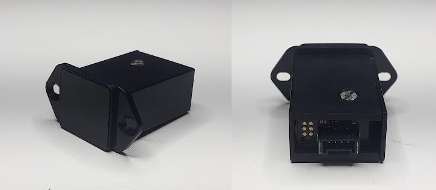
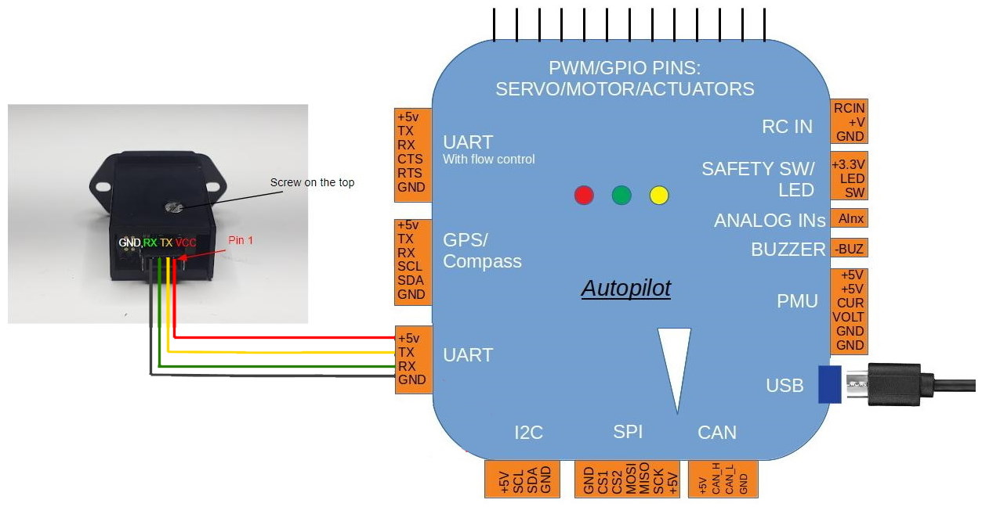
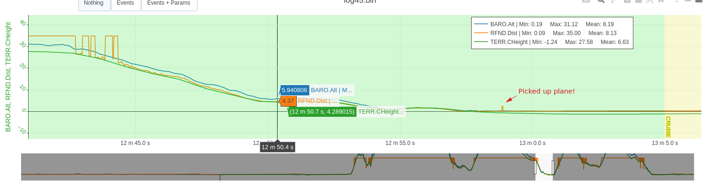

.. _common-teraranger-neo:

==============
TeraRanger NEO
==============

A new addition to the TOF rangefinder offering by `TeraBee <https://www.terabee.com/>`__ . This sensor has much longer range (up to 30 meters) and better performance over less reflective surfaces such as grass, making it very suitable for Plane landing, Copter takeoff and landing, and Object Avoidance applications.

Where to Buy
============

`TeraBee <https://www.terabee.com/shop/lidar-tof-range-finders/teraranger-neo/>`__

Connection to Autopilot
=======================

The sensor can be connected to any autopilot serial port.

Setup
=====

For the below example, we will assume that the rangefinder is connected to SERIAL2 as the first system rangefinder:

- Set :ref:`SERIAL2_PROTOCOL<SERIAL2_PROTOCOL>` =  9 (Rangefinders)
- Set :ref:`SERIAL2_BAUD<SERIAL2_BAUD>` = 9 (9600 Baud)
- Set :ref:`RNGFND1_TYPE<RNGFND1_TYPE>` = 35 (TeraRanger NEO)

As a Plane altitude rangefinder used in auto landings:

- Set :ref:`RNGFND_LANDING<RNGFND_LANDING>` = 1 to enable used of the rangefinder during landing phases of Plane and QuadPlane. The first rangefinder with "down" orientation will be used.

- Set :ref:`RNGFND1_ORIENT<RNGFND1_ORIENT>` = 25 (down)
- Set :ref:`RNGFND1_MIN_CM<RNGFND1_MIN_CM>` = 50 (.5m)
- Set :ref:`RNGFND1_MAX_CM<RNGFND1_MAX_CM>` = 2200 (22m since grass landings will reduce reliable range down to this range instead of 30m)

For Copter and Object Avoidance applications, additional/different parameters will be need to set. See :ref:`common-rangefinder-setup`.

