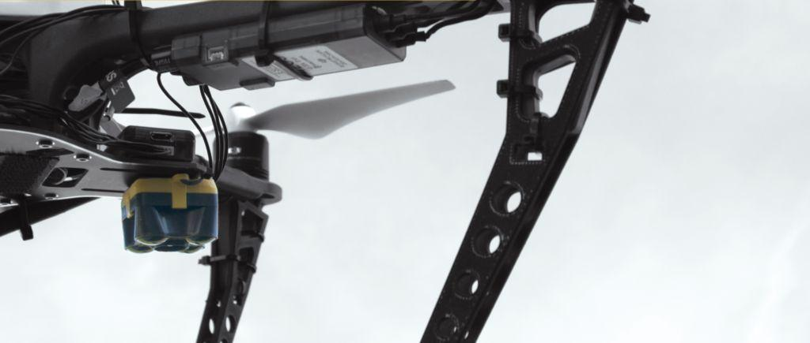
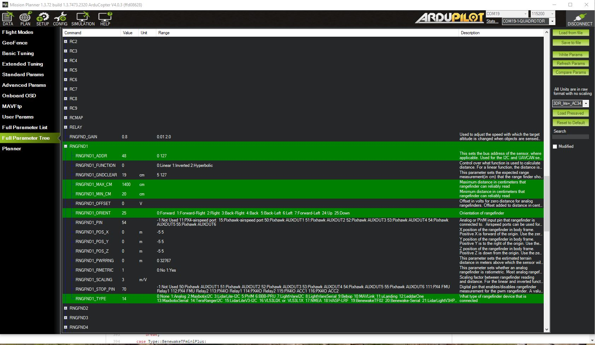
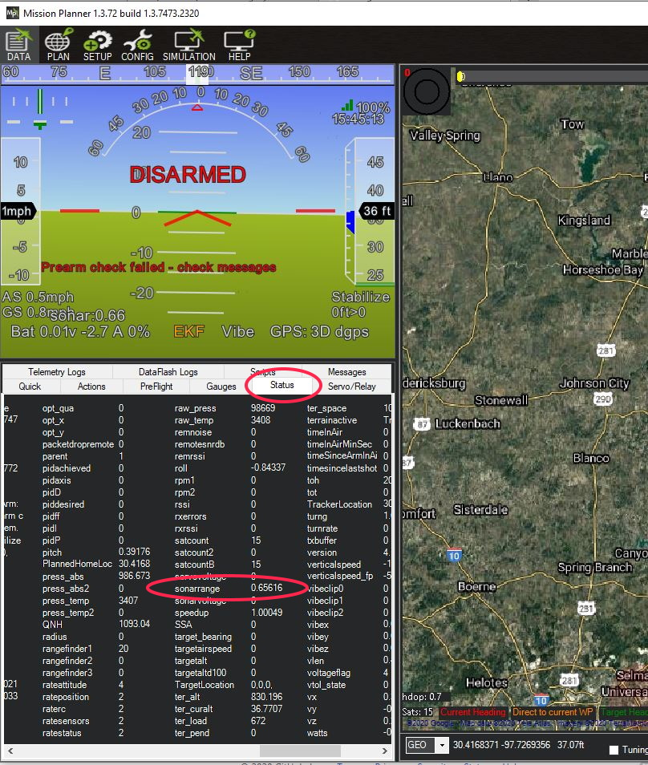

.. _common-teraranger-one-rangefinder:

========================
TeraBee TOF RangeFinders
========================

The TeraBee TeraRanger One and EVO family of rangefinders are 
lightweight, high-performance distance measurement sensors based on
infrared Time-of-Flight (TOF) technology. They are much faster than
ultrasound and far smaller and lighter than laser-based systems. Their
small size, high performance and low power consumption make it ideal for
modern robotic applications, drone operations and automation.

More technical information about these senors can be found below:

- `Evo 60m <https://www.terabee.com/shop/lidar-tof-range-finders/teraranger-evo-60m/>`__

- `Evo600Hz <https://www.terabee.com/shop/lidar-tof-range-finders/teraranger-evo-600hz/>`__

- `Evo 3m <https://www.terabee.com/shop/lidar-tof-range-finders/teraranger-evo-3m/>`__

- `Evo Mini <https://www.terabee.com/shop/lidar-tof-range-finders/teraranger-evo-mini/>`__

- `TeraRanger One <https://www.terabee.com/shop/lidar-tof-range-finders/teraranger-one/>`__

.. note::

   These rangefinders are only supported in ArduPilot autopilots via I2C
   protocol. 
   
Connecting to the TeraRanger/EVO via I2C
========================================

The TeraRanger One sensor can be easily connected to the Pixhawk or other ArduPilot autopilot with
the `TeraRanger I2C adapter <https://www.terabee.com/shop/accessories/i2c-adapter-for-teraranger-one/>`__. Most other versions can be directly connected, see setup table notes in next section.

#. Solder the connector cable for the TeraRanger I2C adapter:

   .. figure:: ../../../images/TeraRangerI2CAdapter-1.png
      :target: ../_images/TeraRangerI2CAdapter-1.png

      TR-I2CAD Power Cables

#. Connect the I2C adapter to the Pixhawk via a DF13 4S cable to the autopilot and the TeraRanger One to the I2C adapter:

   .. figure:: ../../../images/rangefinder_teraranger_one_pixhawk.jpg
      :target: ../_images/rangefinder_teraranger_one_pixhawk.jpg

      TR-One connection to Pixhawk with TR-I2CAD

For the other EVO rangefinder versions, just connect the SCL/SDA lines from the rangefinder to the autopilot's I2C signals of the same name. 

.. note:: some of these rangefinders consume over 100ma of current and should NOT be powered from the autopliots's I2C port, but from an external 5V regulated supply source.

Setup in Mission Planner
========================

To use the TeraRanger One/EVO sensor as rangefinder, connect with *Mission
Planner* and open the **CONFIG/Full Parameter List** menu and set:

-  ``RNGFNDx_MAX_CM``: This parameter sets the maximum
   distance that the rangefinder is used by the autopilot.
-  ``RNGFNDx_MIN_CM``: This parameter set the minimum distance that
   the rangefinder is used by the autopilot.
-  ``RNGFNDx_ADDR``: 48 (for TeraRanger One) or 49 (for EVO series), 0 will disable the rangefinder setup.
-  ``RNGFNDx_TYPE``: 14
-  ``RNGFNDx_ORIENT``: 25 (for downward facing). If used for :ref:`Object Avoidance<common-object-avoidance-landing-page>` or ceiling distancing, instead of altitude ranging, mount and chose the appropriate orientatioin.

Values for the rangefinders are shown below:

+---------------+---------+---------+--------+---------+---------------+
+               | EVO60M  | EVO600Hz|  EVO3M | EVOMini | TeraRanger One+
+---------------+---------+---------+--------+---------+---------------+
+RNGFNDx_MAX_CM |  6000   |   800   |   300  |   330   |       1400    +
+---------------+---------+---------+--------+---------+---------------+
+RNGFNDx_MIN_CM |    50   |   75    |   10   |     30  |        20     +
+---------------+---------+---------+--------+---------+---------------+
+RNGFNDx_ADDR   |    49   |   49    |   49   |     49  |        48     +
+---------------+---------+---------+--------+---------+---------------+
+Power Required | 5V/330ma| 5V/190ma|5V/250ma| 5V/50ma | 10V-20V/120ma +
+---------------+---------+---------+--------+---------+---------------+
+Notes          |    1    |     1   |  1     |         |    2          +
+---------------+---------+---------+--------+---------+---------------+

1. Do not power from autopilot port, unless port is known to have sufficient current capability.
2. Requires 3.3V to 5V level shifting to connect to autopilots I2C signals. Use `TeraRanger I2C adapter <https://www.terabee.com/shop/accessories/i2c-adapter-for-teraranger-one/>`__

   MissionPlanner Setup for using TeraRanger One sensor on autopilot

Testing the sensor
==================

The distances read by the *TeraRanger One* sensor can be displayed on
the *Mission Planner Flight Data* menu. The Status button the
left will show status values. Then choose
“sonarrange”.

   Mission Planner: Setting to display rangefinder data on the Flight Datascreen

.. warning::

    When the autopilot boots, the rangefinder needs to already be powered on, or at 
    least be powered on at the same time as the autopilot. If you power the rangefinder
    after the autopilots has booted, it will not be recognized since the autopilot will have already scanned its I2C bus for devices!
