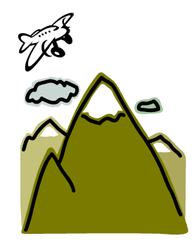
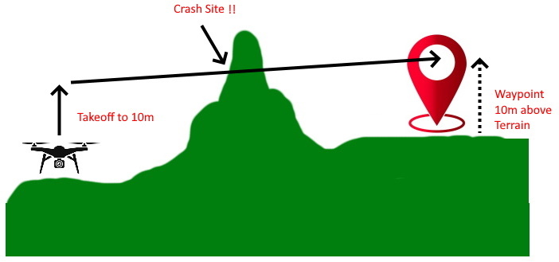
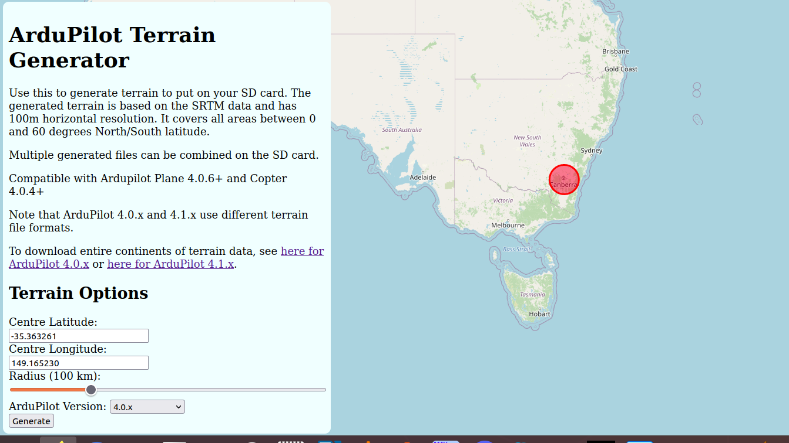
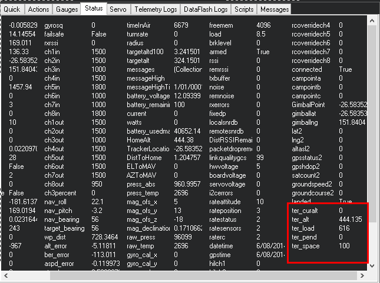

.. _common-terrain-following:

=================
Terrain Following
=================

As of Plane 3.0.4 you can use automatic terrain following for fixed wing
aircraft if you have an autopilot board with local storage (such as the
Pixhawk). This page explains how terrain following works, how to enable
it and what its limitations are.

If using Copter, see :ref:`Copter specific terrain following instructions here <copter:terrain-following>`.

How it works
============

Terrain following works by maintaining a terrain database on the microSD
card on the autopilot which gives the terrain height in meters above sea
level for a grid of geographic locations. On the autopilot this database
is stored in the APM\TERRAIN directory on the microSD card.

The database is populated automatically by the autopilot requesting
terrain data from the ground station over a MAVLink telemetry link. This
can happen either during flight planning when the autopilot is connected
over USB, or during flight when connected over a radio link.

.. note:: The data is only transferred if the autopilot has a GPS lock. So to make sure your missions have the terrain data prior to flight (in case the ground station is not connected during the flight and/or does not have internet connection to obtain the data), be sure that GPS lock is in effect when loading the mission to the autopilot.

Once the terrain data is sent from the GCS to the autopilot it is stored on the
microSD card so that it is available even when the GCS is not connected.
This makes it possible for the autopilot to use terrain data to perform
a terrain following RTL (Return To Launch) even when it is not able to
talk to the ground station.

During flight the ArduPilot code automatically pages in the needed
terrain data from the microSD card into memory as the aircraft
approaches a new area. It maintains an area of about 7km by 8km in
memory if the default terrain grid spacing is used.

In addition to any terrain data for the immediate vicinity of the
aircraft, ArduPilot also asks the ground station for terrain data for
any mission waypoints which are loaded, and for any rally points which
are loaded. This ensures that terrain data is available on the microSD
card for a whole mission even if the GCS becomes unavailable.

Terrain Following Flight Modes
==============================

In Plane terrain following is available in the following flight modes:

-  RTL - Return to launch
-  LOITER - circle a point
-  CRUISE - long distance cruising
-  FBWB - speed/height maintenance
-  GUIDED - "fly to" waypoints
-  AUTO - fully autonomous missions

Use of terrain following in RTL, LOITER, CRUISE, FBWB and GUIDED modes
is controlled by the :ref:`TERRAIN_FOLLOW<TERRAIN_FOLLOW>` parameter. That parameter defaults
to off, so no terrain following will be used in those modes. Set
:ref:`TERRAIN_FOLLOW<TERRAIN_FOLLOW>` to 1 to enable terrain following in those modes.

Use of terrain following in AUTO missions is controlled on a waypoint by
waypoint basis using the reference frame of the waypoint. Normal (non
terrain following) waypoints have a "Relative" reference frame, and
altitudes are specified relative to the home location. Terrain following
waypoints have a "Terrain" reference frame, and altitudes are relative
to the ground level given in the terrain database.

See :ref:`common-understanding-altitude` for altitude definitions.

Uses of Terrain Following
=========================

Terrain following is very useful when flying ArduPilot in areas where
the terrain may vary significantly. Key uses are:

-  **Safe RTL**. Being able to come over a hill rather than trying to
   fly through it when you enter RTL in a hilly area is very useful!
-  **Aerial Photography.** It is useful to be able to maintain a
   constant altitude over the ground when taking a sequence of aerial
   photos
-  **FPV flying.** When flying FPV in CRUISE mode it is useful to
   maintain constant height above the ground so you can spend more time
   enjoying the scenary and less time avoiding hills

Sources of Terrain Data
=======================

The ground station is normally responsible for providing the raw terrain data which is sent to the aircraft via MAVLink. Right now only Mission Planner and MAVProxy support the required TERRAIN_DATA and TERRAIN_REQUEST MAVLink messages needed for terrain following download support. If you are using a different ground station , in order to download terrain data you will need to connect using one of those two ground stations in order to allow ArduPilot to load terrain data onto your board on the ground or in flight.  Once it is loaded, it is saved permanently on the microSD card.

Both MissionPlanner and MAVProxy support the global SRTM database for terrain data.  The ArduPilot SRTM server used by MAVProxy and Mission Planner has 100m grid spacing. Unless the ground control station uses a different server with closer spacing, setting the :ref:`TERRAIN_SPACING <TERRAIN_SPACING>` parameter lower than 100m provides no better resolution, and only consumes more space on the SD card. 

Terrain Data is downloaded any time you save or connect with a loaded mission with these ground stations, or, if flying, the autopilot will request data if it's flying into an area not already downloaded, assuming the ground station can provide it. Usually an internet connection is required by the ground station.

.. warning:: While the autopilot will request the terrain data around waypoints and home location, if it is not connected to a GCS that can supply enroute tiles, the autopilot just interpolates between waypoint's terrain elevation. See below:

If you are not flying with a GCS that can fetch and supply terrain data as the vehicles flies between waypoints, the you may need to load terrain data covering the flight route and/or area for RTL paths manually.

You can download a set of terrain data tiles for any anticipated flight area using this `web utility <https://terrain.ardupilot.org/>`__. 

It will create tiles for the specified radius around a geographic location. Then you can download them, unzip and write in the APM/TERRAIN folder of the SD card.

You can also download .zip files for entire continents, or individual tiles from `here <https://terrain.ardupilot.org/data/>`__.

.. warning:: A long standing bug in the downloaded terrain data files, which occasionally caused terrain data to be missing, even though supposedly downloaded, was fixed in Plane 4.0.6, Copter 4.0.4, and Rover 4.1. It will automatically be re-downloaded when connected to a compatible GCS. However, if you are relying on SD terrain data for an area and don't plan on being connected to a GCS when flying over it, or it's not part of a mission, you should download the area data using the utility above, or linked tiles data repository and place on your SD card in the Terrain directory.

Terrain Spacing
===============

The ArduPilot terrain code has a user settable parameter called
:ref:`TERRAIN_SPACING<TERRAIN_SPACING>` which controls the grid spacing which is used for
requests for terrain data from the aircraft to the ground station. The
default :ref:`TERRAIN_SPACING<TERRAIN_SPACING>` is 100 meters, but users may set a different
grid spacing for specialist applications.

Note that the amount of terrain data kept in memory is directly related
to the grid spacing. If you decrease the ``TERRAIN_SPACING`` by a factor of
2 then the amount of terrain area kept in memory is reduced by a factor
of 4. It is recommended that you use a ``TERRAIN_SPACING`` of 100
meters to prevent the aircraft running off the side of a grid in flight
and not having data available.

If the ground station does not have terrain data available at the
resolution requested by the aircraft then the ground station will
interpolate as necessary to provide the requested grid size. Currently, MAVPRoxy and Mission Planner can only provide data down to 100m spacing.

Terrain Accuracy
================

The accuracy of the SRTM database varies over the surface of the earth.
Typical accuracy is around 10 to 20 meters, although some areas are
worse. This makes terrain following suitable for aircraft that are
flying at altitudes of 60 meters or more. Using terrain data for low
flights is not recommended.

Setting up for terrain following
================================

To setup your fixed wing aircraft for terrain following follow these
steps

-  make sure you have Plane 3.0.4 or later loaded
-  make sure you have the latest MissionPlanner installed (version 1.3.9
   or later)
-  set :ref:`TERRAIN_ENABLE<TERRAIN_ENABLE>` to 1 and :ref:`TERRAIN_FOLLOW<TERRAIN_FOLLOW>` to 1
-  connect to your vehicle over USB when you have GPS lock
-  check the FlightData->Status page in MissionPlanner and look for the
   terrain status data:

When the autopilot has finished loading terrain data you should see
"ter_pend" goes to zero and the current terrain altitude in meters
showing up in "ter_alt". The "ter_pend" value is the number of terrain
blocks that the autopilot is waiting to load from the ground station.

Terrain Look-ahead
==================

The terrain following code "looks ahead" of the current position along
the flight path to try to ensure that the aircraft climbs soon enough to
avoid upcoming terrain. The amount of look-ahead is controlled by the
:ref:`TERRAIN_LOOKAHD<TERRAIN_LOOKAHD>` parameter, which defaults to 2000 meters. The look-ahead
is also limited by the distance to the next waypoint in AUTO mode, so
you need to ensure that you don't have any legs of your mission which
include climb rates your aircraft cannot achieve.

The climb rate used in the terrain look-ahead is based on the
 :ref:`TECS_CLMB_MAX<TECS_CLMB_MAX>` parameter, combined with your current ground speed.

[copywiki destination="plane"]
