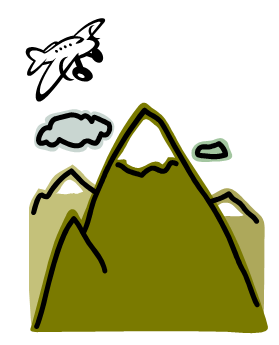
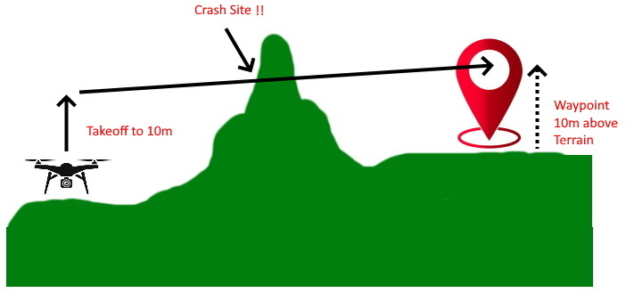
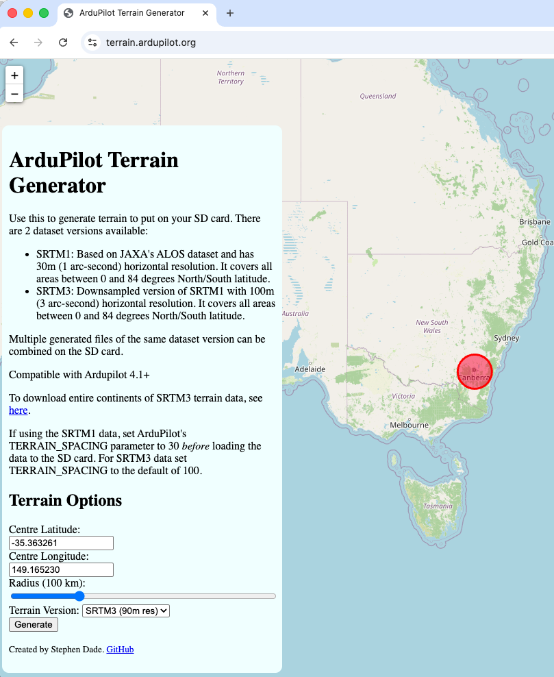
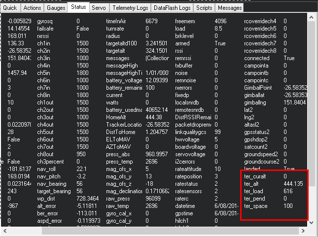

.. _common-terrain-following:

=================
Terrain Following
=================

You can use automatic terrain following for fixed wing
aircraft. This page explains how terrain following works, how to enable
it and what its limitations are.

If using Copter, see :ref:`Copter specific terrain following instructions here <copter:terrain-following>`.

How it works
============

Terrain following works by maintaining a terrain database on the autopilot 
which gives the terrain height in meters above sea level for a grid of geographic locations. 

- If the autopilot has a microSD card this database is stored in the APM/TERRAIN directory on the microSD card.
- If the autopilot does not have a microSD card, there is an option to enable data to be retrieved directly from the GCS into RAM on the autopilot
- On SITL the database is stored in the ./terrain folder relative to the directory where the SITL process is running

The database is populated automatically by the autopilot requesting
terrain data from the ground station over a MAVLink telemetry link. This
can happen either during flight planning when the autopilot is connected
over USB, or during flight when connected over a radio link.

.. note:: One can directly download terrain data via PC to the SD card using the this `web utility <https://terrain.ardupilot.org/>`__. See below.

.. note:: The data is only transferred if the autopilot has a GPS lock. So to make sure your missions have the terrain data prior to flight (in case the ground station is not connected during the flight and/or does not have internet connection to obtain the data), be sure that GPS lock is in effect when loading the mission to the autopilot.

SD Card support for Terrain data
================================

Terrain following works best if the autopilot has an onboard SD card for storage.

Once the terrain data is sent from the GCS to the autopilot it is stored on the
microSD card, so that it is available even when the GCS is not connected.
This makes it possible for an autopilot with an SD card to use terrain data to perform
a terrain following RTL (Return To Launch) even when it is not able to
talk to the ground station.

During flight the ArduPilot code automatically pages in the needed
terrain data from the microSD card into memory as the aircraft
approaches a new area. By default it maintains an area of about 7km by 8km in
memory if the default terrain grid spacing (100m) is used. 
See below for options to change the default behaviour.

In addition to any terrain data for the immediate vicinity of the
aircraft, ArduPilot also asks the ground station for terrain data for
any mission waypoints which are loaded, and for any rally points which
are loaded. This ensures that terrain data is available on the microSD
card for a whole mission even if the GCS becomes unavailable.

Terrain Following Flight Modes
==============================

Use of terrain following in specific flight modes is controlled by the :ref:`TERRAIN_FOLLOW<TERRAIN_FOLLOW>` parameter. That parameter defaults
to off, so no terrain following will be used in those modes. Setting the bitmask in :ref:`TERRAIN_FOLLOW<TERRAIN_FOLLOW>` determines which 
altitude controlled modes terrain following is active. For example, setting it to "10" enables following in FBWB and AUTO. Setting it to "1" 
enables it in all available modes.

Terrain Following in non auto modes can be disabled with an RC switch assigned ``RCx_OPTION`` = 86. 
When enabling (<1200us) or disabling (>1800us) terrain following with the switch, the present 
altitude will be used as the target set point either above terrain, or home, respectively. 
The target altitude can be changed as normal with elevator whether the altitude reference being 
used is above home or above terrain.

Use of terrain following in AUTO missions is controlled on a waypoint by
waypoint basis using the reference frame of the waypoint. Normal (non
terrain following) waypoints have a "Relative" reference frame, and
altitudes are specified relative to the home location, not by the :ref:`TERRAIN_FOLLOW<TERRAIN_FOLLOW>` parameter.
Terrain following waypoints have a "Terrain" reference frame, and altitudes are relative
to the ground level given in the terrain database.

.. note:: in AUTO mode autolandings, the :ref:`TERRAIN_FOLLOW<TERRAIN_FOLLOW>` parameter
   does have an impact, when a rangefinder is also used. See :ref:`rangefinder-autolanding`.

See :ref:`common-understanding-altitude` for altitude definitions.

Uses of Terrain Following
=========================

Terrain following is very useful when flying ArduPilot in areas where
the terrain may vary significantly. Key uses are:

-  **Safe RTL**. Being able to come over a hill rather than trying to
   fly through it when you enter RTL in a hilly area is very useful!
-  **Aerial Photography.** It is useful to be able to maintain a
   constant altitude over the ground when taking a sequence of aerial
   photos
-  **FPV flying.** When flying FPV in CRUISE mode it is useful to
   maintain constant height above the ground so you can spend more time
   enjoying the scenary and less time avoiding hills
-  **Regulatory Compliance.** Many countries have restrictions on the
   altitude drones must fly at or below, often 400' (about 120m). With
   terrain following enabled, missions items and other limits can be specified in AGL (terrain) 
   frame.

Sources of Terrain Data
=======================

The ground station is normally responsible for providing the raw terrain data which is sent to the aircraft via MAVLink. 
Mission Planner, QGroundControl, SiYi UniGCS and MAVProxy support the required TERRAIN_DATA and TERRAIN_REQUEST 
MAVLink messages needed for terrain following download support. 

- Mission Planner and MAVProxy supply the ArduPilot JAXA ALOS sourced data for 100m and 30m spacing 
- QGroundControl supplies COP30 (Copernicus DEM - Global and European Digital Elevation Model) sourced data for 100m and 30m spacing
- SiYi UniGCS supplies terrain data (NASA - SRTM Shuttle Radar Topography Mission Global 1 arc second V003) for 100m and 30m spacing 

.. note::
   SiYi terrain data: NASA JPL. (2013). *NASA Shuttle Radar Topography Mission Global 1 arc second V003* \[Data set\]. `NASA Earth Sciences Data Sets <https://www.earthdata.nasa.gov/data/catalog/lpcloud-srtmgl1-003>`__

If you are using a different ground station that doesn't support TERRAIN_REQUEST and TERRAIN_DATA, 
in order to download terrain data you will need to to either pre-load the data on your SD card or 
connect using one of the above stations in order to allow ArduPilot to load terrain data onto your board on the ground or in flight.  
Once terrain data is loaded, it is saved permanently on the microSD card.

Unless the ground control station uses a different server with support for different spacing, setting the :ref:`TERRAIN_SPACING <TERRAIN_SPACING>`
parameter other than 100m or 30m provides no better resolution, and only consumes more space on the SD card.

Terrain Data is downloaded any time you save or connect with a loaded mission with these ground stations or,
if flying, the autopilot will request data if it's flying into an area not already downloaded, assuming the
ground station can provide it. The ground station may have it's own cache of previously requested data, but if
if flying in an area where there is no cached data, an internet connection is required by the ground station for this to work.

.. note:: If :ref:`TERRAIN_OPTIONS<TERRAIN_OPTIONS>` bit 0 (value +1) is set, the terrain data will not be downloaded from the ground station.

.. warning:: While the autopilot will request the terrain data around waypoints and home location, if it is not connected to a GCS that can supply enroute tiles, and if the relevant terrain data is not on the SD Card, the autopilot just interpolates between the terrain elevation of the waypoints. See below:

If you are not flying with a GCS that can fetch and supply terrain data as the vehicles flies between waypoints,
then you may need to load terrain data covering the flight route and/or area for RTL paths manually.

You can download a set of terrain data tiles at either 100m (SRTM3) or 30m (SRTM1) for any anticipated
flight area using this `web utility <https://terrain.ardupilot.org/>`__.

It will create tiles for the specified radius around a geographic location. Then you can download them, unzip and write in the APM/TERRAIN folder of the SD card.

You can also download .zip files for entire continents, or individual tiles from `here <https://terrain.ardupilot.org/continentsdat3/>`__. 

You may also want to obtain higher resolution data, available from commercial sources online, if you have specialized requirements.

It's a very good idea to remove the SD card from the AutoPilot and copy large terrain data sets directly to
the /APM/TERRAIN folder from your PC, as copying them via MAVFtp in Mission Planner using a USB
or other MAVlink connection is likely to take many, many hours or even days.

Terrain Spacing
===============

The ArduPilot terrain code has a user settable parameter called
:ref:`TERRAIN_SPACING<TERRAIN_SPACING>` which controls the grid spacing which is used for
requests for terrain data from the aircraft to the ground station. The
default :ref:`TERRAIN_SPACING<TERRAIN_SPACING>` is 100 meters but 30m spacing (SRTM1) data provides a good compromise between accuracy and
bandwidth/storage space, and runtime memory requirements. Use ``TERRAIN_SPACING`` = 30
meters for most normal use cases.

Expert users who provide their own terrain data may set a different grid spacing for specialist applications.

Note that the amount of terrain data kept in memory is directly related
to the grid spacing. If you decrease the ``TERRAIN_SPACING`` by a factor of
2 then the amount of terrain area kept in memory is reduced by a factor
of 4. This may be an issue on older boards with less memory, but for a newer
AutoPilot with 1M of RAM, the :ref:`TERRAIN_CACHE_SZ<TERRAIN_CACHE_SZ>` can be
increased to make better use of available memory for caching terrain tiles. The default
is 12 but a good value on an STM32-H7 processor would be 60 or higher.

If your AutoPilot has less memory, less storage space, or communication
bandwidth might be an issue, it is recommended that you use a ``TERRAIN_SPACING`` of 100
meters to prevent the aircraft running off the side of a grid in flight
and not having data available.

If the ground station does not have terrain data available at the
resolution requested by the aircraft then the ground station will
interpolate as necessary to provide the requested grid size. 

Terrain Data Issue - Old Terrain Data
=====================================
In early 2026 an issue was identified with terrain data available from terrain.ardupilot.org.
The issue was resolved on 24th February 2026. From ArduPilot 4.7, ArduPilot will raise a pre-arm 
error if it finds older data on the SD Card, or it's served from a ground control station, perhaps 
from an older cache. It is risky to fly with this old data, but the risks do depend on where 
you are flying, so you might choose to accept the risk. 

If you are running a 4.6.x release or earlier you won’t get the above error message, but that doesn’t mean you are safe. 
You should:

- Delete all the DAT files in the APM/TERRAIN directory on your microSD card then reboot the autopilot
- If using Mission Planner or MAVProxy, delete the SRTM data from your Ground Station. If using Mission Planner delete the contents of C:\\ProgramData\\Mission Planner\\srtm
- Then either download new data from terrain.ardupilot.org or let the normal automatic terrain download system download new terrain data via your GCS.

If you are running the 4.7.x release or higher (or you are running the latest master branch) then you should get the above warning if you have old terrain data, but if you are uncertain then the safe thing to do is delete the old DAT files from APM/TERRAIN and download again.

In 4.7.x or higher you can set :ref:`TERRAIN_OPTIONS<TERRAIN_OPTIONS>` bit 2 (value=4) to override the check and allow you to use old terrain data. 
If you are confident you are not impacted by the bugs (most locations in the world are unaffected) 
then this new :ref:`TERRAIN_OPTIONS<TERRAIN_OPTIONS>` bit allows you to fly without the error messages.  We don’t recommend this, but for some vehicles where replacing the terrain data files is difficult this is 
provided as an option. For example, if you have created your own DAT files from geoTIFF or similar then this would be a way to avoid having to regenerate them. Remember to unset this option bit when you move to newer terrain data.

Terrain Accuracy
================
When the terrain data issue was resolved, the data sources for both 100m and 30m terrain were switched to JAXA's ALOS. There are 2 dataset versions available: 

- SRTM1: Based on JAXA's ALOS dataset and has 30m (1 arc-second) horizontal resolution. It covers all areas between 0 and 84 degrees North/South latitude. 
- SRTM3: Downsampled version of SRTM1 with 100m (3 arc-second) horizontal resolution. It covers all areas between 0 and 84 degrees North/South latitude.

.. note::  This does mean that although we use "SRTM1" and "SRTM3", to refer to the different data sets, neither of the data sets provided by ArduPilot is actually NASA SRTM (Shuttle Radar Topography Mission Global) data.

.. note::
   While the original NASA SRTM data had a target vertical accuracy of +/- 16 meters 
   (see `SRTM Mission Specifications <https://www.earthdata.nasa.gov/data/catalog/lpcloud-srtmgl1n-003>`_), 
   the ALOS AW3D30 data generally achieves an accuracy of +/- 5 meters 
   (see `JAXA AW3D30 Validation Report <https://isprs-archives.copernicus.org/articles/XLI-B4/157/2016/isprs-archives-XLI-B4-157-2016.pdf>`_).

Impacts of Downsampling to SRTM3
--------------------------------

While both datasets are derived from the high-accuracy JAXA ALOS mission, the process of downsampling from the native 30m resolution (SRTM1) to the 100m resolution (SRTM3) introduces several issues:

* **Vertical Accuracy Loss:** Downsampling involves averaging multiple 30m data points into a single 100m cell. This mathematical smoothing increases the vertical error (RMSE), particularly in rugged or mountainous terrain, making the 100m dataset less precise than the 30m version.
* **Loss of Sharp Features:** High-resolution details of valleys, ridges, and hills become "flattened" or smoothed out. The 30m (SRTM1) version is significantly more reliable at capturing sharp topographic changes that a drone might encounter.
* **Averaging Errors:** Each ~100m cell in the SRTM3 version represents the average height of an area roughly the size of a city block. Small but critical obstacles—such as a single sharp peak—may be averaged into the surrounding lower terrain, making them effectively "invisible" to the autopilot's terrain-following logic.

.. note::
   Regardless of which dataset is used, the terrain database represents a "surface model" (including trees/buildings) and can change over time. Always maintain a conservative safety altitude buffer.

Using terrain data for low flights is not recommended, and if using automatic landing, a rangefinder is recommended for the final approach.

Setting up for terrain following using Mission Planner
======================================================

To setup your fixed wing aircraft for terrain following if you are using Mission Planner, follow these steps:

-  make sure you have the latest MissionPlanner installed 
-  set :ref:`TERRAIN_ENABLE<TERRAIN_ENABLE>` to 1 and :ref:`TERRAIN_FOLLOW<TERRAIN_FOLLOW>` to 1
-  connect to your vehicle over USB when you have GPS lock
-  check the FlightData->Status page in MissionPlanner and look for the
   terrain status data:

When the autopilot has finished loading terrain data you should see
"ter_pend" goes to zero and the current terrain altitude in meters
showing up in "ter_alt". The "ter_pend" value is the number of terrain
blocks that the autopilot is waiting to load from the ground station or from the SD Card.

Terrain Options
===============
There are three optional behaviors which can be selected via the :ref:`TERRAIN_OPTIONS<TERRAIN_OPTIONS>` bitmask parameter:

- if bit 0 is set (value+1): downloading of terrain data is halted.
- if bit 1 is set (value+2): enables using terrain data (via GCS) when no SD card is present.
- if bit 2 is set (value+4): will accept "old" terrain data (see below)

Terrain Look-ahead
==================

The terrain following code "looks ahead" of the current position along
the flight path to try to ensure that the aircraft climbs soon enough to
avoid upcoming terrain. The amount of look-ahead is controlled by the
:ref:`TERRAIN_LOOKAHD<TERRAIN_LOOKAHD>` parameter, which defaults to 2000 meters. The look-ahead
is also limited by the distance to the next waypoint in AUTO mode, so
you need to ensure that you don't have any legs of your mission which
include climb rates your aircraft cannot achieve.

The climb rate used in the terrain look-ahead is based on the
 :ref:`TECS_CLMB_MAX<TECS_CLMB_MAX>` parameter, combined with your current ground speed.

Recommended Settings
====================

-  set :ref:`TERRAIN_ENABLE<TERRAIN_ENABLE>` to 1 and :ref:`TERRAIN_FOLLOW<TERRAIN_FOLLOW>` to 1
-  set :ref:`TERRAIN_SPACING<TERRAIN_SPACING>` to 30 meters for more precise AGL calculations
-  set :ref:`TERRAIN_CACHE_SZ<TERRAIN_CACHE_SZ>` to 60 to load more tiles into memory (RAM)
-  set :ref:`TERRAIN_LOOKAHD<TERRAIN_LOOKAHD>` to 1000 meters unless you have a reason to need more

To avoid high bandwidth consumption due to terrain tiles being sent to the aircraft over your telemetry
link, especially if you often fly in different locations, it's also highly recommended to download the 
terrain around your planned flight area in the /APM/TERRAIN folder on the SD Card on the AutoPilot.

[copywiki destination="plane"]
