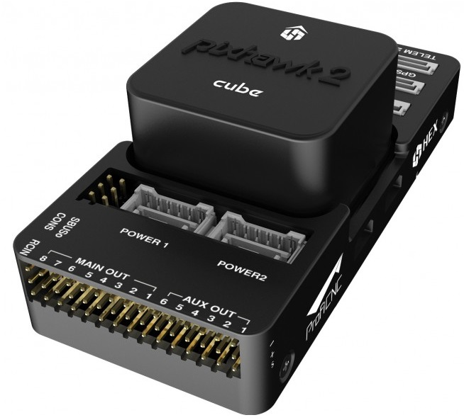
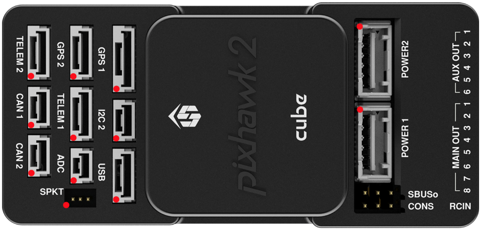
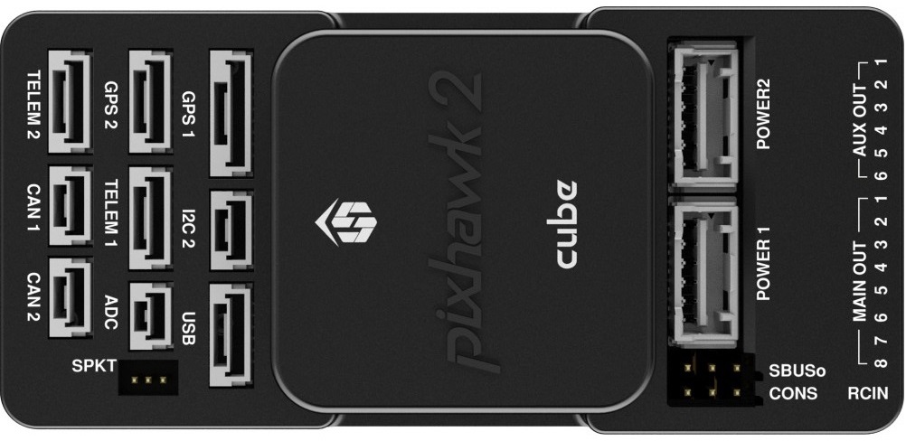

.. _common-thecube-overview:

=================
The Cube Overview
=================

System Features
===============

The Cube autopilot is a further evolution of the Pixhawk autopilot. It is designed for commercial systems and manufacturers who wish to fully integrate a autopilot into their system. On top of the existing features of Pixhawk, it has the following enhancements:

-  3 sets of IMU sensors for extra redundancy
-  2 sets of IMU are vibration-isolated mechanically, reducing the effect of frame vibration to state estimation
-  IMUs are temperature-controlled by onboard heating resistors, allowing optimum working temperature of IMUs
-  The entire flight management unit(FMU) and inertial management unit(IMU) are housed in a relatively small form factor (a cube). All inputs and outputs go through a 80-pin DF17 connector, allowing a plug-in solution for manufacturers of commercial systems. Manufacturers can design their own carrier boards to suite their specific needs.

Specifications
==============

-  **Processor**

   -  32-bit ARM Cortex M4 core with FPU
   -  168 Mhz/256 KB RAM/2 MB Flash
   -  32-bit failsafe co-processor

-  **Sensors**

   -  Three redundant IMUs (accels, gyros and compass)
   -  InvenSense MPU9250, ICM20948 and/or ICM20648 as first and third IMU (accel and gyro)
   -  ST Micro L3GD20+LSM303D or InvenSense ICM2076xx as backup IMU (accel and gyro)
   -  Two redundant MS5611 barometers

-  **Power**

   -  Redundant power supply with automatic failover
   -  Servo rail high-power (7 V) and high-current ready
   -  All peripheral outputs over-current protected, all inputs ESD
      protected

-  **Interfaces**

   -  14x PWM servo outputs (8 from IO, 6 from FMU)
   -  S.Bus servo output
   -  R/C inputs for CPPM, Spektrum / DSM and S.Bus
   -  Analogue / PWM RSSI input
   -  5x general purpose serial ports, 2 with full flow control
   -  2x I2C ports
   -  SPI port (un-buffered, for short cables only not recommended for use)
   -  2x CAN Bus interface
   -  3x Analogue inputs (3.3V and 6.6V)
   -  High-powered piezo buzzer driver (on expansion board)
   -  High-power RGB LED (I2C driver compatible connected externally only)
   -  Safety switch / LED
   -  Optional carrier board for Intel Edison

The Cube connector pin assignments
==================================
This section details the pin assignments of the standard carrier board of The Cube. There are other types of carrier boards available, please refer to the manufacturer pages for pinouts of specific carrier board.

**TELEM1, TELEM2 ports**

.. raw:: html

   <table border="1" class="docutils">
   <tbody>
   <tr>
   <th>Pin </th>
   <th>Signal </th>
   <th>Volt </th>
   </tr>
   <tr>
   <td>1 (red)</td>
   <td>VCC</td>
   <td>+5V</td>
   </tr>
   <tr>
   <td>2 (blk)</td>
   <td>TX (OUT)</td>
   <td>+3.3V</td>
   </tr>
   <tr>
   <td>3 (blk)</td>
   <td>RX (IN)</td>
   <td>+3.3V</td>
   </tr>
   <tr>
   <td>4 (blk)</td>
   <td>CTS</td>
   <td>+3.3V</td>
   </tr>
   <tr>
   <td>5 (blk)</td>
   <td>RTS</td>
   <td>+3.3V</td>
   </tr>
   <tr>
   <td>6 (blk)</td>
   <td>GND</td>
   <td>GND</td>
   </tr>
   </tbody>
   </table>

**GPS1 port**

.. raw:: html

   <table border="1" class="docutils">
   <tbody>
   <tr>
   <th>Pin</th>
   <th>Signal</th>
   <th>Volt</th>
   </tr>
   <tr>
   <td>1 (red)</td>
   <td>VCC</td>
   <td>+5V</td>
   </tr>
   <tr>
   <td>2 (blk)</td>
   <td>TX (OUT)</td>
   <td>+3.3V</td>
   </tr>
   <tr>
   <td>3 (blk)</td>
   <td>RX (IN)</td>
   <td>+3.3V</td>
   </tr>
   <tr>
   <td>4 (blk)</td>
   <td>SCL I2C1</td>
   <td>+3.3V</td>
   </tr>
   <tr>
   <td>5 (blk)</td>
   <td>SDA I2C1</td>
   <td>+3.3V</td>
   </tr>
   <tr>
   <td>6 (blk)</td>
   <td>Button</td>
   <td>GND</td>
   </tr>
   <tr>
   <td>7 (blk)</td>
   <td>button LED</td>
   <td>GND</td>
   </tr>
   <tr>
   <td> (blk)</td>
   <td>GND</td>
   <td>GND</td>
   </tr>
   </tbody>
   </table>

**GPS2 port**

.. raw:: html

   <table border="1" class="docutils">
   <tbody>
   <tr>
   <th>Pin</th>
   <th>Signal</th>
   <th>Volt</th>
   </tr>
   <tr>
   <td>1 (red)</td>
   <td>VCC</td>
   <td>+5V</td>
   </tr>
   <tr>
   <td>2 (blk)</td>
   <td>TX (OUT)</td>
   <td>+3.3V</td>
   </tr>
   <tr>
   <td>3 (blk)</td>
   <td>RX (IN)</td>
   <td>+3.3V</td>
   </tr>
   <tr>
   <td>4 (blk)</td>
   <td>SCL I2C2</td>
   <td>+3.3V</td>
   </tr>
   <tr>
   <td>5 (blk)</td>
   <td>SDA I2C2</td>
   <td>+3.3V</td>
   </tr>
   <tr>
   <td>6 (blk)</td>
   <td>GND</td>
   <td>GND</td>
   </tr>
   </tbody>
   </table>

**ADC**

.. raw:: html

   <table border="1" class="docutils">
   <tbody>
   <tr>
   <th>Pin</th>
   <th>Signal</th>
   <th>Volt</th>
   </tr>
   <tr>
   <td>1 (red)</td>
   <td>VCC</td>
   <td>+5V</td>
   </tr>
   <tr>
   <td>2 (blk)</td>
   <td>ADC IN</td>
   <td></td>
   </tr>
   <tr>
   <td>3 (blk)</td>
   <td>GND</td>
   <td>GND</td>
   </tr>
   </tbody>
   </table>

**I2C2**

.. raw:: html

   <table border="1" class="docutils">
   <tbody>
   <tr>
   <th>Pin</th>
   <th>Signal</th>
   <th>Volt</th>
   </tr>
   <tr>
   <td>1 (red)</td>
   <td>VCC</td>
   <td>+5V</td>
   </tr>
   <tr>
   <td>2 (blk)</td>
   <td>SCL</td>
   <td>+3.3 (pullups)</td>
   </tr>
   <tr>
   <td>3 (blk)</td>
   <td>SDA</td>
   <td>+3.3 (pullups)</td>
   </tr>
   <tr>
   <td>4 (blk)</td>
   <td>GND</td>
   <td>GND</td>
   </tr>
   </tbody>
   </table>

**CAN1&2**

.. raw:: html

   <table border="1" class="docutils">
   <tbody>
   <tr>
   <th>Pin</th>
   <th>Signal</th>
   <th>Volt</th>
   </tr>
   <tr>
   <td>1 (red)</td>
   <td>VCC</td>
   <td>+5V</td>
   </tr>
   <tr>
   <td>2 (blk)</td>
   <td>CAN_H</td>
   <td>+12V</td>
   </tr>
   <tr>
   <td>3 (blk)</td>
   <td>CAN_L</td>
   <td>+12V</td>
   </tr>
   <tr>
   <td>4 (blk)</td>
   <td>GND</td>
   <td>GND</td>
   </tr>
   </tbody>
   </table>

**POWER1&2**

.. raw:: html

   <table border="1" class="docutils">
   <tbody>
   <tr>
   <th>Pin</th>
   <th>Signal</th>
   <th>Volt</th>
   </tr>
   <tr>
   <td>1 (red)</td>
   <td>VCC</td>
   <td>+5V</td>
   </tr>
   <tr>
   <td>2 (red)</td>
   <td>VCC</td>
   <td>+5V</td>
   </tr>
   <tr>
   <td>3 (blk)</td>
   <td>CURRENT</td>
   <td>up to +3.3V</td>
   </tr>
   <tr>
   <td>4 (blk)</td>
   <td>VOLTAGE</td>
   <td>up to +3.3V</td>
   </tr>
   <td>5 (blk)</td>
   <td>GND</td>
   <td>GND</td>
   </tr>
   <td>6 (blk)</td>
   <td>GND</td>
   <td>GND</td>
   </tr>
   </tbody>
   </table>

**USB**

.. raw:: html

   <table border="1" class="docutils">
   <tbody>
   <tr>
   <th>Pin </th>
   <th>Signal </th>
   <th>Volt </th>
   </tr>
   <tr>
   <td>1 (red)</td>
   <td>VCC</td>
   <td>+5V</td>
   </tr>
   <tr>
   <td>2 (blk)</td>
   <td>D_plus</td>
   <td>+3.3V</td>
   </tr>
   <tr>
   <td>3 (blk)</td>
   <td>D_minus</td>
   <td>+3.3V</td>
   </tr>
   <tr>
   <td>4 (blk)</td>
   <td>GND</td>
   <td>GND</td>
   </tr>
   <tr>
   <td>5 (blk)</td>
   <td>BUZZER</td>
   <td>battery voltage</td>
   </tr>
   <tr>
   <td>6 (blk)</td>
   <td>Boot/Error LED</td>
   <td></td>
   </tr>
   </tbody>
   </table>

Cubepilot Ecosystem
===================

.. image:: ../../../images/Cubepilot_ecosystem.jpg
    :target: ../_images/Cubepilot_ecosystem.jpg

More Information
================

For more information and instructions on setting up and using the Cubepilot system see  `Cubepilot Docs  <https://docs.cubepilot.org/user-guides/>`__

For technical help and support on the cubepilot system see  `Cubepilot Forum  <https://discuss.cubepilot.org/>`__

Company information on Cubpilot can be found at  `www.proficnc.com  <http://www.proficnc.com>`__

Carrier Board Design
====================

The reference design files of the standard carrier board are available in `github  <https://github.com/proficnc/The-Cube>`__, or `here <https://github.com/ArduPilot/Schematics/tree/master/ProfiCNC>`__ ,this serve as a starting point for designers to design their own system based on The Cube autopilot.

Where to Buy
============

Official retailers are listed `here  <http://www.proficnc.com/stores>`__.

More Images
===========

