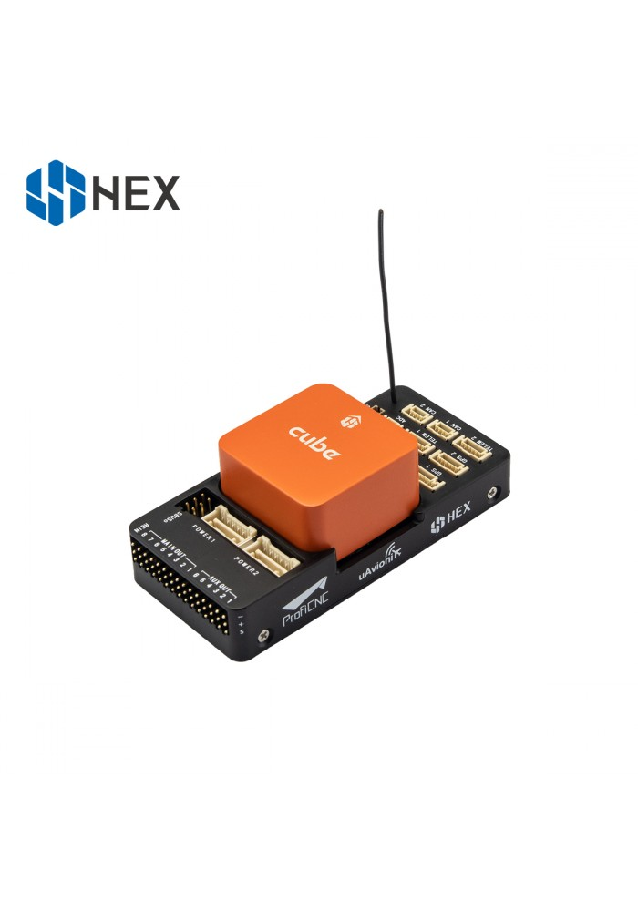
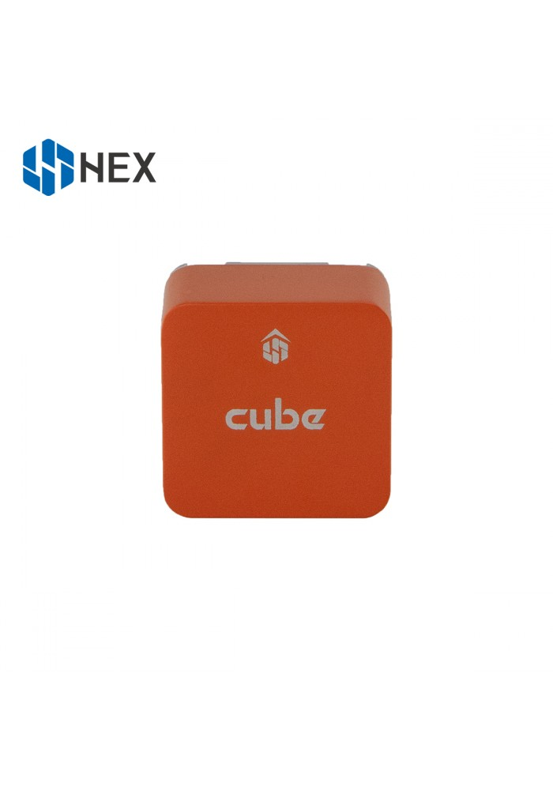

.. _common-thecubeorange-overview:

=====================================
The Cube Orange With ADSB-In Overview
=====================================

System Features
===============

The Cube Orange autopilot is the latest and most powerful model in the Cubepilot ecosystem. Designed for hobby users, commercial system integrators and UAS manufacturers the Cube Orange autopilot is part of a wide ecosystem of autopilot modules and carrier boards. All Cube models are compatible with all carriers which allows users to choose an off the shelf carrier board that best suits their needs. System designers are able to integrate the Cube directly into their designs via published carrier board specifications. 

The Cube Orange is available as a standalone module or as a package with a new updated version of the original carrier board that now includes an integrated ADS-B In module from uAvionics. 

ADS-B Carrier Board
===================

The new ADS-B carrier boards overall footprint is identical to the standard versions and the main changes compared to the original carrier are as follows:

-  Integration of uAvonix ADS-B IN Receiver on Serial 5
-  Built-In ADS-B Antenna 
-  Removal of Intel Edison Bay and Debug USB Ports

All other specification and external connections remain identical to the original board as listed on the Cube Black page.

Cube Orange Features
====================

-  Faster H7 SOC with 1MB ram
-  Upgraded tripple redundant IMU sensors for extra redundancy
-  2 sets of IMU are vibration-isolated mechanically, reducing the effect of frame vibration to state estimation
-  IMUs are temperature-controlled by onboard heating resistors, allowing optimum working temperature of IMUs
-  The entire flight management unit(FMU) and inertial management unit(IMU) are housed in a reatively small form factor (a cube). 
-  Fully Cubepilot carrierboard compatible, all inputs and outputs go through a 80-pin DF17 connector, allowing a plug-in solution for manufacturers of commercial systems. Manufacturers can design their own carrier boards to suit their specific needs now and in the future. 

Specifications
==============

-  **Processor**

   -  32bit ARM® STM32H743 Cortex®-M7（with DP-FPU）
   -  400 Mhz/1 MB RAM/2 MB Flash
   -  32 bit STM32F103 failsafe co-processor

-  **Sensors**

   - Three redundant IMUs (accels, gyros and compass)
   -  ICM 20649 integrated accelerometer / gyro, MS5611 barometer on base board
   -  InvenSense ICM20602 IMU,ICM20948 IMU/MAG, MS5611 barometer on temperature controlled, vibration isolated board
   -  All sensors connected via SPI.

-  **Power**

   -  Redundant power supply with automatic failover
   -  Servo rail high-power (7 V) and high-current ready
   -  All peripheral outputs over-current protected, all inputs ESD
      protected

-  **Interfaces**

   -  14x PWM servo outputs (8 from IO, 6 from FMU)
   -  S.Bus servo output
   -  R/C inputs for CPPM, Spektrum / DSM and S.Bus
   -  Analogue / PWM RSSI input
   -  5x general purpose serial ports, 2 with full flow control
   -  2x I2C ports
   -  SPI port (un-buffered, for short cables only not recommended for use)
   -  2x CAN Bus interface
   -  3x Analogue inputs (3.3V and 6.6V)
   -  High-powered piezo buzzer driver (on expansion board)
   -  High-power RGB LED (I2C driver compatible connected externally only)
   -  Safety switch / LED
   -  Optional carrier board for Intel Edison (now obsolete)

The Cube connector pin assignments
==================================

All other specification and external connections remain identical to the original board as listed on the Cube Black page.

Cubepilot Ecosystem
===================

.. image:: ../../../images/Cubepilot_ecosystem.jpg
    :target: ../_images/Cubepilot_ecosystem.jpg

More Information
================

For more information and instructions on setting up and using the Cubepilot system see  `Cubepilot Docs  <https://docs.cubepilot.org/user-guides/>`__

For technical help and support on the cubepilot system see  `Cubepilot Forum  <https://discuss.cubepilot.org/>`__

Company information on Cubpilot can be found at  `www.proficnc.com  <http://www.proficnc.com>`__

Carrier Board Design
====================

The reference design files of the standard carrier board are available in `github  <https://github.com/proficnc/The-Cube>`__, or `here <https://github.com/ArduPilot/Schematics/tree/master/ProfiCNC>`__ ,this serves as a starting point for designers to design their own system based on The Cube autopilot.

Where to Buy
============

Official retailers are listed `here  <http://www.proficnc.com/stores>`__.

More Images
===========

