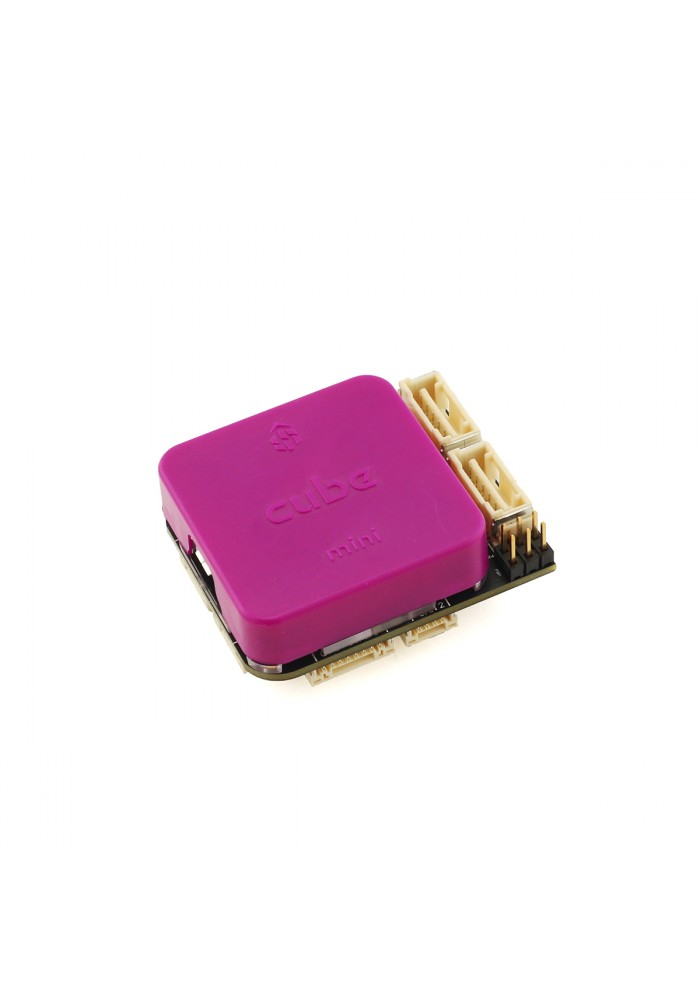
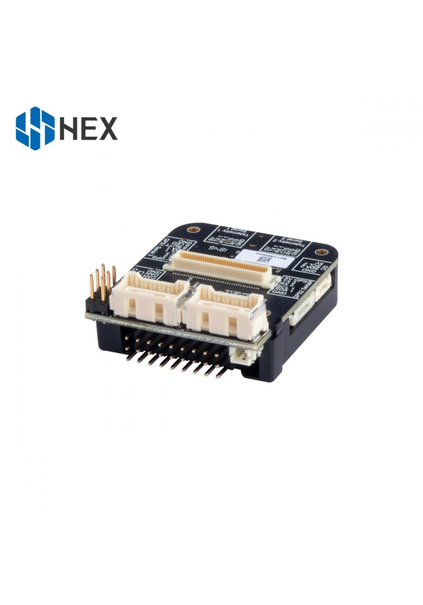

.. _common-thecubepurple-overview:

========================
The Cube Purple Overview
========================

System Features
===============

The Cube Purple autopilot is designed for ground based applications such as boat, car or rover. Based on the Cube Black main module the purple is a much smaller platform for applications where sensor redundancy is not required.

-  Single IMU sensor
-  Single Baro Sensor
-  The entire flight management unit(FMU) and inertial management unit(IMU) are housed in a reatively small form factor (a cube). All inputs and outputs go through a 80-pin DF17 connector, allowing a plug-in solution for manufacturers of commercial systems. Manufacturers can design their own carrier boards to suit their specific needs.

Specifications
==============

-  **Processor**

   -  32-bit ARM Cortex M4 core with FPU
   -  168 Mhz/256 KB RAM/2 MB Flash
   -  32-bit failsafe co-processor

-  **Sensors**

   -  1 x IMU (accels, gyros and compass)
   -  1 x InvenSense MPU9250 (accel and gyro)
   -  1 x MS5611 barometers

Carrier Board Mini
==================

Mini Carrier Board has the standardized DF17 connector which allows the user to connect it to every version of the Cube flight controller. With smaller size and almost the same capability with the standard carrier board, it can better fit in to those applications which have size limits. Also, it can be equipped with the Cube Purple to better fulfil the requests from customers. 

Functionality of Carrier Board:

Dual power input (for redundant power, automatic switch to another power when one fails)
Power distribution (limit the current at each connector, avoiding overloading when one device draws too large current)
Voltage protection (over or under voltage protection, the circuit will be shut down if the voltage exceeds the limit)

The Cube connector pin assignments
==================================

All other specification and external connections remain identical to the original board as listed on the Cube Black page.

Cubepilot Ecosystem
===================

.. image:: ../../../images/Cubepilot_ecosystem.jpg
    :target: ../_images/Cubepilot_ecosystem.jpg

More Information
================

For more information and instructions on setting up and using the Cubepilot system see  `Cubepilot Docs  <https://docs.cubepilot.org/user-guides/>`__

For technical help and support on the cubepilot system see  `Cubepilot Forum  <https://discuss.cubepilot.org/>`__

Company information on Cubpilot can be found at  `www.proficnc.com  <http://www.proficnc.com>`__

Carrier Board Design
====================

The reference design files of the standard carrier board are available in `github  <https://github.com/proficnc/The-Cube>`__, or `here <https://github.com/ArduPilot/Schematics/tree/master/ProfiCNC>`__ ,this serves as a starting point for designers to design their own system based on The Cube autopilot.

Where to Buy
============

Official retailers are listed `here  <http://www.proficnc.com/stores>`__.
