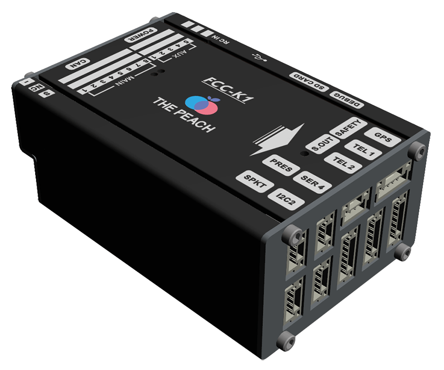
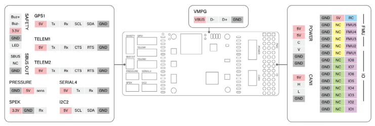
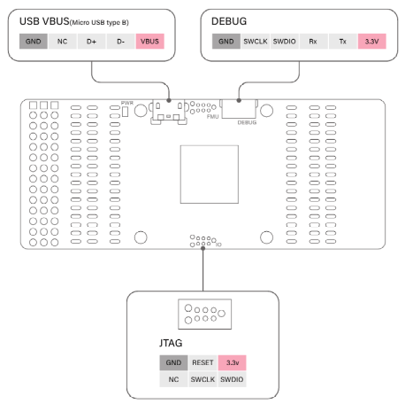

.. _common-thepeach-k1:

===============
ThePeach FCC-K1
===============

Specifications
==============

- **Processor**
    - STM32F427VIT6: 32bit ARM Cortex-M4, 168 MHz 256 KB RAM 2 MB Flash memory
    - IO Processor: STM32F100C8T6: ARM Cortex-M3, 32bit ARM Cortex-M3, 24 MHz, 8KB SRAM
- **On-board Sensors**
    - Accel/Gyro: ICM-20602
    - Accel/Gyro/Mag: MPU-9250
    - Barometer: MS5611
- **Interfaces**
    - 8+5 PWM output (8 from IO, 5 from FMU)
    - Spektrum DSM / DSM2 / DSM-X Satellite compatible input
    - Futaba S.BUS compatible input and output
    - PPM sum signal input
    - Analogue / PWM RSSI input
    - S.Bus servo output
    - Safety switch/LED
    - 4x UART Ports: TELEM1, TELEM2, GPS, SERIAL4
    - 2x I2C Ports: I2C2, GPS
    - 1x CAN bus
    - 1x ADC
    - Analog inputs for voltage / Current of 1 battery
- **Mechanical**
    - Dimensions: 40.2 x 61.1 x 24.8mm
    - Weight: 65g
- **Voltage Ratings**
    - POWER input (5V to 5.5V)
    - USB Input (4.75V to 5.25V)

**note:**

The output power rails **FMU PWM OUT** and **I/O PWM OUT** do not power the autopilot board (and are not powered by it). You must supply power to one of **POWER** or **USB** or the board will be unpowered.

UART Mapping
============
 
 - SERIAL0 -> USB
 - SERIAL1 -> USART2     (TELEM1, RTS/CTS pins) DMA-enabled
 - SERIAL2 -> USART3     (TELEM2, RTS/CTS pins) DMA-enabled
 - SERIAL3 -> UART4      (GPS1) DMA-enabled
 - SERIAL4 -> UART8      (GPS2) TX only DMA-enabled
 - SERIAL5 -> UART7      (Debug)

Serial port protocols (Telem, GPS, etc.) can be adjusted to personal preferences using the ``SERIALx_PROTOCOL`` parameter.

RC Input
========

The RCIN pin, which by default is mapped to timer input, can be used for all ArduPilot supported receiver protocols, except CRSF/ELRS and SRXL2 which require a true UART connetion. However, Fport, when connected in this manner, will only provide RC without telemetry

To allow CRSF and embedded telemetry available in Fport, CRSF, and SRXL2 receivers, a full UART, such as SERIAL4(UART8) would need to be used for receiver connections. Below are setups using UART8. :ref:`SERIAL4_PROTOCOL<SERIAL4_PROTOCOL>` should be set to “23”.

 - Fport would require :ref:`SERIAL4_OPTIONS<SERIAL4_OPTIONS>` be set to”15”
 - CRSF would require :ref:`SERIAL4_OPTIONS<SERIAL4_OPTIONS>` be set to “0”
 - SRXL2 would require :ref:`SERIAL4_OPTIONS<SERIAL4_OPTIONS>` be set to “4” and connects only the UART8 TX pin.

Any UART can be used for RC system connections in ArduPilot also, and is compatible with all protocols except PPM. See :ref:`Radio Control Systems <common-rc-systems>` for details.

PWM Output
==========

The ThePeach FCC-K1 supports up to 13 PWM outputs. All outputs support all normal PWM output formats.

The 5 AUX outputs are in 2 groups and also support DShot:

- AUX 1, 2, 3 and 4 in group1
- AUX 5 in group2

FMU outputs within the same group need to use the same output rate and protocol. If
any output in a group uses DShot then all channels in that group need
to use DShot.

Battery Monitoring
==================

The board has 1 dedicated power monitor port whit a pin connector. It is intended for use with the Analog power monitor supplied with the autopilot.

Compass
=======

The ThePeach FCC-K1 has a built-in MPU9250 compass. Due to potential interference the autopilot is usually used with an external I2C compass as part of a GPS/Compass combination.

GPIOs
=====

The 5 AUX outputs can be used as GPIOs (relays, buttons, RPM etc). To use them you need to set the output’s SERVOx_FUNTION to -1. See `GPIOs <https://ardupilot.org/copter/docs/common-gpios.html#common-gpios>`_ page for more information

The numburing of the GPIOs for PIN variables in Ardupilot is:

- AUX1 50
- AUX2 51
- AUX3 52
- AUX4 53
- AUX5 54

Connectors
==========

Loading Firmware
================

The board comes pre-installed with an ArduPilot compatible bootloader, allowing the loading of xxxxxx.apj firmware files with any ArduPilot compatible ground station.

Firmware for this board can be found `here <https://firmware.ardupilot.org/>`_ in sub-folders labeled “thepeach-k1”.

Where to Buy
============

Order from `ThePeach <https://thepeach.shop>`_

[copywiki destination="plane,copter,rover,blimp"]
