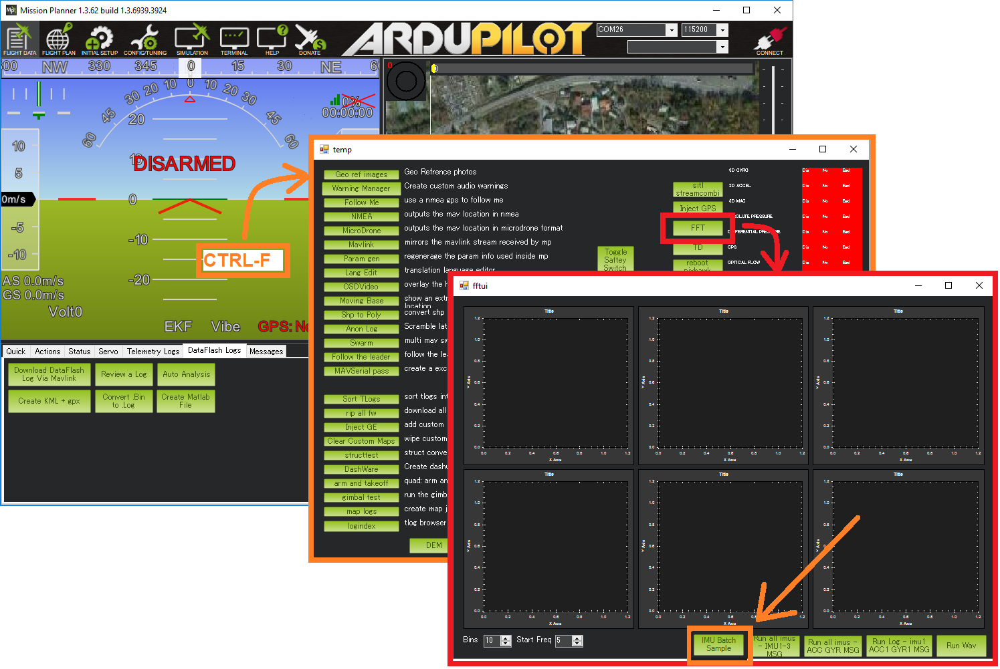
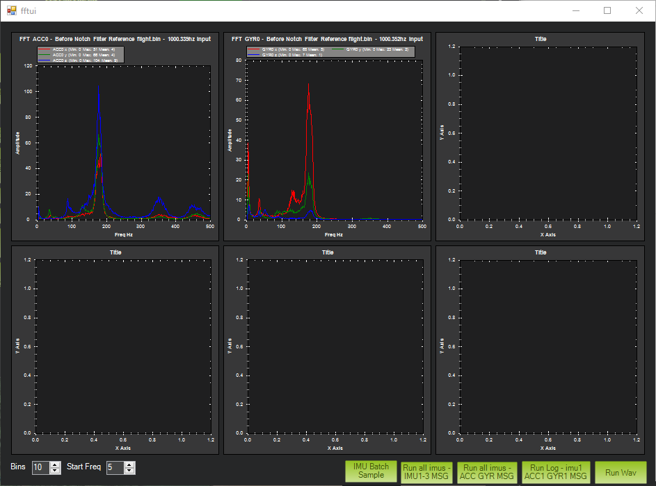

.. _common-throttle-based-notch:

[copywiki destination="copter,plane"]
==================================
Throttle Based Dynamic Notch Setup
==================================

.. _common-imu-notch-filtering-throttle-based-setup:

If you do not have ESC telemetry or an RPM sensor, and are not using an autopilot capable of using the in-flight FFT mode, then throttle-based (:ref:`INS_HNTCH_MODE <INS_HNTCH_MODE>` = 1 ) center frequency control is best.

In order to configure the throttle-based dynamic harmonic notch filter it is important to establish a baseline that identifies the motor noise at the hover throttle level. To do this we need to use the :ref:`batch sampler<common-imu-batchsampling>` to obtain logs for analysis.

- Set :ref:`INS_LOG_BAT_MASK <INS_LOG_BAT_MASK>` = 1 to collect data from the first IMU
- :ref:`LOG_BITMASK <LOG_BITMASK>` 's IMU_RAW bit must **not** be checked.  The default value is fine
- Set :ref:`INS_LOG_BAT_OPT <INS_LOG_BAT_OPT>` = 0 to capture pre-filter gyro data

.. _common-imu-notch-filtering-flight-and-post-flight-analysis:

Determination of Noise Frequencies
==================================

- Perform a hover flight of at least 30s in altitude hold and :ref:`download the dataflash logs <common-downloading-and-analyzing-data-logs-in-mission-planner>`
- Open Mission Planner, press Ctrl-F, press the FFT button, press "new DF log" and select the .bin log file downloaded above

On the graph it should be possible to identify a significant peak in noise that corresponds to the motor rotational frequency. On a smaller Copter this is likely to be around 200Hz and on a larger Copter/QuadPlane 100Hz or so. Here is an example from a 5" quad:

- With the same log, open it in the regular way in mission planner and graph the throttle value. From this identify an average hover throttle value.
- It's also possible to use :ref:`MOT_HOVER_LEARN <MOT_HOVER_LEARN>` = 2 in Copter and read off the value of :ref:`MOT_THST_HOVER <MOT_THST_HOVER>` , or :ref:`Q_M_HOVER_LEARN <Q_M_HOVER_LEARN>` = 2 in QuadPlane and read off the value of :ref:`Q_M_THST_HOVER <Q_M_THST_HOVER>`
- This gives you a hover motor frequency *hover_freq* and thrust value *hover_thrust* . Note that learning of hover thrust only occurs while in an altitude controlled mode with no pitch or roll angle. Therefore, it should be done in calm wind conditions with no pilot stick input for at least 10 seconds.

Harmonic Notch Configuration for Throttle Based Mode
====================================================

- Set :ref:`INS_HNTCH_ENABLE <INS_HNTCH_ENABLE>` = 1 to enable the harmonic notch
- Set :ref:`INS_HNTCH_REF <INS_HNTCH_REF>` = *hover_thrust* to set the harmonic notch reference value
- Set :ref:`INS_HNTCH_FREQ <INS_HNTCH_FREQ>` = *hover_freq* to set the harmonic notch reference frequency
- Set :ref:`INS_HNTCH_BW <INS_HNTCH_BW>` = *hover_freq* / 2 to set the harmonic notch bandwidth

.. _common-imu-notch-filtering-post-configuration-flight-and-post-flight-analysis:

Post Configuration Confirmation Flight and Post-Flight Analysis
===============================================================

- With :ref:`INS_LOG_BAT_MASK <INS_LOG_BAT_MASK>` still set to = 1 to collect data from the first IMU,  set :ref:`INS_LOG_BAT_OPT <INS_LOG_BAT_OPT>` = 2 to capture post-filter gyro data while keeping the :ref:`INS_LOG_BAT_MASK <INS_LOG_BAT_MASK>` unchanged. You may wish to clear :ref:`INS_LOG_BAT_MASK <INS_LOG_BAT_MASK>` after this analysis to prevent logging all the data unnecessarily and to free up RAM which may interfere with some calibrations and/or MAVftp (see :ref:`common-limited_firmware` for more info on RAM limitations).

Perform a similar hover flight and analyze the dataflash logs in the same way. This time you should see significantly less noise and, more significantly, attenuation of the motor noise peak. If the peak does not seem well attenuated then you can experiment with increasing the bandwidth and attenuation of the notch. However, the wider the notch the more delay it will introduce into the control of the aircraft so doing this can be counter-productive.

Here is an example from the same 5" quad with the harmonic notch configured:

.. image:: ../../../images/post-tune-fft.png
    :target:  ../_images/post-tune-fft.png
    :width: 450px

.. note:: be sure to reset the :ref:`INS_LOG_BAT_MASK<INS_LOG_BAT_MASK>` to "0" when finished with analysis flights to free up the RAM consumed by this feature. In some autopilots, you cannot do other memory intensive tasks like Compass Calibration or MAVftp if this batch logging is enabled.

Advanced Notch Frequency Scaling Adjustment in Throttle Based Mode
==================================================================

The harmonic notch is designed to match the motor noise frequency as it changes by interpreting the throttle value. The frequency is scaled up from the hover frequency and will never go below this frequency. However, in dynamic flight it is quite common to hit quite low motor frequencies during propwash. In order to address this it is possible to change the ref value in order to scale from a lower frequency.

- First perform a long dynamic flight using your current settings and post-filter batch logging. Examine the FFT and look at how far the motor noise peak extends below the hover frequency. Use this frequency - *min_freq* - as the lower bound of your scaling. Then in order to calculate an updated value of the throttle reference use:

:ref:`INS_HNTCH_REF <INS_HNTCH_REF>` = *hover_thrust* * SQUAREROOT(*min_freq / hover_freq*)
