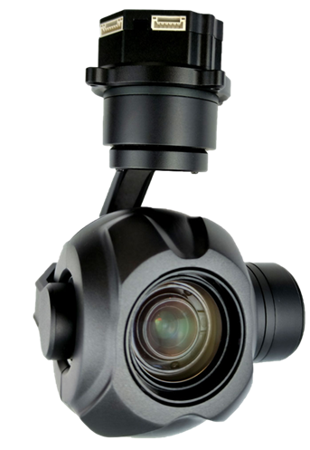
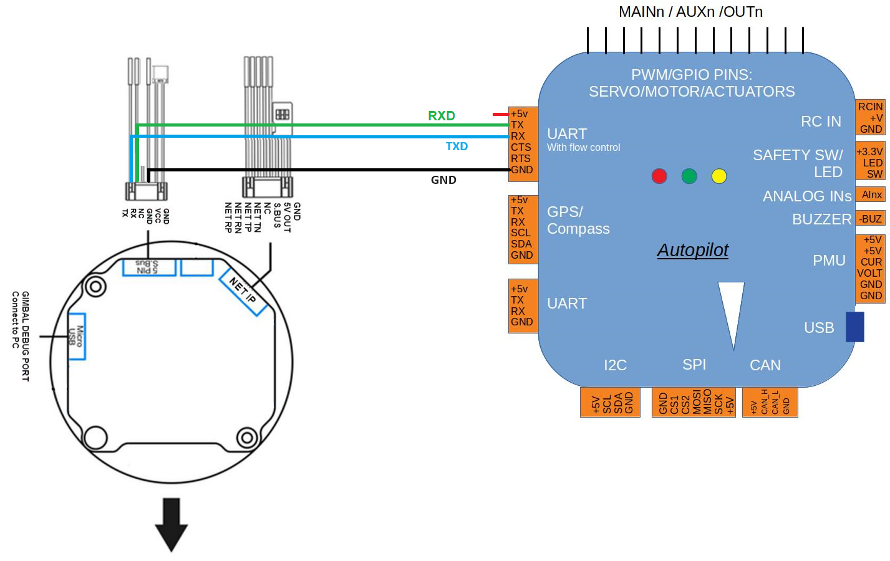
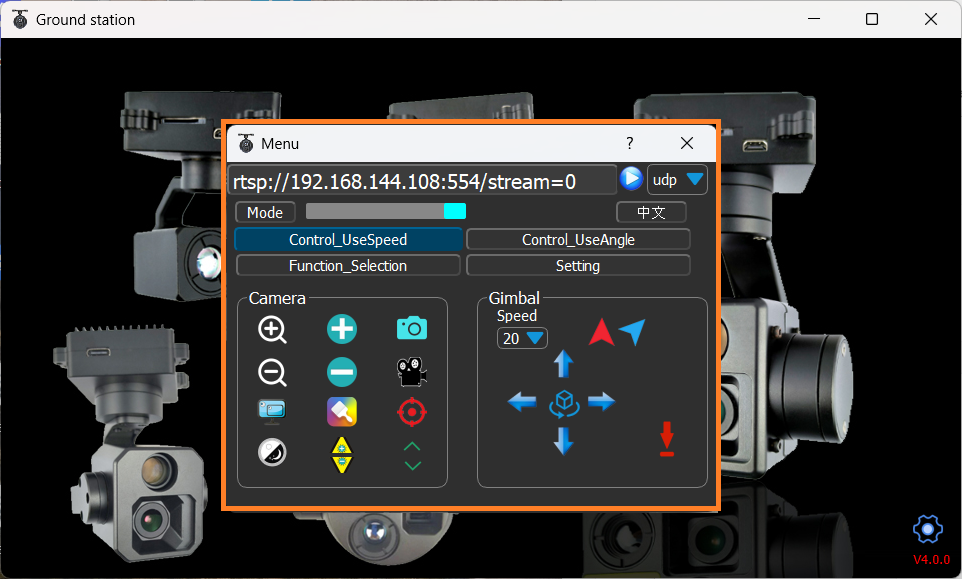

.. _common-topotek-gimbal:

[copywiki destination="plane,copter,rover"]

===============
Topotek Gimbals
===============

`Topotek <https://topotek.com/>`__ provides a wide variety of camera gimbals which communicate with ArduPilot using a custom serial protocol.

.. warning::

    Support for these gimbals is available in ArduPilot 4.6 (and higher)

Where to Buy
------------

These gimbals can be purchased directly from `Topotek <https://topotek.com/>`__

Connecting to the Autopilot
---------------------------

Connect the gimbal's RX, TX and GND pins to one of the autopilot's serial ports as shown above.

Connect with a ground station and set the following parameters.  The params below assume the autopilot's telem2 port is used and the Camera1 control instance,

- :ref:`SERIAL2_PROTOCOL <SERIAL2_PROTOCOL>` to 8 ("Gimbal")
- :ref:`SERIAL2_BAUD <SERIAL2_BAUD>` to "115" for 115200 bps
- :ref:`MNT1_TYPE <MNT1_TYPE>` to "12" ("Topotek") and reboot the autopilot
- :ref:`MNT1_PITCH_MIN <MNT1_PITCH_MIN>` to -90
- :ref:`MNT1_PITCH_MAX <MNT1_PITCH_MAX>` to 45
- :ref:`MNT1_YAW_MIN <MNT1_YAW_MIN>` to -180
- :ref:`MNT1_YAW_MAX <MNT1_YAW_MAX>` to 180
- :ref:`MNT1_RC_RATE <MNT1_RC_RATE>` to 60 (deg/s) to control speed of gimbal when using RC targetting
- :ref:`CAM1_TYPE<CAM1_TYPE>` to 4 / "Mount" to allow control of the camera
- :ref:`RC6_OPTION <RC6_OPTION>` = 213 ("Mount Pitch") to control the gimbal's pitch angle with RC channel 6
- :ref:`RC7_OPTION <RC7_OPTION>` = 214 ("Mount Yaw") to control the gimbal's yaw angle with RC channel 7
- :ref:`RC8_OPTION <RC8_OPTION>` = 163 ("Mount Lock") to switch between "lock" and "follow" mode with RC channel 8

- Optionally these auxiliary functions are also available

  - :ref:`RC9_OPTION <RC9_OPTION>` = 9 ("Camera Trigger") to take a picture
  - :ref:`RC9_OPTION <RC9_OPTION>` = 166 ("Camera Record Video") to start/stop recording of video
  - :ref:`RC9_OPTION <RC9_OPTION>` = 167 ("Camera Zoom") to zoom in and out
  - :ref:`RC9_OPTION <RC9_OPTION>` = 168 ("Camera Manual Focus") to adjust focus in and out
  - :ref:`RC9_OPTION <RC9_OPTION>` = 169 ("Camera Auto Focus") to trigger auto focus

Configuring the Gimbal
----------------------

The camera gimbal can be configured using the "GimbalControl" application which can be downloaded from the `Topotek Download Resources page <https://topotek.com/pages/TOPOTEK-Download-Resources-11763444.html>`__

Ethernet Connectivity
---------------------

Instead of using a UART serial connection, an Ethernet connection may be used to both control the gimbal and display live video stream from the camera

An example setup of a networked ArduPilot vehicle system is detailed in :ref:`common-ethernet-vehicle`

Two video streams are available on different RTSP URLs

- "rtsp://192.168.144.108:554/stream=0" provides a 1080p stream
- "rtsp://192.168.144.108:554/stream=1" provides a 480p stream

If connected to a PC, `VLC <https://www.videolan.org/>`__ can be used to test the feed

- Set the PC's IP address so the first three octets match the camera's IP address which, by default, is 192.168.144.108
- Open VLC
- Select "Media", "Open Network Stream" and enter one of the RTSP URLS listed above

If using QGC, the live video can be configured from the "Application Settings", "General" screen.  Set "Source" to "RTSP Video Stream" and "RTSP URL" to one of the RTSP URLs listed above

Control and Testing
-------------------

See :ref:`Gimbal / Mount Controls <common-mount-targeting>` and :ref:`Camera Controls <common-camera-controls>`  for details on how to control the camera and gimbal using RC, GCS or Auto mode mission commands
