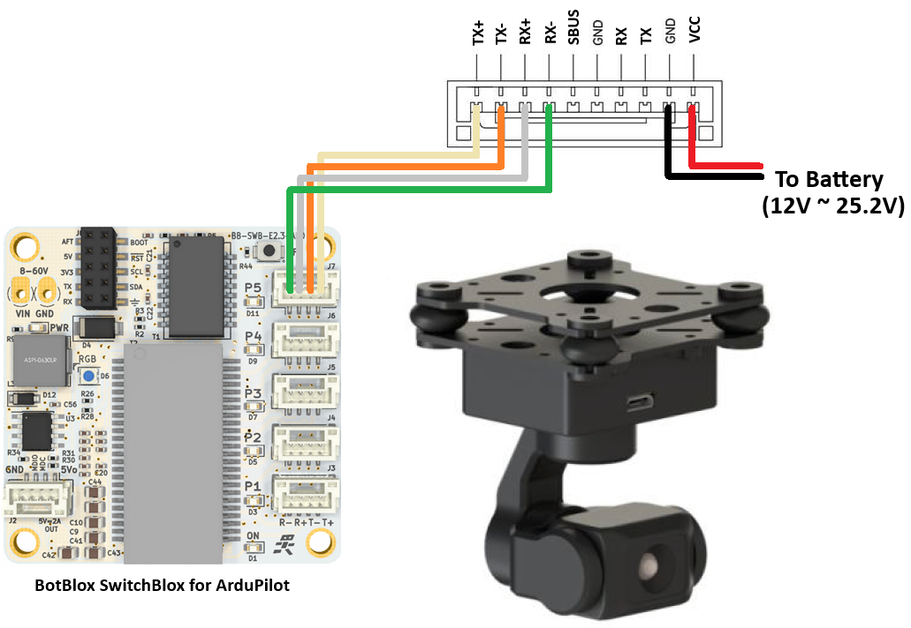

.. _common-topotek-gimbal:

[copywiki destination="plane,copter,rover"]

===============
Topotek Gimbals
===============

`Topotek <https://topotek.com/>`__ provides a wide variety of camera gimbals which communicate with ArduPilot using a custom serial protocol.
The smallest is the `GIP335 <https://topotek.com/gip335-gip335-2k-ultra-lightweight-network-gimbal-camera-p5888810.html>`__  which weighs 60g

.. warning::

    Support for these gimbals is available in ArduPilot 4.6 (and higher)

Where to Buy
------------

These gimbals can be purchased directly from `Topotek <https://topotek.com/>`__

Connecting to the Autopilot
---------------------------

Connect the gimbal's RX, TX and GND pins to one of the autopilot's serial ports as shown above.

Connect with a ground station and set the following parameters.  The params below assume the autopilot's telem2 port is used and the Camera1 control instance,

- :ref:`SERIAL2_PROTOCOL <SERIAL2_PROTOCOL>` to 8 ("Gimbal")
- :ref:`SERIAL2_BAUD <SERIAL2_BAUD>` to "115" for 115200 bps
- :ref:`MNT1_TYPE <MNT1_TYPE>` to "12" ("Topotek") and reboot the autopilot
- :ref:`MNT1_PITCH_MIN <MNT1_PITCH_MIN>` to -90
- :ref:`MNT1_PITCH_MAX <MNT1_PITCH_MAX>` to 45
- :ref:`MNT1_YAW_MIN <MNT1_YAW_MIN>` to -180
- :ref:`MNT1_YAW_MAX <MNT1_YAW_MAX>` to 180
- :ref:`MNT1_RC_RATE <MNT1_RC_RATE>` to 60 (deg/s) to control speed of gimbal when using RC targetting
- :ref:`CAM1_TYPE<CAM1_TYPE>` to 4 / "Mount" to allow control of the camera
- :ref:`RC6_OPTION <RC6_OPTION>` = 213 ("Mount Pitch") to control the gimbal's pitch angle with RC channel 6
- :ref:`RC7_OPTION <RC7_OPTION>` = 214 ("Mount Yaw") to control the gimbal's yaw angle with RC channel 7
- :ref:`RC8_OPTION <RC8_OPTION>` = 163 ("Mount Lock") to switch between "lock" and "follow" mode with RC channel 8

- Optionally these auxiliary functions are also available

  - :ref:`RC9_OPTION <RC9_OPTION>` = 9 ("Camera Trigger") to take a picture
  - :ref:`RC9_OPTION <RC9_OPTION>` = 166 ("Camera Record Video") to start/stop recording of video
  - :ref:`RC9_OPTION <RC9_OPTION>` = 167 ("Camera Zoom") to zoom in and out
  - :ref:`RC9_OPTION <RC9_OPTION>` = 168 ("Camera Manual Focus") to adjust focus in and out
  - :ref:`RC9_OPTION <RC9_OPTION>` = 169 ("Camera Auto Focus") to trigger auto focus

Configuring the Gimbal
----------------------

The camera gimbal can be configured over an Ethernet connection using the "GimbalControl" application which can be downloaded from the `Topotek Download Resources page <https://topotek.com/pages/TOPOTEK-Download-Resources-11763444.html>`__

To configure using the serial port use the "Angle control" or "Speed control" applications which can also be downloaded from `Topotek Download Resources page <https://topotek.com/pages/TOPOTEK-Download-Resources-11763444.html>`__

Ethernet Connectivity
---------------------

Instead of using a UART serial connection, an Ethernet connection may be used to both control the gimbal and display live video stream from the camera

An example setup of a networked ArduPilot vehicle system is detailed in :ref:`common-ethernet-vehicle`

- Connect the gimbal and autopilot using an :ref:`ethernet adapter <common-ethernet-adapters>`
- Ensure the autopilot and gimbal are on the same subnet (e.g the first 3 octets of the IP address match, 4th octet is different)

  - The gimbal's IP address can be set using the "GimbalControl" application (see image above)
  - Set the autopilot's :ref:`NET_ENABLE<NET_ENABLE>` = 1 and reboot to enable networking
  - Set the autopilot's IP address using :ref:`NET_IPADDR0<NET_IPADDR0>`, :ref:`NET_IPADDR1<NET_IPADDR1>`, :ref:`NET_IPADDR2<NET_IPADDR2>`, :ref:`NET_IPADDR3<NET_IPADDR3>` (e.g. 192.168.144.14)

- Create a serial connection over ethernet

  - Set :ref:`NET_P1_TYPE<NET_P1_TYPE>` = 1 (UDP Client) and reboot the autopilot
  - Set :ref:`NET_P1_IP0<NET_P1_IP0>`, :ref:`NET_P1_IP1<NET_P1_IP1>`, :ref:`NET_P1_IP2<NET_P1_IP2>`, :ref:`NET_P1_IP3<NET_P1_IP3>` to the gimbal's IP address (e.g. 192.168.144.108)
  - Set :ref:`NET_P1_PORT<NET_P1_PORT>` = 9003 (port that gimbal listens for commands on)
  - Set :ref:`NET_P1_PROTOCOL<NET_P1_PROTOCOL>` = 8 (Gimbal)

Two video streams are available on different RTSP URLs

- "rtsp://192.168.144.108:554/stream=0" provides a 1080p stream
- "rtsp://192.168.144.108:554/stream=1" provides a 480p stream

If connected to a PC, `VLC <https://www.videolan.org/>`__ can be used to test the feed

- Set the PC's IP address so the first three octets match the camera's IP address which, by default, is 192.168.144.108
- Open VLC
- Select "Media", "Open Network Stream" and enter one of the RTSP URLS listed above

If using QGC, the live video can be configured from the "Application Settings", "General" screen.  Set "Source" to "RTSP Video Stream" and "RTSP URL" to one of the RTSP URLs listed above

Firmware Updates
----------------

At least some Topotek gimbals support upgrading the firmware via SD card

- Email Topotek and request the latest firmware.  The email address can be found at the bottom of the `topotek.com <https://topotek.com/>`__ website
- Eject the gimbal's SD card and insert it into a computer
- Copy the firmware into a file folder named "topotek" in the root directory of the SD card
- Replace the SD card back into the gimbal
- Powerup the Gimbal and it should update within 20 seconds
- Remove the SD card, delete the firmware file and reinsert the SD card into the gimbal

Downloading Images and Video
----------------------------

Images and videos captured by the camera gimbal can be remotely downloaded via Ethernet

If a Windows PC is used:

- Enable SMB file sharing support (`Microsoft instructions are here <https://learn.microsoft.com/en-us/windows-server/storage/file-server/troubleshoot/detect-enable-and-disable-smbv1-v2-v3>`__)

  - From the Start menu search for "Turn Windows Features on or off"
  - Enable "SMB 1.0/CIFS File Sharing Support"

  .. image:: ../../../images/topotek-enable-windows-smb.png
      :target: ../_images/topotek-enable-windows-smb.png

  - Open Settings, Network & internet, Ethernet and set the PC's IP address so the first three octets match the camera's IP address (e.g. setting to 192.168.144.99 should work)
  - Open a file explorer and enter the camera's IP address, ``\\192.168.144.108``, into the address bar
  - Images and videos can be found in the ``camera/DCIM/snap`` and ``camera/DCIM/record`` directories respectively

If a Linux/Ubuntu PC is used:

- Install "smbclient" and "cifs-utils" packages (e.g. ``sudo apt-get install smbclient cifs-utils``)
- Edit the "/etc/fstab" file and add an entry to the bottom like below

::

      //192.168.144.108/camera /media/windowsshare cifs vers=1.0,guest,uid=1000 0 0

- Set the PC's IP address so the first three octets match the camera's IP address (e.g. setting to 192.168.144.99 should work)
- Mount the shared directory (e.g. ``sudo mount /media/windowsshare``)
- The images and videos can be found in the ``/media/windowsshare/DCIM/snap`` and ``/media/windowsshare/DCIM/record`` directories respectively

Control and Testing
-------------------

See :ref:`Gimbal / Mount Controls <common-mount-targeting>` and :ref:`Camera Controls <common-camera-controls>`  for details on how to control the camera and gimbal using RC, GCS or Auto mode mission commands
