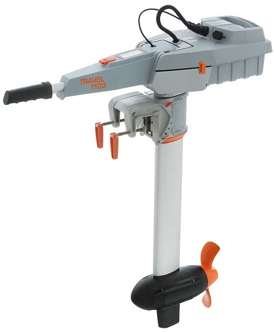

.. _common-torqeedo:

========================
Torqeedo Electric Motors
========================

Rover-4.2.0 (and higher) supports controlling a single `Torqeedo Travel <https://www.torqeedo.com/en/products/outboards/travel>`__, `Ultralight <https://www.torqeedo.com/en/products/outboards/ultralight>`__ or `Cruise <https://www.torqeedo.com/en/products/outboards/cruise>`__ motor using its custom RS485 protocol.

Some images from this page are courtesy of torqeedo.com

What to Buy
-----------

- Torqeedo motors can be purchased directly from `torqeedo.com <https://www.torqeedo.com/en/products/outboards/travel/travel-1103-c/M-1151-00.html>`__  or one of their `dealers <https://www.torqeedo.com/en/stores>`__
- `Throttle extension cable or motor extension cable <https://www.torqeedo.com/en/search?q=extension%20cable>`__
- `Japan Drones RS485-to-Serial converter board <http://japandrones.com/shopdetail/000000000176/ct21/page1/order/>`__ or DIY parts include

    - `RS485 to TTL converter <https://www.amazon.ca/MAX485CSA-Converter-Integrated-Circuits-Products/dp/B06W9H64TN/ref=sr_1_fkmrnull_1?keywords=rs485+to+ttl+lc&qid=1552083892&s=gateway&sr=8-1-fkmrnull>`__
    - `3.3V regulator <https://www.sparkfun.com/products/526>`__
    - `N-Channel MOSFET <https://www.sparkfun.com/products/10213>`__ (only required if using the tiller interface)
    - 3-pin or 4-pin `screw terminal <https://www.sparkfun.com/search/results?term=screw+terminal>`__
    - 6-pin serial cable

AutoPilot connection
--------------------

The autopilot can be connected to either the battery's tiller connector or to the motor connector.  If the torqeedo's built-in battery will be used then the autopilot should be connected to the tiller connector.  If instead a separate battery will be used then the autopilot should be connected to the motor connector (and the built-in battery can be removed)

  .. image:: ../../../images/torqeedo-connector-options.png
      :target: ../_images/torqeedo-connector-options.png
      :width: 400px

An interface board should be assembled using the parts mentioned above and connected as shown below.  The image on the left shows the wiring if the tiller connector is used, the image on the right is for use of the motor connector

  .. image:: ../../../images/torqeedo-autopilot-connection.png
      :target: ../_images/torqeedo-autopilot-connection.png
      :width: 400px

.. warning::

   If the motor connector method is used with non-torqeedo batteries, be sure to use batteries with built-in short circuit protection.  During early development and testing of this interface, after applying large and rapid changes to the throttle and managed to cause a short circuit within the motor.  A short circuit, especially with large batteries, could lead to a fire and serious injury.

Below are pictures of the modified throttle extension cable and `Japan Drones RS485-to-Serial converter board <http://japandrones.com/shopdetail/000000000176/ct21/page1/order/>`__ 

  .. image:: ../../../images/torqeedo-throttle-cable-pins.jpg
      :target: ../_images/torqeedo-throttle-cable-pins.jpg
      :width: 400px

  .. image:: ../../../images/torqeedo-throttle-cable-running-electronics-adapter.jpg
      :target: ../_images/torqeedo-throttle-cable-running-electronics-adapter.jpg
      :width: 400px

Below are pictures of the modified motor extension cable and `Japan Drones RS485-to-Serial converter board <http://japandrones.com/shopdetail/000000000176/ct21/page1/order/>`__

  .. image:: ../../../images/torqeedo-motor-cable-small-annotated.jpg
      :target: ../_images/torqeedo-motor-cable-small-annotated.jpg
      :width: 400px

  .. image:: ../../../images/torqeedo-running-electronics-adapter-small.jpg
      :target: ../_images/torqeedo-running-electronics-adapter-small.jpg
      :width: 400px

Configuration
-------------

Please set the following parameters

- :ref:`TRQD_TYPE <TRQD_TYPE>` = 1 (Tiller) if the autopilot will be connected to the tiller connector or 2 (Motor) if connected to the motor connector
- :ref:`SERIAL1_PROTOCOL <SERIAL1_PROTOCOL>` = 39 (Torqeedo) if the Torqeedo is connected to serial port 1.  If another serial port is used please set the appropriate SERIALx_PROTOCOL parameter
- :ref:`SERIAL1_BAUD <SERIAL1_BAUD>` = 19 (19200 bps) if using serial port 1.  If another serial port is used please set the appropriate SERIALx_BAUD parameter instead

If a serial port with flow control pins (clear-to-send and ready-to-send) is used no further parameter settings are required.  If serial port without flow-control is used then please set

- :ref:`TRQD_ONOFF_PIN <TRQD_ONOFF_PIN>` = 54 (AUX5) and connect the autopilot's AUX5 pin to the interface's board's MOSFET
- :ref:`TRQD_DE_PIN <TRQD_DE_PIN>` = 55 (AUX6) and connect the autopilot's AUX6 pin to the RS485<->TTL converter's DE and RE pins

Battery voltage and current information are taken from the Torqeedo battery or motor by setting this parameter

- :ref:`BATT_MONITOR <BATT_MONITOR>` = 23 (Torqeedo)

Logging and Reporting
---------------------

Motor RPM and temperature along with battery voltage and current are reported to the ground station in real-time using the ESC_TELEMETRY_1_TO_4 mavlink message.  If using Mission Planner (and perhaps other ground stations) these values can be seen on the "Data" screen's "Status" tab in the "esc3_curr", "esc3_rpm", etc fields.

By default "TRQD" messages are written to the onboard log at 10hz seconds and include:

- Health : whether the autopilot is successfully controlling the motor
- DesMotSpeed : the latest desired motor from the pilot or autopilot expressed as a number from -1000 to +1000
- MotSpeed : the latest requested speed sent to the motor as a number from -1000 to +1000
- SuccCnt : the number of messages successfully consumed from the motor (this should rise steadily)
- ErrCnt : the number of bytes or messages that were corrupted or could not be processed (this should be a relatively low number)

The "TRST" log message (only available when using the "Tiller" connection) includes the Master error code, motor temperature, voltage, current, power (in Watts) and RPM along with the battery percentage state of charge, voltage and current.

The "TRSE" log message (only available when using the "Tiller" connection) includes the motor type, battery capacity and software versions.

The "TRMP" log message (only available when using the "Motor" connection) includes the motor RPM, power (in Watts), voltage, current and temperature.

This above log information can also be sent as text to the ground station by setting :ref:`TRQD_OPTIONS <TRQD_OPTIONS>` = 3

Introduction Videos
-------------------

.. youtube:: uq1okSejrUE
    :width: 100%

.. youtube:: V8N3lA-20fs
    :width: 100%

.. youtube:: Wt7vfV4CcFc
    :width: 100%

[copywiki destination="rover"]

