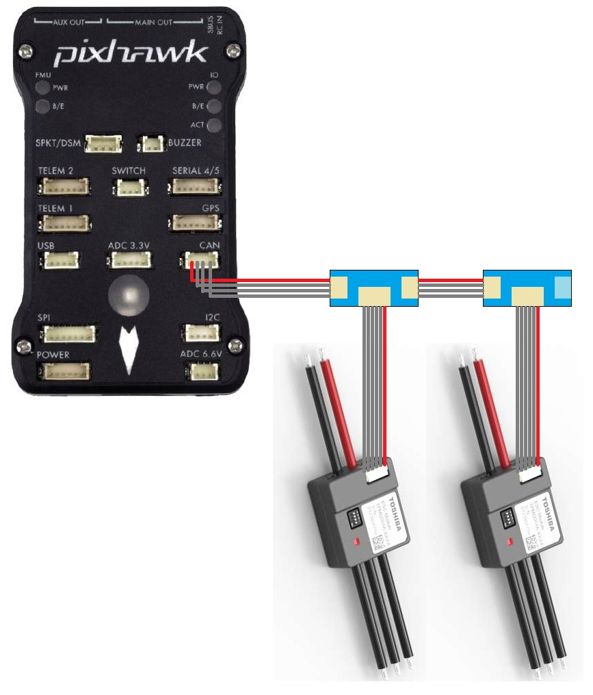
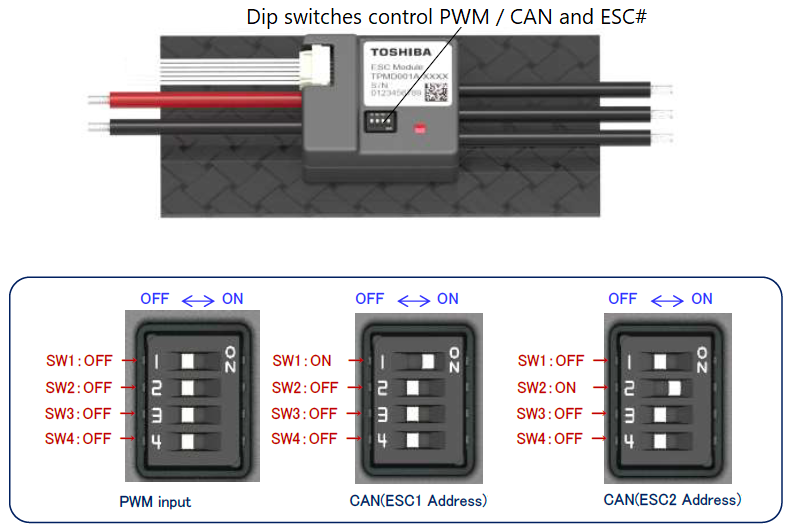
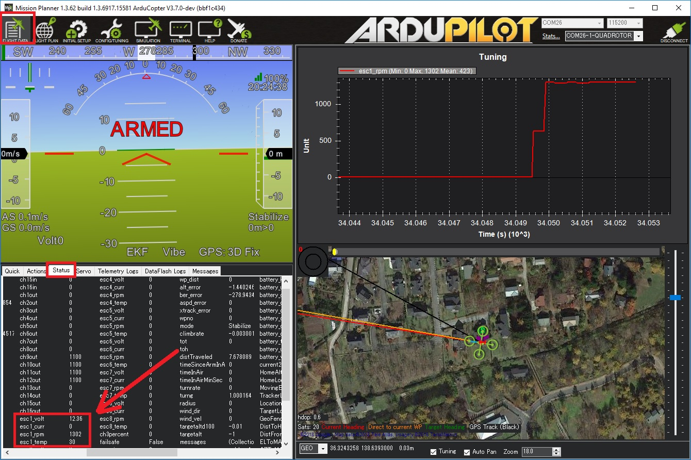

.. _common-toshiba-can-escs:

================
Toshiba CAN ESCs
================

..  youtube:: mPRICmE3kyk
    :width: 100%

ToshibaCAN ESCs are high-end ESCs that allow control and feedback using a custom CAN protocol.  Some additional specifications:

- FOC which should result in about 10% longer flight times while also being quieter than non-FOC ESCs
- Up to 7S batteries (future versions are planned for up to 12S), 50Amps
- Up to 12 motors
- Fast sync issue recovery time (100ms to 150ms)
- Relatively lightweight
- Designed and manufactured in Japan

.. note::

    Support for these ESCs is included in Copter-4.0 (and higher), Plane-3.10 (and higher) and Rover-3.5 (and higher)

Where To Buy
------------

These ESCs can be purchased by directly contacting the following companies (replace "AT" with "@" in the email addresses)

- Toshiba USA: Alan.Li AT taec.toshiba.com
- Hikari Alphax Japan: masaki_nakamura AT h-ax.com

CAN splitter boards are also required, the boards used in the above video were provided by `EAMS Lab <http://elab.co.jp/>`__ but these are also not readily available for sale.

Connection and Configuration
----------------------------

- ESCs should be daisy chained together using CAN splitter boards and then one 4-pin CAN cable should be connected to the autopilot's CAN port.  Note that the last splitter board has a terminator (i.e. no port) on one side.

.. warning::

    If using a Cube autopilot, the CAN1 and CAN2 labels are reversed.  These instructions assume the ESCs are connected to the CAN1 port which is labelled "CAN2" on Cube autopilots

- Set the dip switches on each ESC to specify its unique number.  This number also maps the ESC to an equivalent PWM output on the back of the autopilot.  For example ESC 1 will react just like a normal PWM ESC connected to the autopilot's MAIN OUT 1.  By default this mapping also matches the :ref:`motor order diagrams <Copter:connect-escs-and-motors>`.
- Set :ref:`CAN_D1_PROTOCOL <CAN_D1_PROTOCOL>` = 3 (ToshibaCAN)
- Set :ref:`CAN_P1_DRIVER <CAN_P1_DRIVER>` = 1 (First driver) to specify that the ESCs are connected to the CAN1 port
[site wiki="copter,rover"]
- Set :ref:`MOT_PWM_MIN <MOT_PWM_MIN>` = 1000 and :ref:`MOT_PWM_MAX <MOT_PWM_MAX>` = 2000 so ArduPilot uses an output range that matches the ESCs input range
[/site]
[site wiki="copter"]
- Set :ref:`MOT_SPIN_ARM <MOT_SPIN_ARM>` = 0.03 meaning the motors will spin at 3% of full thrust when armed
- Set :ref:`MOT_SPIN_MIN <MOT_SPIN_MIN>` = 0.05 meaning the motors will spin at no less than 5% of full thrust when flying
[/site]
[site wiki="plane"]
- Set ``SERVOx_MIN`` = 1000 and ``SERVOx_MAX`` = 2000 for each ESC connected (``x`` corresponds to the ESC number) so ArduPilot uses an output range that matches the ESCs input range
[/site]

Logging and Reporting
---------------------

ToshibaCAN ESCs provide information back to the autopilot which is recorded in the autopilot's onboard log's ESCn messages and can be viewed in any :ref:`ArduPilot compatible log viewer <common-logs>`.  This information includes:

- RPM
- Voltage
- Current
- ESC Temperature
- Total Current
- Motor Temperature (if the optional motor temperature sensor is connected)

The RCOU messages are also written to the onboard logs which hold the requested output level sent to the ESCs expressed as a number from 1000 (meaning stopped) to 2000 (meaning full output).

This information (except the motor temperature) can also be viewed in real-time using a ground station.  If using the Mission Planner go to the Flight Data screen's status tab and look for esc1_rpm.

.. note::

   Sending ESC data to the GCS requires using MAVLink2.  Please check the appropriate SERIALx_PROTOCOL parameter is 2 (where "x" is the serial port number used for the telemetry connection).
