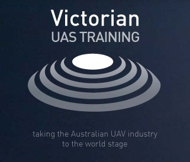

.. _common-training-centers:

================
Training Centers
================

Australia
=========

Victorian UAS Training
----------------------

.

  - **Location:** Ballarat, Victoria
  - **Language:** English
  - **Description:** Government-Approved training center that can train you on flying with ArduPilot.  This center provides training for commercial use in compliance with government regulations. Full CASA/3DR certified Training, AOC for commercial use of Fixed wing and Rotary wing.
  - **Contact:** `www.victorianuastraining.com.au <https://www.victorianuastraining.com.au/>`__ or email: info@victorianuastraining.com.au

Japan
=====

`Drone Japan <https://www.drone-j.com/>`__
------------------------------------------

  - **Location:** Tokyo, Japan
  - **Languages:** Japanese, English
  - **Description:** ArduPilot operation and software development training including writing new flight modes, attitude control and sensor drivers.
  - **Schedule:** One or two days training per month for four months.  Custom training including intensive courses available on request.
  - **Contact:** `drone-j.com <https://www.drone-j.com/>`__

France
======

`Drones Center France <https://www.drones-center.com/>`__
---------------------------------------------------------

  - **Location:** 30min from Paris, France
  - **Languages:** French, English
  - **Description:** Operational training for all types of aircraft from experienced pilots.
  - **Schedule:** One-on-one or group training to fit your schedule.
  - **Contact:** `Drones-Center.com <http://www.drones-center.com/>`__

USA
===

`LeTourneau University (LETU) <https://www.letu.edu/>`__
--------------------------------------------------------

  - **Location:** Longview, TX, USA
  - **Language:** English
  - **Description:** four courses:
     - Intro to RPAS (history, applications, and regulations leading to the FAA part 107 certificate), Lab: build and fly RC airplane, program and drive APM:Rover
     - RPAS Operations (system architecture, control theory, and operational considerations), Lab: flight training with APM:Copter and APM:Plane
     - Flight Control Systems (systems engineering: discussion of robotic flight control and payload integration, MavLink UDP), Lab: ArduPilot test and integration into new airframes; advanced payload integration
     - Operations in the National Airspace System (real-world application of prior courses; data management/processing/analysis, geotagging, etc), Lab: use of ArduPilot vehicles used in prior courses to pursue data collection projects that benefit the community
  - **Courses** `here <https://catalog.letu.edu/preview_program.php?catoid=13&poid=4687&returnto=1119>`__

South Korea
===========

`D-Makers <https://www.dmakers.co.kr>`__
----------------------------------------

  - **Location:** Sangju-si or Incheon, South Korea
  - **Languages:** Korean, English
  - **Description:** Supplies education programs about making and operating drones using ArduPilot and Pixhawk.
  - **Schedule:** One-on-one or group training to fit your schedule.
  - **Contact:** `dmakers.co.kr <https://www.dmakers.co.kr>`__

Books
=====

- `Designing Purpose-Built Drones for ArduPilot Pixhawk 2.1: Build drones with ArduPilot <https://www.amazon.in/Designing-Purpose-Built-Drones-ArduPilot-Pixhawk/dp/1786469162>`__

.. note::

     If your school would like to be added to this list, please send an email to partners@ardupilot.org.  Please send your company information including a logo to and express your desire to be added to the Training centers page.  Please include any evidence you can provide of the types of training provided.We ask that you consider supporting ArduPilot by becoming a `Partner <https://ardupilot.org/about/Partners>`__

[copywiki destination="copter,plane,rover,dev"]
