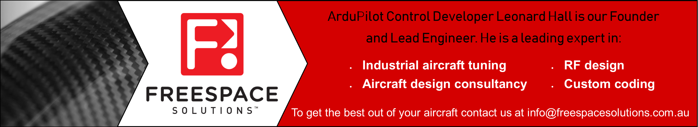

.. _common-tuning:

======
Tuning
======

With the default PID settings, ArduPilot will fly most RC vehicles
safely right out of the box. To fly well, with tight navigation and
reliable performance in wind, you’ll want to tune your autopilot
parameters. The following topics shown you how.

[site wiki="copter"]
.. toctree::
    :maxdepth: 1

    Tuning Process Instructions <tuning-process-instructions>
    AutoTune <autotune>
    Roll and Pitch Tuning <ac_rollpitchtuning>
    Advanced Tuning <tuning>
    Basic Tuning <basic-tuning>
    Configuring Notch Filtering <common-imu-notch-filtering>

-----

[/site]

[site wiki="plane"]
.. toctree::
    :maxdepth: 1

    Tuning QuickStart <tuning-quickstart>
    Automatic Tuning with AUTOTUNE <automatic-tuning-with-autotune>
    Roll, Pitch and Yaw Controller Tuning <roll-pitch-controller-tuning>
    Navigation Tuning <navigation-tuning>
    Cruise Speed Tuning <tuning-cruise>
    TECS (Total Energy Control System) for Speed & Height – Tuning Guide <tecs-total-energy-control-system-for-speed-height-tuning-guide>
    Calibrating an Airspeed Sensor <calibrating-an-airspeed-sensor>
    Tuning Ground Steering for a Plane <tuning-ground-steering-for-a-plane>
[/site]

[copywiki destination="copter,plane"]
