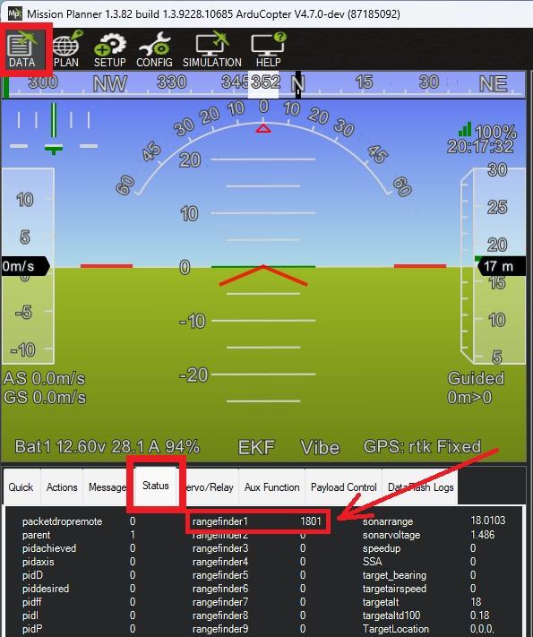

.. _common-twtof240ui-lidar:

================
TWTOF240UI Lidar
================

The TWTOF240UI is a small I2C time-of-flight lidar. Its stated range is 0.10 m to 2.4 m on a high-reflectivity target. In direct sun the outdoor range is much shorter than that indoor rating.

ArduPilot's driver uses the I2C interface only. The module also has a UART interface, which this driver does not use.

.. warning::

   The module supply is 3.0 to 3.6 V. Do not power it from a 5 V rail.

Connecting to the Autopilot
===========================

Connect SDA, SCL, VCC, and GND to an I2C port on the autopilot.

Set the following parameters:

- :ref:`RNGFND1_TYPE <RNGFND1_TYPE>` = 49 (TWTOF240UI). Reboot after setting this.
- :ref:`RNGFND1_ADDR <RNGFND1_ADDR>` = 0 uses the driver's default address, 54 decimal (0x36). If the module address was changed, set this to that address in decimal.
- :ref:`RNGFND1_MIN <RNGFND1_MIN>` = 0.10
- :ref:`RNGFND1_MAX <RNGFND1_MAX>` = 2.4
- :ref:`RNGFND1_GNDCLR <RNGFND1_GNDCLR>` to the distance in metres from the sensor to the ground when the vehicle is landed. This depends on how the sensor is mounted.

.. note::

   A reading above 3 m is the module's failure code, not a distance. The driver ignores it.

.. note::

   Autopilots with 1 MB of flash leave this driver out of the standard build. Include it by setting ``AP_RANGEFINDER_TWTOF240UI_ENABLED`` in the build. See :ref:`common-custom-firmware`.

Testing the sensor
==================

Distances read by the sensor can be seen on Mission Planner's Flight Data screen's Status tab. Look for "rangefinder1".

