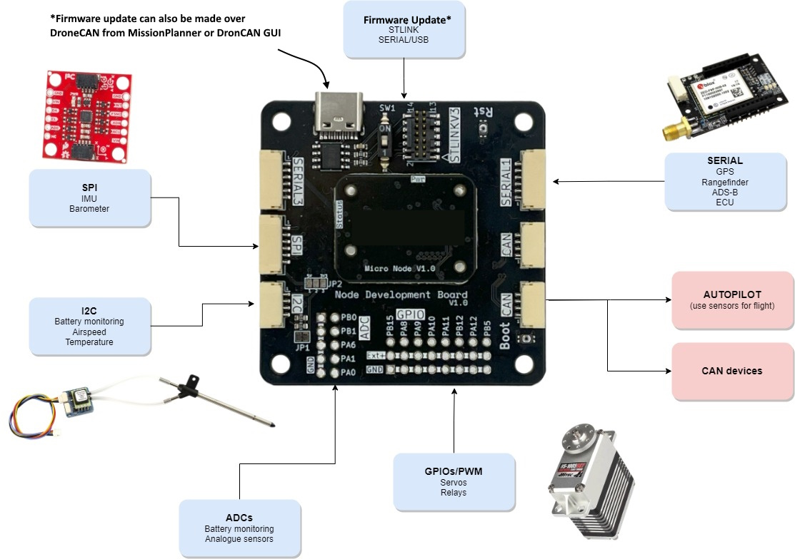
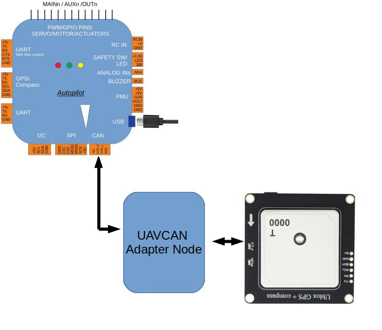
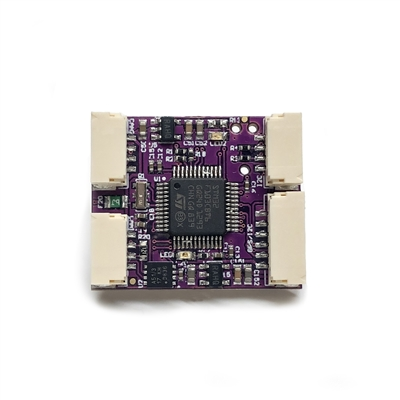

.. _common-uavcan-adapter-node:

===================
UAVCAN Adapter Node
===================

These allow existing ArduPilot supported peripherals to be adapted to the CAN bus as UAVCAN devices.

They utilize the `AP_Periph <https://github.com/ArduPilot/ardupilot/tree/master/Tools/AP_Periph>`__ library to remotely locate existing ArduPilot drivers onto an STMF103 or STMF303 based device, translating UART,SPI, I2C, or GPIO-based peripheral devices supported by ArduPilot into UAVCAN devices on the CAN bus.

GPS adapted to UAVCAN:

This provides an easy method to develop integrated UAVCAN peripherals which can be used with ArduPilot or other UAVCAN systems.

The first adapter was manufactured by `mRobotics <https://store.mrobotics.io/product-p/mro10042.htm>`__ , is shown below,and provides socketed outputs for a UART+I2C and another I2C connection, and board pads for a second UART, SPI bus, GPIOs, and ADC inputs.

The first generation was based on the f103 processor, while current generation uses an f303 for more memory, allowing more peripheral options to be accommodated simultaneously in the firmware.

`Schematic <https://github.com/ArduPilot/Schematics/blob/master/mRobotics/mRo_CANnode_V1_R1.pdf>`__

Features
=========

The AP_Periph UAVCAN firmware can be configured to enable a wide range of
UAVCAN sensor types. Support is included for:

 - GPS modules (including RTK GPS)
 - Magnetometers (SPI or I2C)
 - Barometers (SPI or I2C)
 - Airspeed sensors (I2C)
 - Rangefinders (UART or I2C)
 - ADSB (Ping ADSB receiver on UART)
 - LEDs (GPIO, I2C or WS2812 serial)
 - Safety LED and Safety Switch
 - Buzzer (tonealarm or simple GPIO)

And AP_Periph UAVCAN firmware supports these UAVCAN features:

 - dynamic or static CAN node allocation
 - firmware upload
 - automatically generated bootloader
 - parameter storage in flash
 - easy bootloader update
 - high resiliance features using watchdog, CRC and board checks
 - firmware update via MissionPlanner or uavcan-gui-tool

Firmware
========

`Firmware <https://firmware.ardupilot.org/AP_Periph/>`__ is provided in the AP_Periph folder for several UAVCAN devices based on this concept. Currently, the following firmware is pre-built, but the code allows for easy customization for any given peripheral or adapter based on the F103/303 processors.

F103 Based
----------

- f103-GPS         :Serial GPS, I2C Compass, I2C RGB LED
- f103-ADSB        :Serial ADS_B, I2C Compass, I2C Airspeed
- f103-Rangefinder :Serial Rangefinder, I2C Airspeed

F303 Based
----------

- f303-GPS         :Serial GPS, SPI RM3100 Compass, I2C Compass, I2C RGB LED
- f303-M10025      :Serial GPS, SPI RM3100 Compass, SPI DPS310 Baro, I2C RGB LED, I2C Airspeed, Safety Switch
- f303-Universal   :Serial GPS/Rangefinder/ADS-B, I2C Compass, I2C Baro, I2C RGB LED, I2C Airspeed

F303-Universal Firmware Setup
=============================

The f303-Universal firmware has the ability to be used for several serial devices but only one can be enabled to use the single UART. Once Firmware is uploaded the default device connected to the UART port is set to GPS, to use another device such as Rangefinder the GPS has to be turned off and Rangefinder or other device enabled.

To achieve this, either use :ref:`UAVCAN GUI<common-uavcan-gui>` or :ref:`MissionPlanner SLCAN.<common-mp-slcan>` Once connected, set the appropriate params, i.e. for TFmini_S/Plus rangefinder you would set GPS_TYPE=0 and RNGFND1_TYPE=20, this allows the single serial port to connect to the rangefinder.

Options for serial devices are:

 - GPS_TYPE=0
 - RNGFND1_TYPE=0
 - ADSB_BAUDRATE=0

 The above settings would disable all of the devices, then you should enable just the one you want, knowing that you can’t have two serial devices as there is just one UART.

The firmware can also be used for I2C peripherals.

 - COMPASS
 - BARO
 - AIRSPEED SENSOR
 - NCP5623 LED

Rangefinder
-----------

 To use rangefinders, follow the instructions at  :ref:`UAVCAN Setup Advanced<common-uavcan-setup-advanced>` to set up the Ardupilot parameters. Using MissionPlanner or UAVCAN Gui, set the parameters on the adaptor node following the instructions for the relevant rangefinder.

 .. note::

 	The orientation of the rangefinder (RNGFND1_ORIENT) must be set to 0 on the adaptor node.

 .. note::

 	The RNGFNDx_ADDR Ardupilot parameter must be set above 0 and be equal to the number set on the UAVCAN adapter node.

UAVCAN Adapter Nodes
====================

:ref:`mRo UAVCAN Adapter Node <common-mro-uavcan-adapter-node>`
