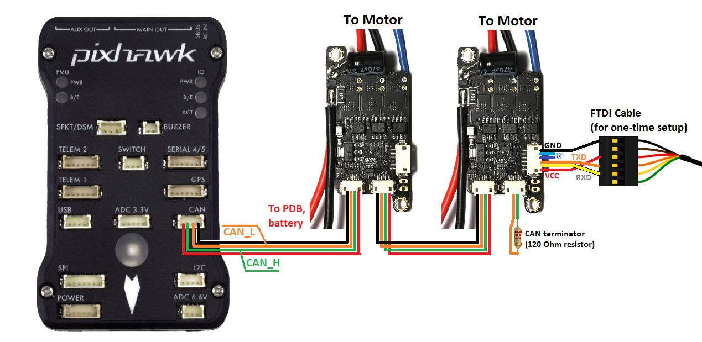
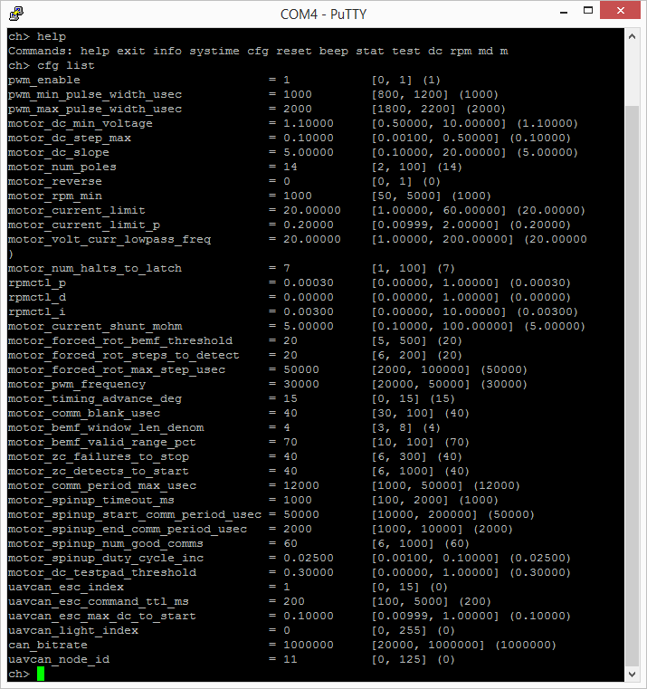

.. _common-uavcan-escs:

===========
UAVCAN ESCs
===========

Copter, Plane and Rover support `UAVCAN <https://uavcan.org>`__ Electronic Speed Controllers
(ESCs) that allow two-way communication with the autopilot
enabling potentially easier setup and in-flight monitoring of ESC and
motor health.

..  youtube:: LnUmYgAINBc
    :width: 100%

List of CAN ESCs
================

+-----------------------------------------------------------------------------------------------+--------------------------------------------------------------------------------------------+-----------------------------------------------------------------------------------------------------------------+
+ Name                                                                                          + Avail                                                                                      + Ever Worked                                                                                                     +
+===============================================================================================+============================================================================================+=================================================================================================================+
+ `Zubax Orel 20 <https://files.zubax.com/products/io.px4.sapog/Zubax_Orel_20_Datasheet.pdf>`__ + `Yes <https://titaneliteinc.com/titanoc/index.php?route=product/product&product_id=995>`__ + Yes                                                                                                             +
+-----------------------------------------------------------------------------------------------+--------------------------------------------------------------------------------------------+-----------------------------------------------------------------------------------------------------------------+
+ `Zubax Myxa <https://zubax.com/products/myxa/>`__                                             + Yes                                                                                        + Yes                                                                                                             +
+-----------------------------------------------------------------------------------------------+--------------------------------------------------------------------------------------------+-----------------------------------------------------------------------------------------------------------------+
+ `Zubax Mitochondrik <https://zubax.com/products/mitochondrik>`__                              + Yes                                                                                        + Yes                                                                                                             +
+-----------------------------------------------------------------------------------------------+--------------------------------------------------------------------------------------------+-----------------------------------------------------------------------------------------------------------------+
+ `Holybro Kotleta20 <http://www.holybro.com/product/kotleta20/>`__                             + Yes                                                                                        + Yes                                                                                                             +
+-----------------------------------------------------------------------------------------------+--------------------------------------------------------------------------------------------+-----------------------------------------------------------------------------------------------------------------+
+ `AutoQuad ESC32 <http://autoquad.org/esc32/>`__                                               + No                                                                                         + No                                                                                                              +
+-----------------------------------------------------------------------------------------------+--------------------------------------------------------------------------------------------+-----------------------------------------------------------------------------------------------------------------+
+ `VESC <http://vedder.se/2015/01/vesc-open-source-esc/>`__                                     + `Yes <https://www.ollinboardcompany.com/product/vedder-s-speed-controller>`__              + No (`proposal <https://discuss.ardupilot.org/t/next-gen-esc-validation-and-integration-vesc-declined/12534>`__) +
+-----------------------------------------------------------------------------------------------+--------------------------------------------------------------------------------------------+-----------------------------------------------------------------------------------------------------------------+
+ `HiEnd Can Bus ESC <https://www.aerolab.de/esc-regler/hiend-can-bus-esc/>`__                  + Yes                                                                                        + ?                                                                                                               +
+-----------------------------------------------------------------------------------------------+--------------------------------------------------------------------------------------------+-----------------------------------------------------------------------------------------------------------------+
+ :ref:`Velocity ESC <common-velocity-can-escs>`                                                + Yes                                                                                        + Yes                                                                                                             +
+-----------------------------------------------------------------------------------------------+--------------------------------------------------------------------------------------------+-----------------------------------------------------------------------------------------------------------------+

Connecting to the Flight Controller
===================================

One ESC (it does not matter which) should be connected to the flight controller's
CAN port using a 4-pin DF13 to 4-pin UAVCAN adapter cable. Each
subsequent ESC should be connected to the previous using a 4-pin
UAVCAN cable.  The final ESC should have a CAN bus terminator plugged
into one of its 4-pin UAVCAN ports.

The FTDI Cable connection is only required for the one-time set-up
discussed below.

Alternatively, the ESC can be configured via CAN bus using the `UAVCAN GUI Tool <https://uavcan.org/GUI_Tool/>`__.

ESC setup using CLI
===================

Each ESC must go through a one-time manual setup using an `FTDI cable <http://store.jdrones.com/cable_ftdi_6pin_5v_p/cblftdi5v6p.htm>`__
to define its UAVCAN Node Id and motor number.  In future versions of
ArduPilot this will be replaced with a setup procedure using the mission
planner (and other GCSs).

The steps required are:

-  Connect the FTDI cable to the ESC's "Developer port" as shown in the
   image above.
-  Power the ESCs with a battery
-  Use a terminal program such as
   `Putty <https://www.chiark.greenend.org.uk/~sgtatham/putty/latest.html>`__
   to connect to the ESC using the FTDI cable's COM port, using serial
   at 115200 baud
-  press **Enter** into the terminal and a "ch>" prompt should appear
-  type ``cfg list`` to see a full list of parameters
-  on motor #1 (i.e. front-right on a quad) set the uavcan_node_id to
   "10" and esc_index to "0" by typing:

   -  ``cfg set uavcan_node_id 10``
   -  ``cfg set esc_index 0``
   -  ``cfg save``   (to save the configuration)
   - ``reboot``

-  to test the motor moves:

   -  ``dc arm``  (to enable the output)
   -  ``dc 0.2`` (to spin motor at 20%)
   -  ``dc`` (to stop motor)

-  repeat for motors #2 (back left on a quad), #3, #4, etc with each
   motor having a node-id and index one higher than the previous (in
   fact the node-id doesn't matter as long as it's unique).

Logging and Reporting
---------------------

UAVCAN ESCs provide information back to the autopilot which is recorded in the autopilot's onboard log's CESC messages and can be viewed in any :ref:`ArduPilot compatible log viewer <common-logs>`.  This information includes:

- Error Count
- Voltage
- Current
- Temperature
- RPM
- Power (as a percentage)

The RCOU messages are also written to the onboard logs which hold the requested output level sent to the ESCs expressed as a number from 1000 (meaning stopped) to 2000 (meaning full output).

Unlike other CAN ESCs, this information cannot be viewed in real-time through the ground station but this will likely be added in the future (`see this issue <https://github.com/ArduPilot/ardupilot/issues/13396>`__)

Additional information
======================

`Zubax Sapog wiki page <https://kb.zubax.com/display/MAINKB/Using+Sapog-based+ESC+with+ArduPilot>`__,
`Sapog reference manual <https://files.zubax.com/products/io.px4.sapog/Sapog_v2_Reference_Manual.pdf>`__,
and `ESC firmware <https://github.com/PX4/sapog>`__.
