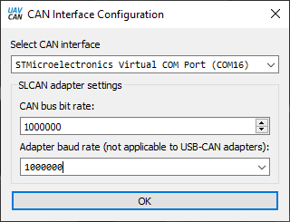
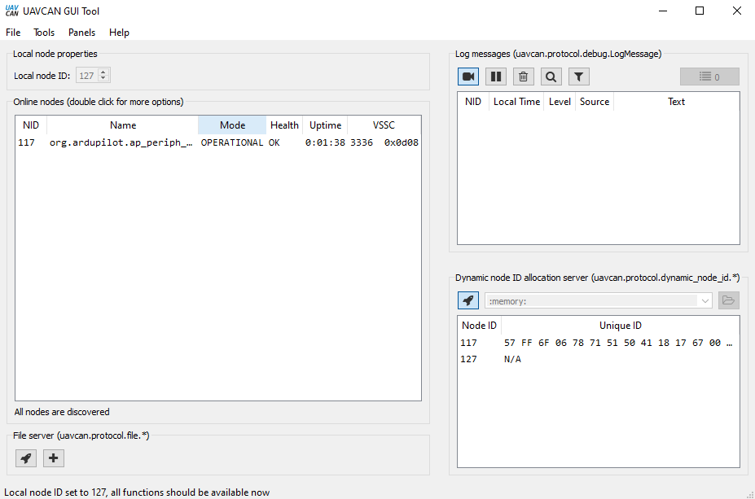
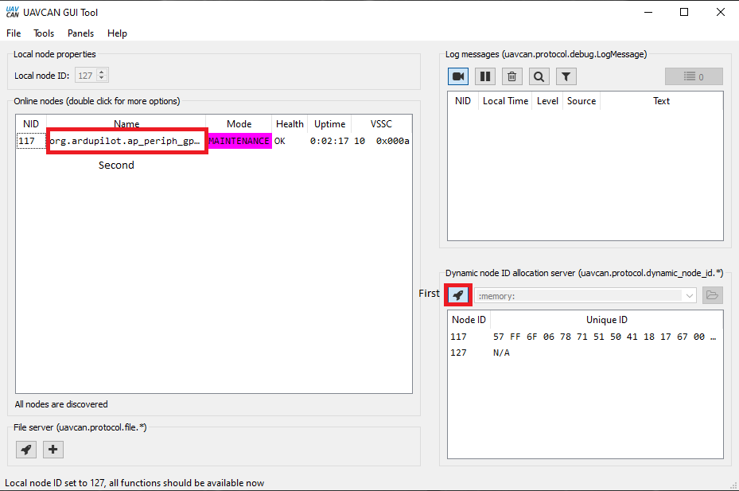
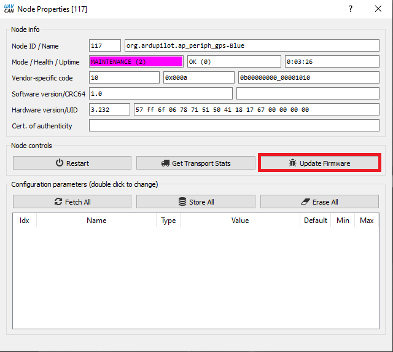
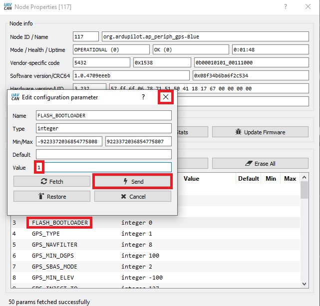
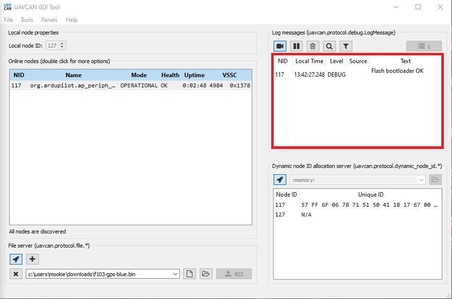
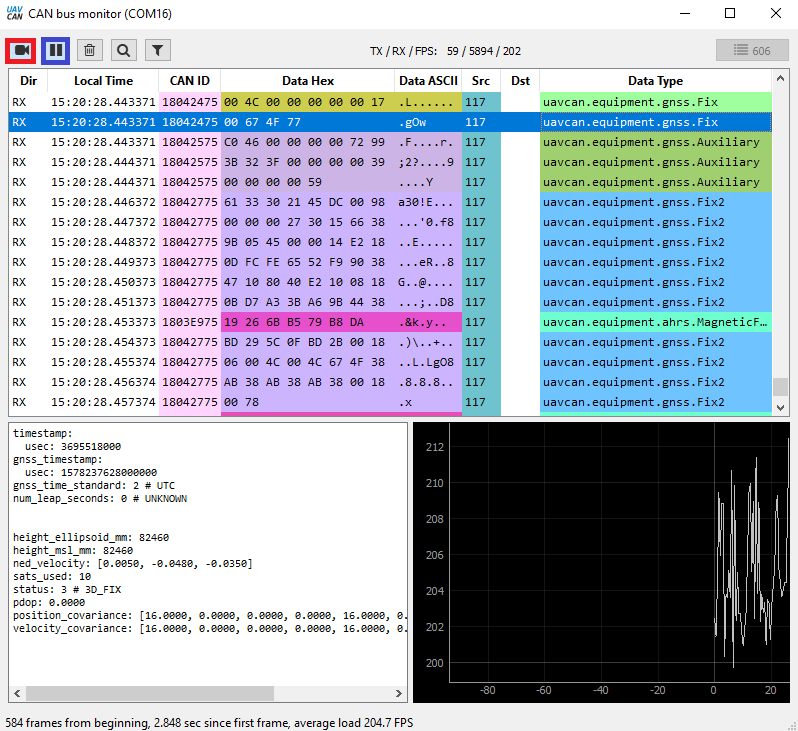

.. _common-uavcan-gui:

==========
UAVCAN GUI
==========

UAVCAN_GUI is a tool that allows viewing, configuration and software updates of nodes
connected to the BUS.

Download `UAVCAN_GUI <https://uavcan.org/GUI_Tool/Overview/>`_ and install.

Before the autopilot can be connected, SLCAN mode must be operational. See :ref:`common-slcan-f4` or :ref:`common-slcan-f7h7` for setup information.

Start UAVCAN GUI and select the correct USB port for the SLCAN interface. The default CAN bus bit rate of 1,000,000 wont  need to be changed unless the :ref:`CAN_P1_BITRATE<CAN_P1_BITRATE>` or :ref:`CAN_P2_BITRATE<CAN_P2_BITRATE>` (if using the second autopilot CAN port) has been changed. The Adapter baud rate should match the autopilot's SERIALx port baud rate. The default value of 115.2KBaud should be correct.

.. note:: Almost all ArduPilot autopilots use VCP USB connections and Adapter port baud rate value is irrelevant and can be any value.

UAVCAN_GUI tool will start with an interface as the image below.
Click on tick box next to Local node ID. Leave it unchanged, unless you have another node on the CANBUS with the same address.

If the node has a bootloader only installed, then firmware will need to be
uploaded. ``MAINTENANCE`` will be displayed. Firmware can be found `here <https://firmware.ardupilot.org/AP_Periph/>`__ and downloaded for the node.  Click on the button lower right and then double click on ``org.ardupilot.ap_periph`` as highlighted.

The following pop up window will appear. Click on update firmware and select the correct file for the node connected.

.. note:: If you have trouble updating firmware, trying renaming the firmware filename to something very short, such as "a.bin". Longer filenames sometimes have difficulty loading.

Once the firmware has finished uploading to node the main window will change to ``OPERATIONAL`` as per image below. Press the ``Fetch All`` button, and double click on the FLASH_BOOTLOADER parameter and enter 1 in the highlighted box. Presss ``Send`` and close the dialog. The address of the node can be changed in this window to avoid conflict with another node on the CANBUS, as well as any UAVCAN device specific parameters.

A debug message will show complete.

Messages coming through the CANBUS can be viewed using the bus monitor tool in "Tools" menu.

To return to normal operation, close the UAVCAN_GUI tool.
