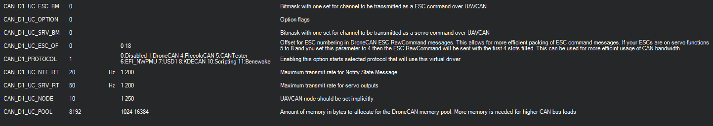
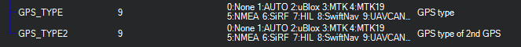

.. _common-uavcan-setup-advanced:

==============
DroneCAN Setup
==============

DroneCAN was created to continue the development of the widely used UAVCAN v0 protocol. This protocol has proven itself as robust and feature rich and has been widely deployed in the commercial drone industry and enjoys broad support among industry partners. The proposed introduction of the UAVCAN v1 protocol involved changes to UAVCAN that increased complexity and did not offer a smooth migration path for existing deployments. After extended discussions within the UAVCAN consortium it was decided that the best solution was to continue development of UAVCAN v0 under the name DroneCAN.

This article provides guidance to setup DroneCAN protocol on ArduPilot.

.. tip::

   The physical CAN port, and its driver selected as DroneCAN protocol, should be enabled first. Please refer to the
   :ref:`CAN Bus Setup <common-canbus-setup-advanced>`

Overview
========

DroneCAN is a lightweight protocol designed for reliable communication
in aerospace and robotic applications via CAN bus.
The DroneCAN network is a decentralized peer network, where each peer
(node) has a unique numeric identifier - node ID and that is only one
parameter needs to be set for basic setup.

Detailed description of protocol can be found at https://uavcan.org/

DroneCAN Peripheral Types Supported
===================================

ArduPilot currently supports the following types of DroneCAN peripherals:

+---------------------+--------------------+-------------------+
|GPS                  |Compass             |Barometer          |
+---------------------+--------------------+-------------------+
|Rangefinder          |ADSB Receiver       |Power Module       |
+---------------------+--------------------+-------------------+
|LED                  |Buzzer              |Airspeed           |
+---------------------+--------------------+-------------------+
|Safety Switch/LED    |                    |                   |
+---------------------+--------------------+-------------------+
|DroneCAN Adapter Node                                         |
+---------------------+--------------------+-------------------+

DroneCAN device type is selected by:

-  GPS,Compass, Barometer, ADSB Receiver, LED, Buzzer, Safety Switch/LED, and Airspeed devices are automatically identified in the DroneCAN protocol
-  Rangefinder: ``RNGFNDx_TYPE`` = 24
-  Power Module: :ref:`BATT_MONITOR<BATT_MONITOR>` or ``BATTx_MONITOR`` = 8

DroneCAN Setup Parameters
=========================
shown for the first DroneCAN driver, second driver has identical parameters

- :ref:`CAN_D1_PROTOCOL<CAN_D1_PROTOCOL>` if set for DroneCAN(1) has the following associated parameters:
- :ref:`CAN_D1_UC_POOL<CAN_D1_UC_POOL>`: a memory pool for the driver of this size will be allocated if possible. The default size can usually be reduced, saving RAM for other functions and features, if the CAN traffic is light, as with GPSes or Compass, as opposed to ESCs.

DroneCAN Adapter Node
=====================

These devices are general purpose DroneCAN nodes with I/O ports that allow the attachment of non-DroneCAN ArduPilot peripherals to the DroneCAN bus via UART ports, I2C, SPI, and/or GPIOs. See :ref:`DroneCAN Adapter Nodes<common-uavcan-adapter-node>`.

DroneCAN ESC and Servo Configuration settings
=============================================
See :ref:`common-uavcan-escs` for information on DroneCAN ESCs.

Each DroneCAN ESC or Servo will have an programmed ID or channel address corresponding to the autopilot's servo/motor output channel. These are set by switches on the ESC or via a setup/configuration program, depending on the ESC.

There are three parameters that determine which autopilot servo/motor channels are sent to the CAN ESC and/or Servos:
For the examples below, the values are shown for CAN driver #1.

-  :ref:`CAN_D1_UC_NODE<CAN_D1_UC_NODE>` - which is the node ID of the autopilot sending the commands to the ESCs so that there can be differentiation between multiple sources on the CAN bus
-  :ref:`CAN_D1_UC_ESC_BM<CAN_D1_UC_ESC_BM>` - bitmask that determines which autopilot servo/motor output signals are sent to the DroneCAN ESCs.
-  :ref:`CAN_D1_UC_ESC_SRV<CAN_D1_UC_SRV_BM>` - bitmask that determines which autopilot servo/motor output signals are sent to the Servos on DroneCAN Servos

In the bitmap masks, each bit position represents an ESC or servo ID number
that the corresponding autopilot servo/motor channel command will be directed to. For example, 00001111 (15 decimal) would send commands to ESC or SERVO IDs 0 through 3.

.. note:: When using DroneCAN ESCs/Servos, you can set the ``SERVOx_FUNCTION`` for those, but still use those outputs on the autopilot for GPIOs using the :ref:`SERVO_GPIO_MASK<SERVO_GPIO_MASK>` parameter. The autopilot outputs will become GPIOS and the corresponding ``SERVOx_FUNCTION`` will be sent out DroneCAN.

To reduce bandwidth, the :ref:`CAN_D1_UC_ESC_BM<CAN_D1_UC_ESC_BM>` and :ref:`CAN_D1_UC_ESC_SRV_BM<CAN_D1_UC_SRV_BM>` params should be set
to enable only the motor and servo channels you need CAN signals to be sent to. In addition, the :ref:`CAN_D1_UC_ESC_OF<CAN_D1_UC_ESC_OF>` parameter lets you further maximize bandwidth by offsetting the ESC position to the first time slots on the bus, eliminating empty time slots. For example, if the ESCs are on outputs 5 to 8, an offset of 4 will transport them in the first 4 timeslots which would otherwise be empty and consume bandwidth.

-  Example: For a configuration of CAN servos on channels 1,2,4 and ESC motor on channel 3, set:
-  Example: :ref:`CAN_D1_UC_ESC_BM<CAN_D1_UC_ESC_BM>` = 0x0B
-  Example: :ref:`CAN_D1_UC_ESC_SRV<CAN_D1_UC_SRV_BM>` = 0x04

GPS configuration settings
==========================

If there is a DroneCAN GPS device, it has to be enabled in ``GPS``
subgroup of parameters.
The ``TYPE`` parameter should be set to 9 for corresponding GPS receiver in autopilot.

DroneCAN LED configuration
==========================

DroneCAN LEDs are enabled by setting bit 5 in the :ref:`NTF_LED_TYPES<NTF_LED_TYPES>` bitmask. The :ref:`CAN_D1_UC_NTF_RT<CAN_D1_UC_NTF_RT>` sets the rate that notification messages are transmitted in DroneCAN.

DroneCAN Rangefinder configuration
==================================

Set ``RNGFNDx_TYPE`` = 24 to enable DroneCAN rangefinder type. Rangefinder data received over DroneCAN will only be used if the received sensor_id matches the parameter ``RNGFNDx_ADDR``. For AP_Periph firmware based adaptor nodes, this value is 0, so ``RNGFNDx_ADDR`` must be set to 0. Other DroneCAN rangefinders may differ. See also :ref:`DroneCAN Adaptor Node<common-uavcan-adapter-node>` instructions.

DroneCAN Options
================

Several options for each DroneCAN driver can be selected via the :ref:`CAN_D1_UC_OPTION<CAN_D1_UC_OPTION>` and :ref:`CAN_D2_UC_OPTION<CAN_D2_UC_OPTION>` bitmask parameters. Default is not set:

====================      =================
CAN_Dx_UC_OPTION bit      Function when set
====================      =================
0                         ClearDNADatabase, :ref:`see below <dronecan_node_conflicts>`
1                         IgnoreDNANodeConflicts, :ref:`see below <dronecan_node_conflicts>`
2                         EnableCanfd, :ref:`CANFD below<dronecan_node_flexibledatarate>`
3                         IgnoreDNANodeUnhealthy, ignore disconnected node ids
4                         SendServoAsPWM, instead of sending servo positions as -1 to -1, send as PWM values in us
5                         SendGNSS, send GPS fix and status info over DroneCAN, used by some gimbals
====================      =================

.. _dronecan_node_conflicts:

DroneCAN Node ID Conflicts
==========================

When a device is attached and recognized, it's node ID and hardware ID are entered into a database which is stored between power cycles. If multiple devices with the same node ID and different hardware IDs are used (swapping smart batteries, for example, with the same node ID), a conflict will arise in the database. This will require the use of the :ref:`CAN_D1_UC_OPTION<CAN_D1_UC_OPTION>` parameter to allow the database to be reset on the next boot, or conflicts in the database to be ignored.

.. _dronecan_node_flexibledatarate:

CAN FD (Flexible Data rate)
===========================

If the DroneCAN port is attached to CAN FD peripherials, setting :ref:`CAN_D1_UC_OPTION<CAN_D1_UC_OPTION>` bit 2 (+ value 4) will enable this mode. 

.. note:: CAN FD requires a larger memory pool allocation than normal. Default is 24KB instead of the normal 12KB.

.. _dronecan_mixed_protocols:

Mixed Protocols on a DroneCAN CAN bus
=====================================

If the ``CAN_Dx_PROTOCOL`` is DroneCAN, then the following other devices with differing protocols can also reside on that bus by setting the ``CAN_Dx_PROTOCOL2`` parameter:

=====  ===============
ID     Device Protocol
=====  ===============
7      USD1
10     Scripting
11     Benewake
12     Scripting2
13     TOFSenseP
14     NanoRadar_NRA24
=====  ===============

SLCAN
=====

.. note:: SLCAN access via COM port is disabled when armed to lower cpu load. Use SLCAN via MAVLink instead. This method is generally preferred, in any case.

ArduPilot and DroneCAN provide a means to directly communicate with DroneCAN devices on the CAN BUS attached to the autopilot: SLCAN. Enabling SLCAN and communicating with the DroneCAN devices is dependent on the autopilot's processor. F7/H7 processors use one method and F4, a different method.

- :ref:`Mission Planner SLCAN <planner:dronecan-uavcan-slcan>`

.. toctree::
    :maxdepth: 1

    SLCAN Access on F4 Based Autopilots <common-slcan-f4>
    SLCAN Access on F7/H7 Based Autopilots <common-slcan-f7h7>
    DroneCAN GUI <common-uavcan-gui>

