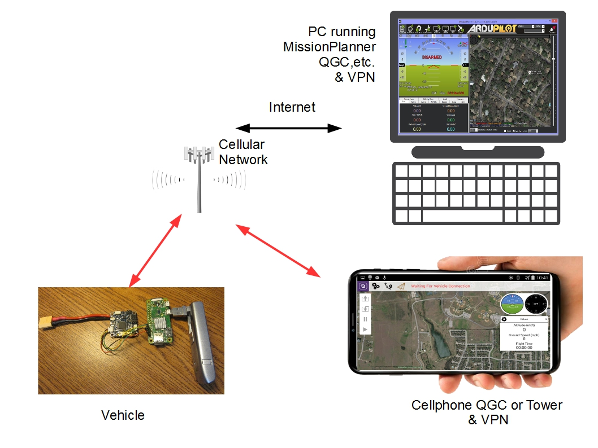

.. _common-UAVcast-telemetry:

================================
UAVcast 3G/4G Cellular Telemetry
================================

`UAVcast <http://uavmatrix.com>`__ allows the transmission of MAVLink telemetry via the 3G/4G cellular network over nearly unlimited distances.

.. note::
 Since most cellular coverage is directed to cover only 200-300 feet AGL, except in metropolitan areas with high rise buildings, flight (ArduPlane/ArduCopter) applications may experience coverage issues at higher vehicle altitudes.