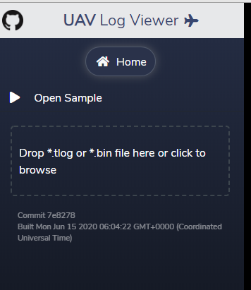
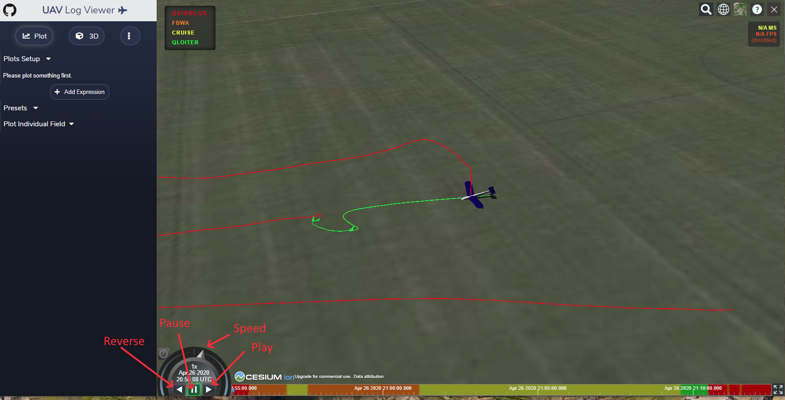
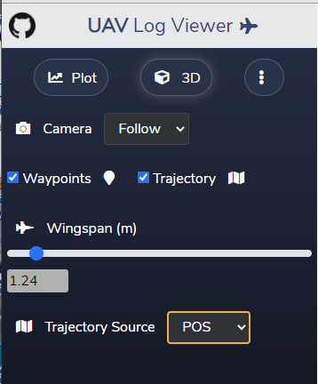
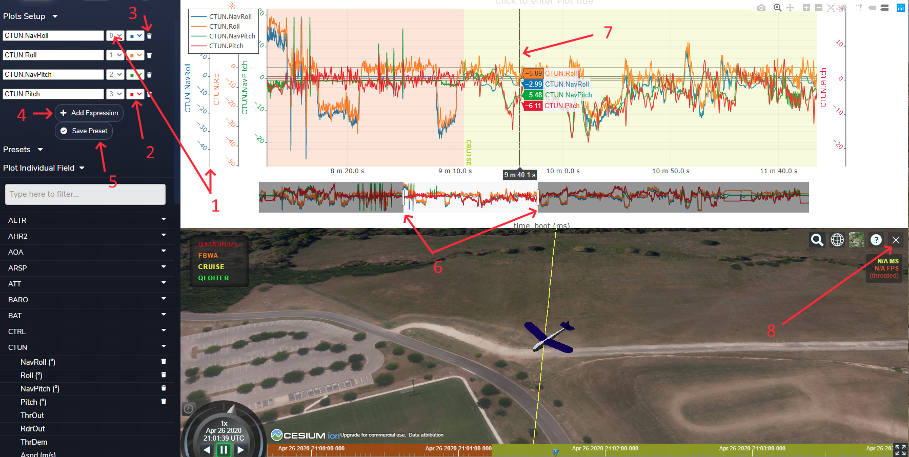
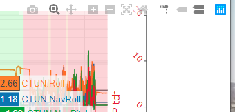
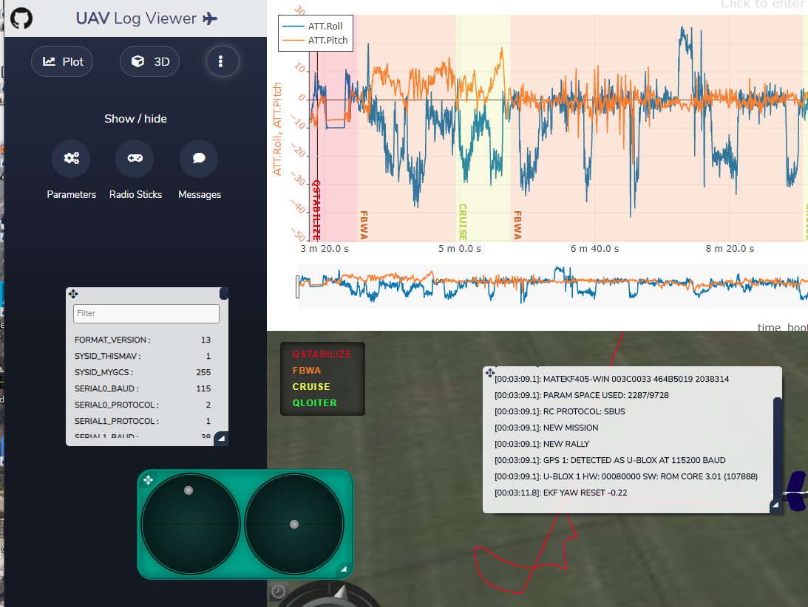

.. _common-uavlogviewer.rst:

=============
UAV LogViewer
=============

This utility provides an easy to use viewer for ArduPilot dataflash and telemetry logs. Data can be plotted and even manipulated, and the flight visually re-flown in 3D. It is accessed `here <http://plot.ardupilot.org>`__ and is web based, although most of the computations are done locally in the web browser. Both Chrome/Chromium and FireFox are supported browsers.

Initial Screen
==============

Upon accessing, this panel is presented. You can "Open (a) Sample" file to experiment with, or load an ArduPilot .tlog or .bin  log file, either by drag and drop or by clicking to obtain a file explorer dialog to select the file.

Main Screen
===========

Once a log is loaded, if it has GPS data, it will display this screen:

which is the 3D flight viewer. You can replay the flight in 3D by pressing the "play" button, or "pause", "reverse", or  change playback "speed". Various map tools/options are in the upper right corner.

In the upper left are setup menu buttons for the Plot (whose options are shown already), 3D panel, and additional widgets for parameters, log messages, and a joystick visualizer for the first four RC channels.

3D View Options
---------------

In this panel, you can change the camera mode in 3D playback, if waypoints and/or trajectory is shown, the size of the vehicle in the display, and the data source used for showing the trajectory.

Plot Options
------------

This is one of the most powerful features of the viewer. This allows you to select which log values are plotted. You can search for an individual field to  plot, eg for CTUN.NavRoll you would type "Nav") or just navigate thru to the message with that field. Here we have plotted CTUN.NavRoll, CTUN.Roll,CTUN.NavPitch, and CTUN.Pitch.The Navigation controller's desired roll and pitch versu actual. ( For a complete list of log messages, see: `Copter Log Messages <https://ardupilot.org/copter/docs/logmessages.html>`__ , `Plane Log Messages <https://ardupilot.org/plane/docs/logmessages.html>`__ , or `Rover Log Messages <https://ardupilot.org/rover/docs/logmessages.html>`__ ).

Presets
-------

Above the "Plot Individual Field" dropdown, is a "Presets" dropdown with many commonly used combinations of data plots already pre-configured.

Plot Features
-------------

#. When each field is added, a Y axis number is assigned, and the data autoscaled and centered. This can be changed by hovering over the axis and scrolling to change scale, or clicking and moving the origin. If you wish to automatically align and scale several fields to one another, just set the y axis number to be the same. They will remain together from that point on.

#. You can change the color code by clicking the color swatch.

#. You can remove a data plot by clicking the trash can icon.

#. You can even create and plot expressions that use the fields by "Add Expression" button. See ` Graph Expressions for MavExplorer <https://ardupilot.org/dev/docs/using-mavexplorer-for-log-analysis.html#graph-expressions>`__ for examples of using expressions in a plot analysis.

#. You can also save the present plot and its setup using the "Save Preset" button. These are persistent from session to session. A preset can be removed by tbd.

#. Using the slider bars on the timeline under the main graphs, you can narrow or expand the plot region of the lob and move its center on the log timeline. Note that the 3D graph follows.

#. The mouse cursor will move the 3D plot's time position. It can also show the exact values of each plot line at its current position.

#. You can dismiss the 3D screen by clicking in the X box in its upper right corner. The entire right side will now be devoted to the plots.

- If you move the mouse to the upper right corner of the plot screen, several options will become visible. You can take a snapshot of the plot area, re-auto scale, zoom, move, change what values appear with the mouse cursor, toggle x/y lines that move with cursor position, etc.

Widgets
=======

Three widgets are available when you click the widgets menu at the top left of the screen.

These are sizable (bottom right corners) and movable (upper left corner) panels that display the log messages up to the cursor point, the joystick positions (first 4 rc channels), and a searchable parameter list. These can be shown or dismissed with their buttons when in this setup menu. Click "Plot" or "3D" to return to those screens.

[copywiki destination="copter,plane,rover,dev,antennatracker,planner"]