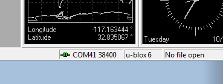

.. _common-ublox-gps:

=======================
UBlox GPS Configuration
=======================

`3DR uBlox <https://store.3dr.com/products/3dr-gps-ublox-with-compass>`__
modules are shipped with a `custom configuration <https://github.com/diydrones/ardupilot/tree/master/libraries/AP_GPS/config>`__
that is compatible with Copter, Rover and Plane.  This article explains
how you can reprogram the custom configuration if needed (this is not
expected to be necessary for normal users).

.. image:: ../../../images/3DR-ublox.jpg
    :target: ../_images/3DR-ublox.jpg

Connection Option #1 - Mission Planner and Pixhawk as Passthrough
=================================================================

The mission planner and pixhawk can pass through the communication
between u-center and the GPS by doing the following:

-  Connect to Pixhawk to your PC and connect with the Mission Planner
-  On the Flight Data screen press Ctrl-F and then select "MAVSerial
   pass"
-  Open u-center and select Receiver, TCP Client and in the Network
   Connection window set Address to "localhost" and Port to "500" and
   press OK.
-  See instructions below as to how to upload config with u-center.

.. image:: ../../../images/GPS_PassThrough_MP.jpg
    :target: ../_images/GPS_PassThrough_MP.jpg

.. image:: ../../../images/GPS_PassThrough_Ucenter.png
    :target: ../_images/GPS_PassThrough_Ucenter.png

Connection Option #2 - FTDI cable
=================================

You will need an `FTDI cable <http://store.jdrones.com/cable_ftdi_6pin_5v_p/cblftdi5v6p.htm>`__ and
a `GPS adapter cable <http://store.scoutuav.com/product/cables-connectors/gps-cable-10-cm/>`__ to
connect the GPS to your computer. If you have never plugged an FTDI
device into your computer, you may need to download and install
the `Virtual COM port driver <http://www.ftdichip.com/Drivers/VCP.htm>`__.

.. image:: ../../../images/ublox_gps_ftdi_connection.jpg
    :target: ../_images/ublox_gps_ftdi_connection.jpg

Connection Option #3 - using the APM2 as a passthrough
======================================================

-  Download the `APM / UBlox passthrough <http://firmware.ardupilot.org/downloads/wiki/advanced_user_tools/GPS_UBLOX_passthrough_APM2.hex>`__
   binary to your computer
-  Load the binary onto your APM2 using the **Mission Planner's Initial
   Setup \| Install Firmware \| Load custom firmware link**

..  youtube:: JIgs3UCLfd0
    :width: 100%

Installing and Uploading the config using U-Center
==================================================

-  Download and install \ `uBlox's u-center software <http://www.u-blox.com/en/evaluation-tools-a-software/u-center/u-center.html>`__
     Note that this is Windows only.
-  Get the 3DR-Ublox.txt configuration file for Ublox6 or 7
   `here <https://github.com/diydrones/ardupilot/tree/master/libraries/AP_GPS/config>`__. 
   For M8N the file is
   `here <https://raw.githubusercontent.com/diydrones/ardupilot/master/libraries/AP_GPS/config/Marco-Ublox_M8N.txt>`__.
-  Run u-center and connect your uBlox to your computer.
-  Click the magic wand button to enable auto-bauding, then select your
   appropriate COM port by clicking the down arrow next to the Connect
   button. If the uBlox is connected to the port you selected, you
   should see the serial activity indicator blinking in the program's
   status bar in the lower right-hand corner of the window, it also
   shows the current baud rate.

   .. image:: ../../../images/COM-port-selection.png
       :target: ../_images/COM-port-selection.png

-  To load the configuration file, In u-center go to the Tools menu,
   then GPS Configuration. A small window should appear. Add the path to
   the **3DR-Ublox.txt** configuration file, enable the **Store
   configuration into BBR/Flash (non-volatile memory)** option, and
   click the \ **File \| GPS** button.

   .. image:: ../../../images/GPS-configuration.png
       :target: ../_images/GPS-configuration.png
   
   .. image:: ../../../images/configuration-window.png
       :target: ../_images/configuration-window.png

You may get a \ **Configuration Version Check** alert telling you there
is a version mismatch between the configuration file and the GPS.  This
is because the configuration file was written for the GPS software
version 7.03 so if you have a module with an older version (i.e. 7.01)
it will complain but will likely still work. Click yes to continue.

You should see a window with a log of the configuration file upload, if
the upload is successful the window should close automatically and the
GPS module should now be connected to u-center at 38400 baud. You can
confirm this by checking the connection status in u-center's status bar.

The uBlox module is now ready to be used with Copter, Rover or Plane on
the APM2, PX4/Pixhawks.

