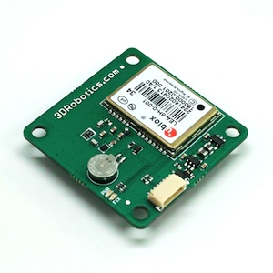
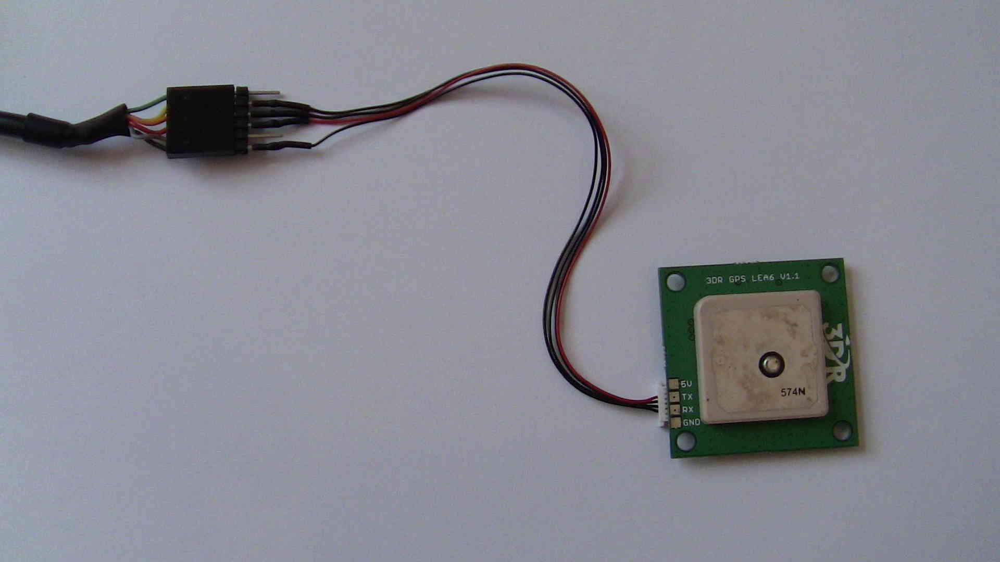

.. _common-ublox-gps:

=======================
UBlox GPS Configuration
=======================

This article explains how to connect to u-center to change the configuration of a :ref:`3DR uBlox <common-installing-3dr-ublox-gps-compass-module>` module. 
This is not expected to be necessary for normal users.

Connection Option #1 - Mission Planner and Pixhawk as Passthrough
=================================================================

Mission planner and pixhawk can pass through the communication
between u-center and the GPS by doing the following:

-  Connect Pixhawk to your PC and connect with the Mission Planner
-  On the Flight Data screen press Ctrl-F and then select "MAVSerial pass"
-  Open u-center and select Receiver, TCP Client and in the Network
   Connection window set Address to "localhost" and Port to "500" and press OK.
-  See instructions below as to how to upload config with u-center.

.. image:: ../../../images/GPS_PassThrough_MP.jpg
    :target: ../_images/GPS_PassThrough_MP.jpg

Connection Option #2 - FTDI cable
=================================

You will need an `FTDI cable <http://store.jdrones.com/cable_ftdi_6pin_5v_p/cblftdi5v6p.htm>`__ and
a `GPS adapter cable <http://store.scoutuav.com/product/cables-connectors/gps-cable-10-cm/>`__ to
connect the GPS to your computer. If you have never plugged an FTDI
device into your computer, you may need to download and install
the `Virtual COM port driver <http://www.ftdichip.com/Drivers/VCP.htm>`__.

