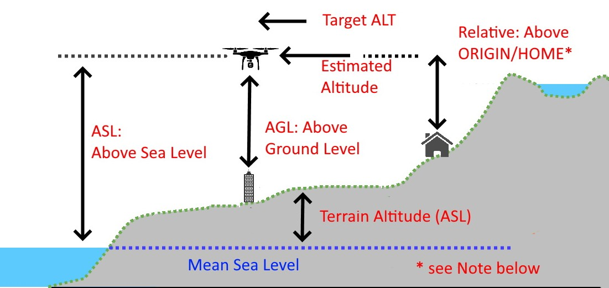
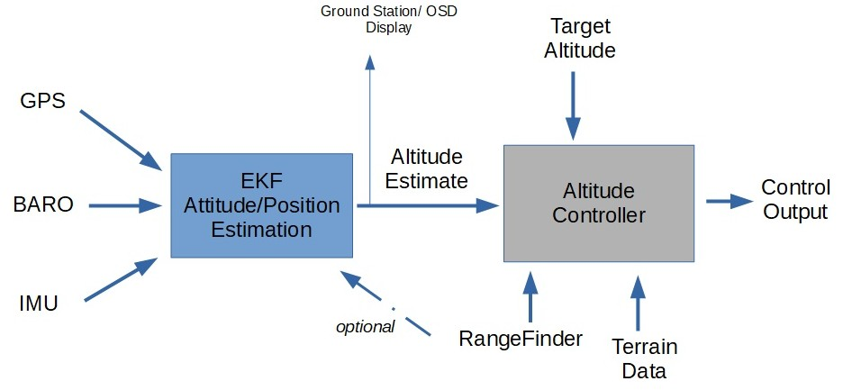

.. _common-understanding-altitude:

===================================
Understanding Altitude in ArduPilot
===================================

ArduPilot documentation uses the word "altitude" often and in many different ways and contexts. Not all "altitudes" mean the same thing, and an good understanding of what altitude means in any given context is important to understand expected operation and behavior.

.. note:: ORIGIN and HOME are set during ground initialization from the GPS and are usually the same location, but the user may move the HOME location during the flight via Mission Planner (for a different RTL point), but the Origin always remains the same unless intentionally reset.

Definitions of Altitude (ALT)
=============================

In the above diagram, various types of "altitude" are shown:

- ASL: Altitude above (mean) Sea Level - the altitude of the vehicle expressed as distance above the mean seal level of the world.
- AGL: Altitude above Ground Level: the altitude of the vehicle above whatever is directly below it.
- Relative: Relative altitude above HOME/ORIGIN position's altitude. This is what is displayed in the ground station and OSD as the vehicle's altitude.
- Terrain ALT: The height above sea level (asl) of a terrain position. This sometimes, but not always includes, any natural or man-made additions to the terrain's ground altitude.
- Estimated ALT: The autopilot's estimation of vehicle Relative altitude above ORIGIN which is used internally by the vehicle's Altitude Controller to maintain or obtain the Target ALT in altitude controlled modes (Plane: FBWB/AUTO/GUIDED/CRUISE/LOITER/CIRCLE), Copter: ALTHOLD/CIRCLE/LOITER/GUIDED/AUTO/DRIFT)
- Target ALT: The desired altitude in altitude controlled modes. Either from pilot input (eg ALTHOLD) or from navigation controller (eg AUTO)

Estimated and Target ALT
========================

The above simplified diagram shows how altitude control is implemented in ArduPilot.

The EKF subsystem is responsible for generating attitude, velocity, position, and altitude estimates for the vehicle so that the navigation and control systems can properly operate. EKF takes the IMU, GPS, and BARO sensor inputs and integrates them to provide these estimates, one of which is the Estimated ALT.

This is then fed to the vehicle's altitude control system, which attempts to match the Target ALT in altitude controlled modes.

The Target ALT can come from many different sources depending on the vehicle mode. For example, In Plane's FBWB mode, the pitch stick increases or decreases the Target ALT, while in AUTO mode when navigating to a waypoint, the navigation controller feeds a varying ramp of Target ALT as it progresses toward the waypoint to reach that waypoint's new altitude, if different from the previous waypoint's.

In the altitude controller, the Target ALT can also be modified by either Terrain Data from the GCS or SD card if :ref:`TERRAIN_ENABLE<TERRAIN_ENABLE>` is enabled, and/or RangeFinder altitude readings of distance above ground, if enabled and within the range of the rangefinder. Note that in both cases, the displayed altitude in the GCS HUD or OSD is the Estimated Altitude as long as EKF is working (otherwise it will use BARO altitude relative to HOME).

.. note:: Sometimes the GPS ASL altitude is displayed prior to setting of the Origin position in the EKF during ground initialization.

Target ALT Modification using RangeFinder (RF)
==============================================

Copter
------

If a downward facing RangeFinder is enabled and within range, then the Target ALT will be modified to use the RF's altitude measurements in Copter and in VTOL modes of Plane.

For example, you are in ALTHOLD in Copter, hovering at 30m and out of the RangeFinder's range. The Target ALT has been set to the current Estimated ALT and will try to hold it. Now you descend using the throttle stick to 10m and are now within the RF's range. When you release the stick, the Target ALT will be set to the RF reported altitude. The Estimated Altitude is still being used to adjust control outputs.

If the vehicle is moved over a ground object 1m tall. The Estimated ALT will remain unchanged, since it's based on BARO, GPS ALT, etc. but the Target ALT will be increased by 1M due to the RF readings showing 1m less distance to the ground. Any changes in RF altitude are immediately reflected in the Target ALT, so if the less accurate Estimated ALT erroneously varies a little, the RF effectively immediately cancels that via Target ALT adjustment, yielding more accurate altitude control.

If the RF's measurements change too rapidly (>2m for 3 reports), or the RF moves out of range, then they will be ignored and current altitude from the Estimated ALT set as new Target ALT. This prevents rapid climbs/descents with fast moving RF data. It also means that tracking requiring large,rapid changes, such as quickly approaching a tall object, will result in a possible impact. See :ref:`Object Avoidance <common-object-avoidance-landing-page>` in those cases.

This is called ``Surface Tracking`` in ArduPilot.

Optionally (normally recommended only for indoor use), the RF can be used as an additional sensor source for the EKF for altitude estimation. This is normally only used when the only altitude sensor available is a RF, since they have very limited range and more subject to environmental impacts to accuracy.

Plane
-----

In Plane, when using fixed wing modes, RangeFinder use, when within range and enabled by the :ref:`RNGFND_LANDING<RNGFND_LANDING>` parameter, is limited to:

- Adjusting glide slope during :ref:`Automatic Landings <automatic-landing>`, during the approach and pre-flare phases of the landing.
- Determining altitude when :ref:`LGR_DEPLOY_ALT<LGR_DEPLOY_ALT>`, or :ref:`LGR_RETRACT_ALT<LGR_RETRACT_ALT>` is reached, if a downward facing RF is active and within range.
- When :ref:`Q_LAND_FINAL_ALT<Q_LAND_FINAL_ALT>` is reached in VTOL landings in QuadPlane, if a downward facing RF is active.
- Determining if below :ref:`Q_ASSIST_ALT<Q_ASSIST_ALT>`.
- Determining if below :ref:`Q_VFWD_ALT<Q_VFWD_ALT>`.

Target ALT Modification using Terrain Following Data
====================================================

If Terrain Following is enabled and active, then the terrain altitude changes are used to increase or decrease the Target ALT for whatever the present location is, as it moves, depending on vehicle and mode. For details see :ref:`common-terrain-following` for Plane or :ref:`terrain-following` for Copter.

For Copter, this can be combined with RangeFinder use for obtain :ref:`Surface Tracking<terrain-following-manual-modes>` over obstacles at low altitudes.

[copywiki destination="copter,plane"]
