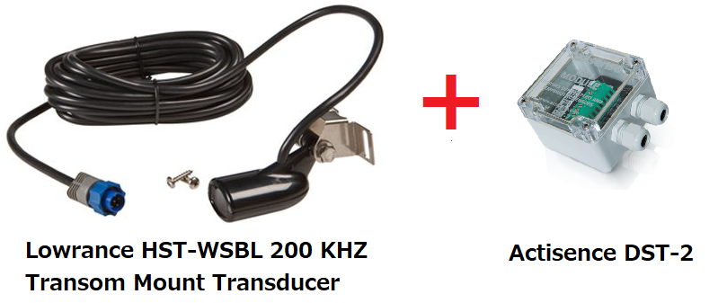
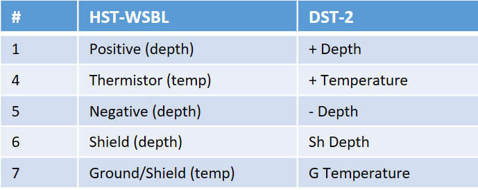
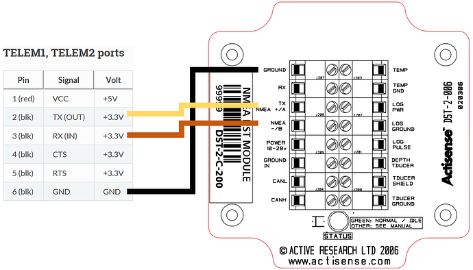

.. _common-underwater-sonar-analog:

=========================
Underwater Sonar (Analog)
=========================

This page details the setup of a low-cost analog underwater sonar (aka "fish finder") and a digitizer to convert the analog readings into NMEA 0183 which can be read by ardupilot.  This setup allows measuring the depth of the water below a boat.  The sensor described has a maximum claimed a range of 300m and a relatively wide beam of 22deg.

These instructions were provided by `OlavA at the bottom of this ardupilot.org blog post <https://discuss.ardupilot.org/t/mapping-a-lake-with-ardupilot/32401/34>`__

*images courtesy of lowarnace.com and actisense.com*

.. note::

   Support for this sensor was added to Rover-3.4.

Recommended Hardware
--------------------

- `Lowrance HST-WSBL 83/200 kHz Transom Mount Transducer <https://www.lowrance.com/lowrance/type/sonar-transducers/hst-wsbl/>`__ available from many retailers including `amazon.com <https://www.amazon.com/Lowrance-HST-WSBL-Transom-Mount-Transducer/dp/B000KKB5YK>`__.  Other sensors may also work.
- `DST-2 200kHz digitizer <https://www.actisense.com/product/dst-2/>`__ available from `many retailers <https://www.actisense.com/where-to-buy/>`__ including `Navstore.com <https://www.navstore.com/actisense-dst-2-200-active-dst-module-200-khz.html>`__ (`manuals here <http://www.actisense.com/media/?product=dst-2&type=downloads>`__)

Connecting and Configuring
--------------------------

The image below shows the pin-out of an airmar analog transducer, but the pinout is the same as for the Lowrance HST-WSBL

.. image:: ../../../images/underwater-sonar-analog-airman-pinout.jpg

The Lowrance HST-WSBL pins should be connected to the pins on the right side of the DST-2, as shown below.   Note that the Lowrance HST-WSBL does not have a speed sensor so only pins 1 and 4-7 should be connected

The DST-2 requires a 10V to 28V power source, meaning it can be powered from a 3S or 4S lipo battery.

Next pins on the left side of the DST-2 (serial and RS-232 output) should be connected to the autopilot's telemetry/serial input. The easiest connection method is to connect the DST-2's 5V serial output directly to the telemetry port of the autopilot's Tx, Rx, and common ground.  It is best to check the DST-2 docs before connecting but below shows how the telemetry pins from a Pixhawk (or another autopilot) should be connected to the pins on the left side of the DST-2.

Connect with a ground station to the autopilot and set the following parameters (these settings assume the first sensor is connected to Telem2/Serial2)

-  :ref:`SERIAL2_PROTOCOL <SERIAL2_PROTOCOL>` = 9 (Lidar)
-  :ref:`SERIAL2_BAUD <SERIAL2_BAUD>` = 4 (4800 baud)

Then the following range finder related parameters should be set:

-  :ref:`RNGFND1_TYPE <RNGFND1_TYPE>` = 17 (NMEA)
-  :ref:`RNGFND1_MIN_CM <RNGFND1_MIN_CM>` = 13
-  :ref:`RNGFND1_MAX_CM <RNGFND1_MAX_CM>` = 30000 (i.e. 300m).  *This is the distance in centimeters that the rangefinder can reliably read.*
-  :ref:`RNGFND1_ORIENT <RNGFND1_ORIENT>` = 25 (i.e. down) if mounted on a boat

Testing the sensor
==================

Distances read by the sensor can be seen in the Mission Planner's Flight
Data screen's Status tab. Look closely for "sonarrange".

.. image:: ../../../images/mp_rangefinder_lidarlite_testing.jpg
    :target: ../_images/mp_rangefinder_lidarlite_testing.jpg

