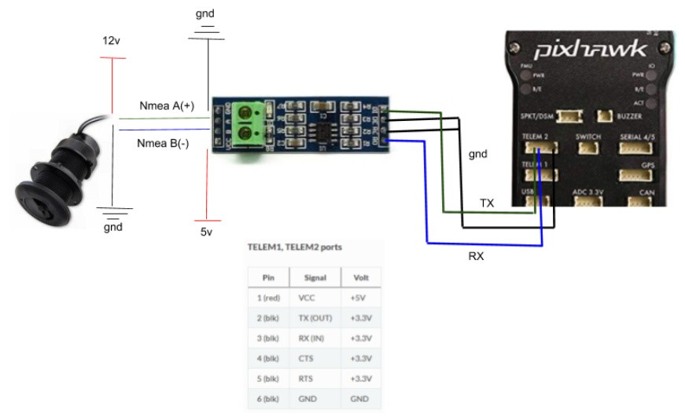

.. _common-underwater-triducer:

[copywiki destination="copter,plane,rover"]

========
Triducer
========

Triducer combines Speed, temperature, and Depth into one Transducer. These instructions were provided by `Evan at the bottom of this ardupilot.org blog post <https://discuss.ardupilot.org/t/affordable-transducer-for-autonomous-boat/39484>`__

Mounting the triducer
---------------------

The following example provides schematics to install a triducer on a Pixhawk and uses these parts:

- A triducer. In this example, it is an `Airmar DST800 triducer <http://www.airmar.com/uploads/brochures/dst800.pdf>`__ ;
- An RS-485 TTL converter. In this example, it is `MAX485 chipset based. <https://www.amazon.ca/MAX485CSA-Converter-Integrated-Circuits-Products/dp/B06W9H64TN/ref=sr_1_fkmrnull_1?keywords=rs485+to+ttl+lc&qid=1552083892&s=gateway&sr=8-1-fkmrnull>`__ 

Parameters for this particular hawdware:

- :ref:`RNGFND1_MAX_CM<RNGFND1_MAX_CM>` = 700
- :ref:`RNGFND1_MIN_CM<RNGFND1_MIN_CM>` = 50
- :ref:`RNGFND1_ORIENT<RNGFND1_ORIENT>` = 25
- :ref:`RNGFND1_TYPE<RNGFND1_TYPE>` = 17
- :ref:`SERIAL2_PROTOCOL<SERIAL2_PROTOCOL>` = 9
- :ref:`SERIAL2_BAUD<SERIAL2_BAUD>` = 4

Troubleshooting
---------------

It is possible to connect the triducer (or other transducers) to a computer through an RS-485 to USB converter. Once it is properly working, it is possible to connect to the appropriate COM port with a 4800 baud rate.

.. note::

	This page needs some improvement. Please, help this task by opening an issue on GitHub with more useful information to add here.