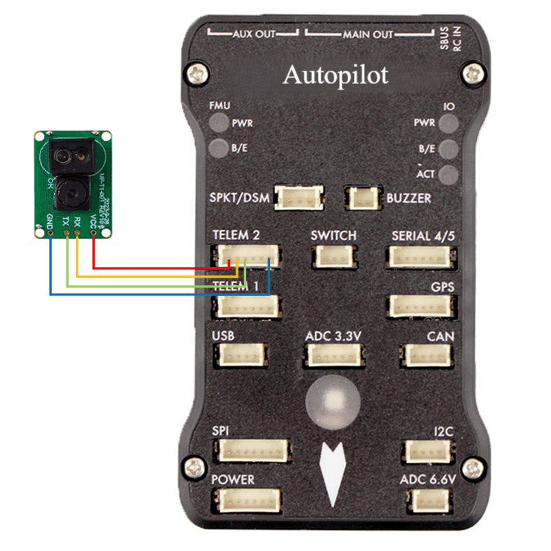

.. _common-upixels-tx-series:

===================================
UPixels T101-Plus/T201 Optical Flow
===================================

[copywiki destination="copter,plane,rover"]

UP-T101-Plus and UP-T201 are an optical flow + laser 2-in-1 module, mainly used in drones to achieve both horizontal and vertical positioning functions, more suitable for indoor use.

Where to Buy
============

The sensor is available from various retailers.
Here are some links:

- `UPixels UP-T101-Plus Optical Flow Module <https://www.aliexpress.com/item/1005008598363229.html>`__
- `UPixels UP-T201 Optical Flow Module <https://www.aliexpress.com/item/1005008600450663.html>`__

For those in China:

- `UPixels UP-T101-Plus <https://e.tb.cn/h.65IG904vvu98A5h?tk=pKeVeBljdeJ>`__
- `UPixels UP-T201 <https://e.tb.cn/h.6gnDI2K1M8vUMJ9?tk=wT2Kez7Ldox>`__

Connection to Autopilot
=======================

UP-T101-Plus Wiring Diagram:
----------------------------

UP-T201 Wiring Diagram:
----------------------------
.. image:: ../../../images/upixels-t201.png
   :target: ../_images/upixels-t201.png

- The flow sensor should be mounted on the underside of the copter with the camera lens pointing downwards.
- Connect the sensor's GND and TX pin to one of the autopilot's serial ports. Note that the TX pin of the sensor should be connected to the RX pin of the autopilot. In the image above the sensor is connected to a Pixhawk's Telem2 port.
- Connect the sensor's VCC to a 3.3V or 5V power source.

Configuration and Parameter
===========================
- Set :ref:`FLOW_TYPE<FLOW_TYPE>` = 9
- Set :ref:`SR1_EXTRA3<SR1_EXTRA3>` = 50
- Set :ref:`SERIAL2_BAUD<SERIAL2_BAUD>` = 115200
- Set :ref:`SERIAL2_PROTOCOL<SERIAL2_PROTOCOL>` = 16
- Set :ref:`RNGFND1_TYPE<RNGFND1_TYPE>` = 45
- Set :ref:`RNGFND1_ORIENT<RNGFND1_ORIENT>` = 45
- Set :ref:`RNGFND1_MAX_CM<RNGFND1_MAX_CM>` = 400 (The UP-T101-Plus is set to 400 and the UP-T201 is set to 1500)
- Set :ref:`RNGFND1_MIN_CM<RNGFND1_MIN_CM>` = 2 (The UP-T101-Plus is set to 2 and the UP-T201 is set to 5)

Once the sensor is activated, you should be able to observe the optical flow and distance sensor data on the Status page of the task planner. opt_m_x", "opt_m_y", "opt_qua" and "rangefinder1" data have been updated.

Additional Notes
================

- As with the :ref:`PX4Flow sensor <common-px4flow-overview>` a range finder is required to use the sensor for autonomous modes including :ref:`Loiter <loiter-mode>` and :ref:`RTL <rtl-mode>`
- Performance can be improved by setting the :ref:`sensors position parameters <common-sensor-offset-compensation>`.  For example if the sensor is mounted 2cm forward and 5cm below the frame's center of rotation set :ref:`FLOW_POS_X <FLOW_POS_X>` to 0.02 and :ref:`FLOW_POS_Z <FLOW_POS_Z>` to 0.05.

Testing and Setup
=================

- See :ref:`common-optical-flow-sensor-setup` for setup guides.
- Details of the modules are available: `UPixels_GitHub <https://github.com/Upixels-China/Upixels_Optical_flow>`__.
- Note that recommended value for :ref:`EK2_FLOW_DELAY <EK2_FLOW_DELAY>` or :ref:`EK3_FLOW_DELAY <EK3_FLOW_DELAY>` for this sensor is 10. 
