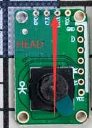
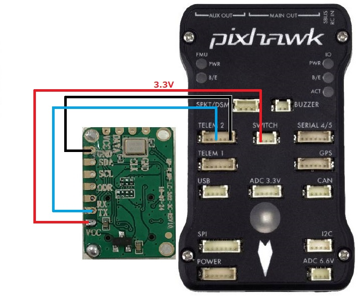

.. _common-upixels-upflow:

===========================
UPixels UPFlow Optical Flow
===========================

[copywiki destination="copter,plane,rover"]

The UPixels UPFlow optical flow sensor is a lightweight and low cost optical flow sensor which can be used to improve horizontal position control especially in GPS denied environments.

Support for this sensor is available in Copter-4.1 (and higher)

Where to Buy
------------

The sensor is available from various retailers.
Here are some links:

- `UPIXELS UP-FLOW Optical Flow Module <https://www.aliexpress.com/item/32969297064.html?spm=a2g0o.productlist.0.0.7e736ba7fkeO27&algo_pvid=53b87016-4503-4819-b309-e990e315a3ce&algo_expid=53b87016-4503-4819-b309-e990e315a3ce-4&btsid=0bb47a2216155643963414074ecf0a&ws_ab_test=searchweb0_0,searchweb201602_,searchweb201603>`__

For those in China:

- `UPIXELS UP-FLOW  LC-302-3C <https://item.taobao.com/item.htm?id=616234104077&spm=a8919.3000000002019401.0.1>`__

Connection to Autopilot
-------------------------------

- The flow sensor should be mounted with the head of the little man facing forward and the camera facing down, as shown in the image above.
- Connect the sensor's GND and TX pin to one of the autopilot's serial ports. Note that the TX pin of the sensor should be connected to the RX pin of the autopilot. In the image above the sensor is connected to a Pixhawk's Telem2 port.
- Connect the sensor's VCC to a 3.3V or 5V power source.
- Set :ref:`FLOW_TYPE <FLOW_TYPE>` = 8
- Set :ref:`SERIAL2_PROTOCOL <SERIAL2_PROTOCOL>` = 18 if using Serial2/Telem2, if connected to another serial port use the corresponding SERIALx_PROTOCOL parameter

Additional Notes
-----------------

- As with the :ref:`PX4Flow sensor <common-px4flow-overview>` a range finder is required to use the sensor for autonomous modes including :ref:`Loiter <loiter-mode>` and :ref:`RTL <rtl-mode>`
- :ref:`FlowHold <flowhold-mode>` does not require the use of a rangefinder
- Performance can be improved by setting the :ref:`sensors position parameters <common-sensor-offset-compensation>`.  For example if the sensor is mounted 2cm forward and 5cm below the frame's center of rotation set :ref:`FLOW_POS_X <FLOW_POS_X>` to 0.02 and :ref:`FLOW_POS_Z <FLOW_POS_Z>` to 0.05.

Testing and Setup
-----------------

- See :ref:`common-optical-flow-sensor-setup` for setup guides.
- Note that recommended value for :ref:`EK2_FLOW_DELAY <EK2_FLOW_DELAY>` or :ref:`EK3_FLOW_DELAY <EK3_FLOW_DELAY>` for this sensor is 10. 
