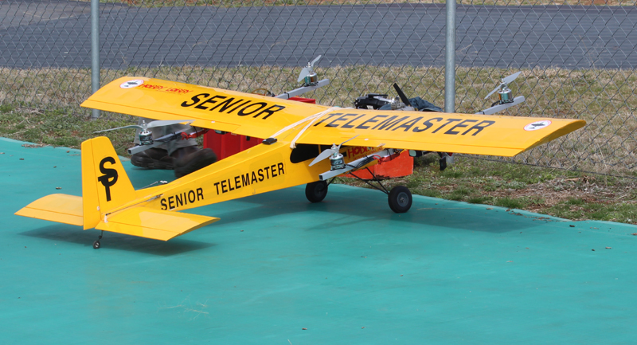
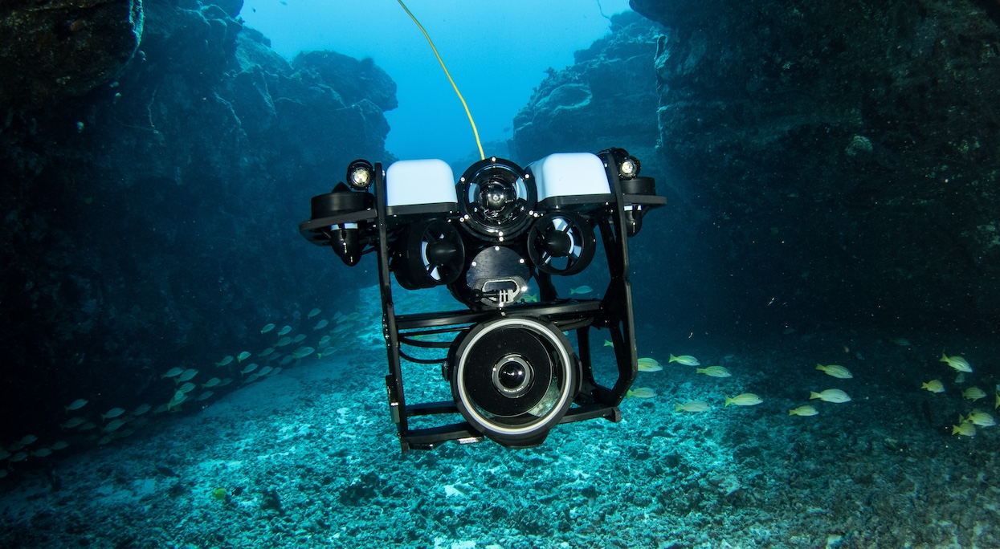
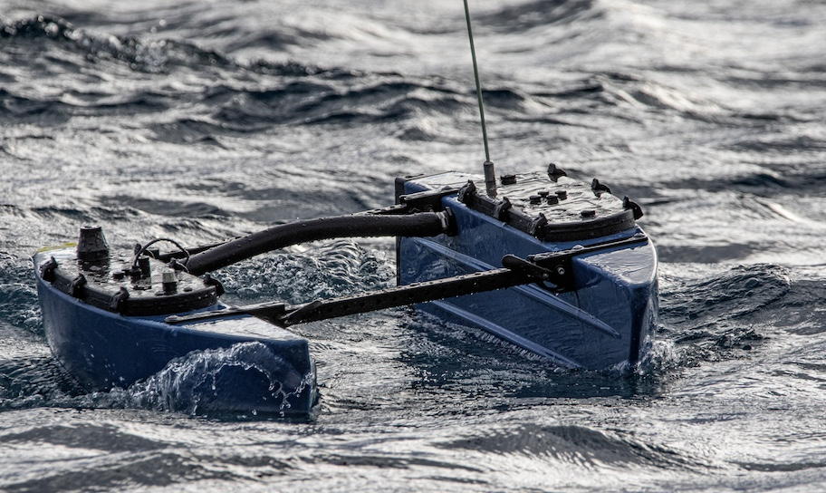
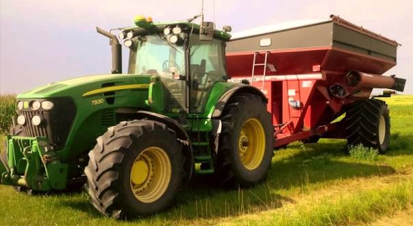
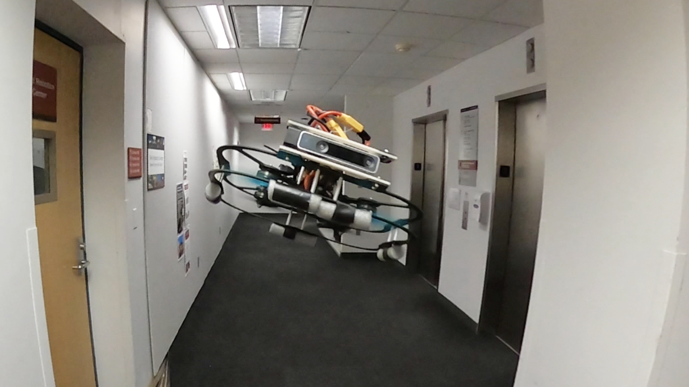
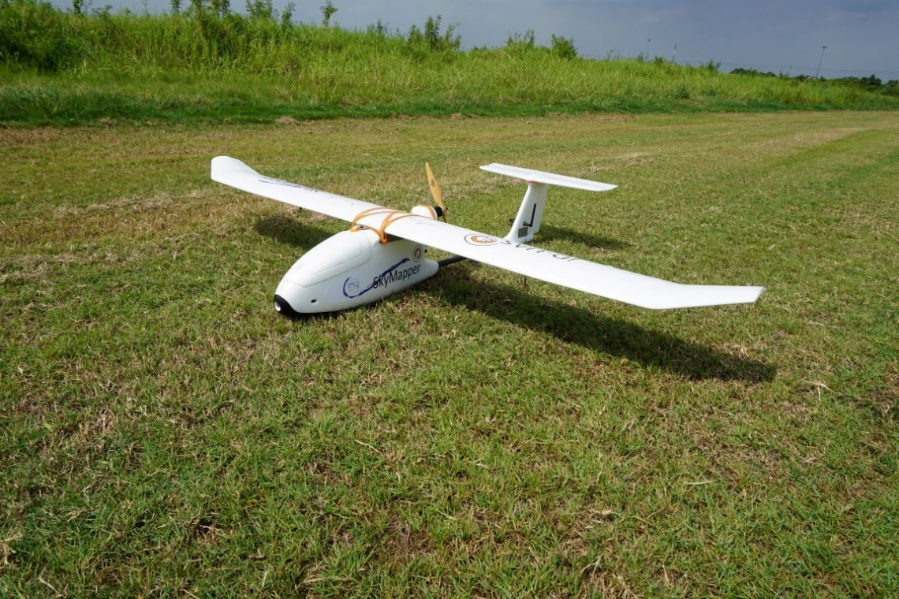

.. _common-use-cases-and-applications:

==========================
Use-Cases and Applications
==========================

Use Cases
=========

- VTOL Search and Rescue

- Submersible ROV

- Observation and exploration

.. youtube:: T_FMx7C5P_8
   :width: 100%

- Wreck discovery and documenting

.. youtube:: BV91zgzEFHs
   :width: 100%

- Photography and videography

.. youtube:: 8IOn9yDXBLM
   :width: 100%

- Boat, equipment, and infrastructure inspection

.. youtube:: LCWA_9RFQ24
   :width: 100%

- Biological sampling and surveying

.. youtube:: t6J94qbZqKk
   :width: 100%

- Underwater retrieval

.. youtube:: _tzUh62LPjA
   :width: 100%

- Academic and research projects

.. youtube:: X8CUwg6_y7E
   :width: 100%

- ROV and AUV competitions

- Bathymetry Boat

.. youtube:: p24jFOGKxb8
   :width: 100%

- Autonomous Mowers and Tractors

- `Autonomous Vehicle Collision Avoidance <https://discuss.ardupilot.org/t/cmu-nrec-falco-drone-safe-flights-by-agile-collision-avoidance/83300>`__

.. youtube:: k6jKkpmj4-k
   :width: 100%

.. toctree::
    :maxdepth: 1

    3d Mapping <common-3d-mapping>
    

.. toctree::
    :maxdepth: 1

    First Person View (FPV) <common-fpv-first-person-view>
    Multi-Vehicle Flying <common-multi-vehicle-flying>
    
- `Crop Spraying <https://ardupilot.org/copter/docs/sprayer.html>`__

- `Non-GPS Positioning Systems <https://ardupilot.org/copter/docs/common-non-gps-navigation-landing-page.html>`__
    
- `Indoor Flying <https://ardupilot.org/copter/docs/indoor-flying.html>`__

Vehicle Types
=============

ArduPilot can support many vehicles types: Planes, Multicopter, Helicopter, Rover, Subs, Boats, Blimps, Sailboats, VTOL Planes....and its even used on an orbiting satellite!

Its not only used for autonomous operation but as basic stabilization for pilot controlled vehicles.

See all the supported :ref:`vehicle types and frames here <common-all-vehicle-types>`
[site wiki="plane"]
Records
=======

.. toctree::
    :maxdepth: 1

    Plane Records <records>
    
 [/site]
