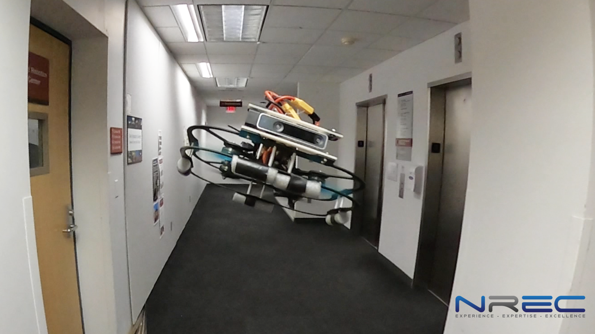

.. _common-use-cases-and-applications:

==========================
Use-Cases and Applications
==========================

Use Cases
=========

- VTOL Search and Rescue

- Submersible ROV

- Autonomous Mowers and Tractors

.. image:: ../../../images/case-tractor.jpg

- `Autonomous Vehicle Collision Avoidance <https://discuss.ardupilot.org/t/cmu-nrec-falco-drone-safe-flights-by-agile-collision-avoidance/83300>`__

..  youtube:: k6jKkpmj4-k
    :width: 640
    :height: 480

.. toctree::
    :maxdepth: 1

    3d Mapping <common-3d-mapping>
    

.. toctree::
    :maxdepth: 1

    First Person View (FPV) <common-fpv-first-person-view>
    Multi-Vehicle Flying <common-multi-vehicle-flying>
    
- `Crop Spraying <https://github.com/ArduPilot/ardupilot_wiki/edit/master/copter/source/docs/sprayer.rst>`__

- `Non-GPS Positioning Systems <https://ardupilot.org/copter/docs/common-non-gps-navigation-landing-page.html>`__
    
- `Indoor Flying <https://ardupilot.org/copter/docs/indoor-flying>`__

Vehicle Types
=============

ArduPilot can support many vehicles types: Planes, Multicopter, Helicopter, Rover, Subs, Boats, Blimps, Sailboats, VTOL Planes....and its even used on an orbiting satellite!

Its not only used for autonomous operation but as basic stabilization for pilot controlled vehicles.

See all the supported :ref:`vehicle types and frames here <common-all-vehicle-types>`
[site wiki="plane"]
Records
=======

.. toctree::
    :maxdepth: 1

    Plane Records <records>
    
 [/site]
